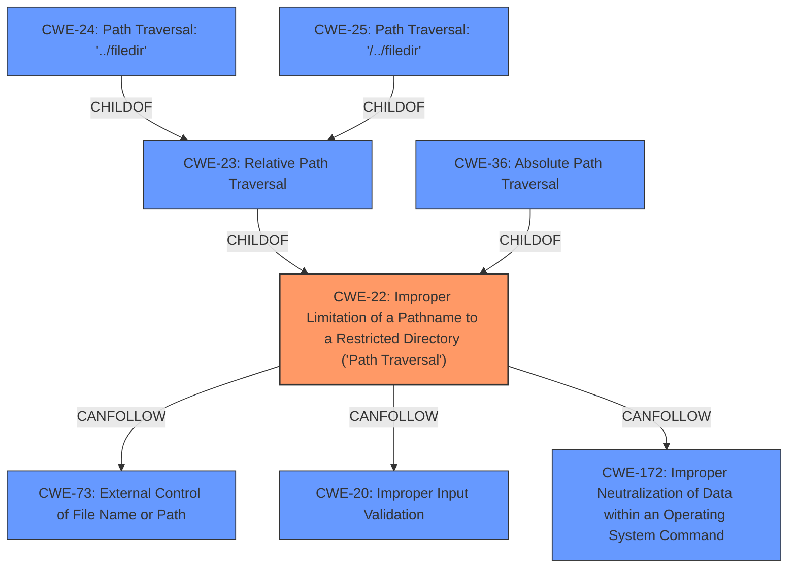

# Analysis for CVE-2021-25282

# Summary
| CWE ID | CWE Name | Confidence | CWE Abstraction Level | CWE Vulnerability Mapping Label | CWE-Vulnerability Mapping Notes |
|---|---|---|---|---|---|
| CWE-22 | Improper Limitation of a Pathname to a Restricted Directory ('Path Traversal') | 1.0 | Base | Allowed | Primary CWE |

## Evidence and Confidence

*   **Confidence Score:** 1.0
*   **Evidence Strength:** HIGH

## Relationship Analysis
The primary relationship that influenced the decision was the parent-child relationship between CWE-22 and its variants. While several variants like CWE-24, CWE-25, and CWE-36 were considered, the evidence did not point to a specific type of path traversal, making the base CWE-22 the most appropriate choice. There are also CANFOLLOW relationships with CWE-73 and CWE-20, suggesting potential follow-up issues related to external control of file names/paths and improper input validation, respectively. The CANFOLLOW relationship with CWE-172 suggests a possible issue related to the exposure of sensitive information through the directory traversal.

## Vulnerability Chain
The vulnerability chain starts with the **directory traversal** weakness in the `salt.wheel.pillar_roots.write` method. This allows an attacker to write to arbitrary locations on the file system, potentially leading to privilege escalation or other impacts.

## Summary of Analysis
The primary CWE selected is CWE-22, Improper Limitation of a Pathname to a Restricted Directory ('Path Traversal'). This is based on the vulnerability description stating a **directory traversal** issue in the `salt.wheel.pillar_roots.write` method of SaltStack Salt. The CVE Reference Links Content Summary confirms this, stating that the root cause is a directory traversal issue, and the impact is that an attacker could potentially write to arbitrary locations on the file system. The retriever results also list CWE-22 as the top match.

The evidence directly supports this classification: "The salt.wheel.pillar_roots.write method is vulnerable to **directory traversal**." and "The update addresses multiple vulnerabilities including a **directory traversal** issue in `wheel.pillar_roots.write`." The function `wheel.pillar_roots.write` does not properly restrict the path, allowing an attacker to traverse directories outside the intended scope.

CWE-23, Relative Path Traversal, CWE-24, Path Traversal: '../filedir', CWE-25, Path Traversal: '/../filedir', CWE-36, Absolute Path Traversal, CWE-73 External Control of File Name or Path, CWE-41 Improper Resolution of Path Equivalence, and CWE-59 Improper Link Resolution Before File Access ('Link Following') were considered, but the provided information does not give enough specific detail to select these more specific options. CWE-116, Improper Encoding or Escaping of Output was considered, but is not directly related to the described vulnerability. CWE-325, Missing Cryptographic Step, CWE-303, Incorrect Implementation of Authentication Algorithm, and CWE-613, Insufficient Session Expiration are unrelated to the **directory traversal** issue.

CWE-22 is the optimal level of specificity as it accurately describes the **weakness** without being overly specific about the type of path traversal.