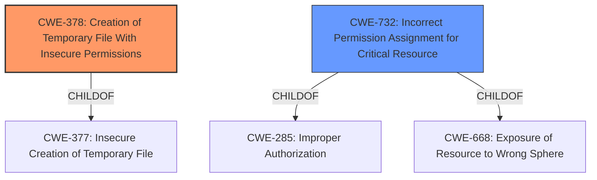

# Analysis for CVE-2021-25314

# Summary
| CWE ID  | CWE Name                                          | Confidence | CWE Abstraction Level | CWE Vulnerability Mapping Label | CWE-Vulnerability Mapping Notes |
| :------- | :------------------------------------------------ | :--------- | :-------------------- | :------------------------------ | :------------------------------ |
| CWE-378 | Creation of Temporary File With Insecure Permissions | 1          | Base                  | Primary                         | Allowed                       |
| CWE-732 | Incorrect Permission Assignment for Critical Resource | 0.7        | Class                 | Secondary                       | Allowed-with-Review           |

## Evidence and Confidence

*   **Confidence Score:** 0.9
*   **Evidence Strength:** HIGH

## Relationship Analysis
The primary CWE, CWE-378, is a Base level CWE, which is a preferred level for mapping. It has a parent, CWE-377, but the description for CWE-378 more closely matches the vulnerability.
CWE-732 is a Class level CWE. It is a parent of CWE-285 and CWE-668. While the description matches, it is more general than CWE-378 and is therefore a secondary candidate.

## Vulnerability Chain
The vulnerability chain starts with the **creation of a temporary file with insecure permissions** (CWE-378). This allows a local attacker to then **escalate to root**.

## Summary of Analysis
The initial analysis identified CWE-378 as the primary candidate due to the **rootcause** description matching its definition. The vulnerability description clearly states "**creation of temporary file with insecure permissions**". The CVE Reference Links Content Summary also confirms this by stating "**Insecure file permissions (0666) on temporary files**". The retriever results also listed CWE-378 at the top of the list of candidates. The confidence is high because of the explicit mention of insecure permissions on temporary files.

CWE-732 was considered as a secondary candidate because the vulnerability involves **incorrect permission assignment**, but it's less specific than CWE-378 which focuses specifically on temporary files.

Relevant CWE Information:

# Enhanced Context (25 CWEs)

## CWE-378: Creation of Temporary File With Insecure Permissions
**Abstraction:** Base
**Similarity Score**: 1.371
**Source**: dense

**Description**:
Opening temporary files without appropriate measures or controls can leave the file, its contents and any function that it impacts vulnerable to attack.

**Mapping Guidance**:
- Usage: Allowed
- Rationale: This CWE entry is at the Base level of abstraction, which is a preferred level of abstraction for mapping to the root causes of vulnerabilities.

## CWE-732: Incorrect Permission Assignment for Critical Resource
**Abstraction:** Class
**Similarity Score**: 0.512
**Source**: sparse

**Description**:
The product specifies permissions for a security-critical resource in a way that allows that resource to be read or modified by unintended actors.

**Mapping Guidance**:
- Usage: Allowed-with-Review
- Rationale: While the name itself indicates an assignment of permissions for resources, this is often misused for vulnerabilities in which "permissions" are not checked, which is an "authorization" weakness (CWE-285 or descendants) within CWE's model [REF-1287].