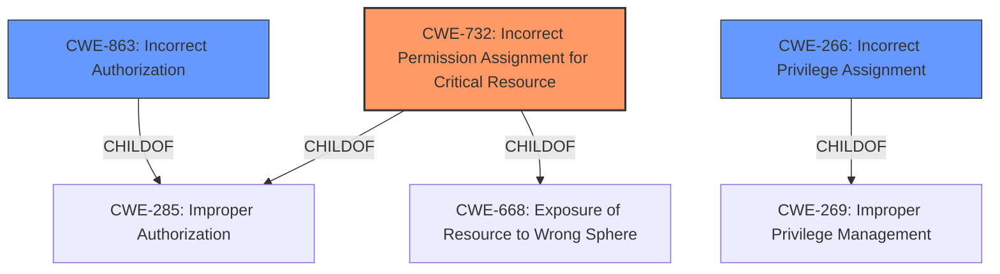

# Analysis Report for CVE-2021-25318

# Vulnerability Analysis Report: CVE-2021-25318

## Description


## Analysis (with Relationship Data)

# Summary
| CWE ID | CWE Name | Confidence | CWE Abstraction Level | CWE Vulnerability Mapping Label | CWE-Vulnerability Mapping Notes |
|---|---|---|---|---|---|
| CWE-732 | Incorrect Permission Assignment for Critical Resource | 0.9 | Class | Allowed-with-Review | Primary CWE |
| CWE-863 | Incorrect Authorization | 0.7 | Class | Allowed-with-Review | Secondary Candidate |
| CWE-266 | Incorrect Privilege Assignment | 0.6 | Base | Allowed | Secondary Candidate |

## Evidence and Confidence

*   **Confidence Score:** 0.9
*   **Evidence Strength:** HIGH

## Relationship Analysis
The primary CWE, CWE-732, is a child of CWE-285 (Improper Authorization) and CWE-668 (Exposure of Resource to Wrong Sphere). This hierarchical relationship indicates that CWE-732 is a more specific type of authorization issue related to critical resources. CWE-863 (Incorrect Authorization) is also a child of CWE-285, representing a related but potentially broader class of authorization flaws. CWE-266 (Incorrect Privilege Assignment) falls under CWE-269 (Improper Privilege Management), and it indicates a different but related aspect of access control. The abstraction levels influenced my decision, prioritizing the Class-level CWE-732 due to its direct relevance to the resource context of the vulnerability, and considering the Base-level CWE-266 as it captures the root cause of assigning incorrect privileges.



## Vulnerability Chain
The chain of root cause and weaknesses for the Vulnerability Description is as follows:
1.  **Root Cause:** **Incorrect Permission Assignment for Critical Resource** (CWE-732) due to Rancher not properly specifying the API group.
2.  **Weakness:** Overly permissive access granted to users.
3.  **Impact:** Users can modify resources they should not have access to, potentially leading to privilege escalation and data exposure.

## Summary of Analysis
Initially, the description points to an **Incorrect Permission Assignment for Critical Resource** vulnerability. The CVE Reference Links Content Summary confirms this, stating that the **vulnerability stems from Rancher not properly specifying the API group when creating Kubernetes RBAC resources for applications**. The use of a wildcard instead of a specific API group granted broader access than intended.

CWE-732 (Incorrect Permission Assignment for Critical Resource) is the most appropriate primary mapping because it directly reflects the **incorrect assignment** aspect highlighted in the vulnerability description and the CVE details. This is further supported by the vulnerability description key phrase identifying "**Incorrect Permission Assignment for Critical Resource**" as the rootcause.

CWE-863 (Incorrect Authorization) and CWE-266 (Incorrect Privilege Assignment) were also considered. CWE-863 is a more general class of authorization issues, while CWE-266 focuses on the incorrect assignment of privileges. While both are relevant, they are less specific than CWE-732, which directly addresses the resource context of the vulnerability. The decision to prioritize CWE-732 is based on the evidence that the vulnerability is primarily about incorrect permission assignments leading to broader access to critical resources, aligning with the "resource" aspect of CWE-732.

The selected CWEs are at the optimal level of specificity because they accurately capture the root cause and contributing factors to the vulnerability. CWE-732 addresses the incorrect permission assignment for critical resources, while CWE-863 and CWE-266 highlight related aspects of authorization and privilege management. The decision to map to these CWEs is based on the MITRE mapping guidance and the specific details of the vulnerability.

Relevant CWE Information:

# Enhanced Context (25 CWEs)
The following CWEs were identified as potentially relevant to this vulnerability:

## CWE-280: Improper Handling of Insufficient Permissions or Privileges 
**Abstraction Level**: Base
**Similarity Score**: 0.77
**Source**: dense

**Description**:
The product does not handle or incorrectly handles when it has insufficient privileges to access resources or functionality as specified by their permissions. This may cause it to follow unexpected code paths that may leave the product in an invalid state.

**Mapping Guidance**:
- Usage: Allowed
- Rationale: This CWE entry is at the Base level of abstraction, which is a preferred level of abstraction for mapping to the root causes of vulnerabilities.

## CWE-274: Improper Handling of Insufficient Privileges
**Abstraction Level**: Base
**Similarity Score**: 0.76
**Source**: dense

**Description**:
The product does not handle or incorrectly handles when it has insufficient privileges to perform an operation, leading to resultant weaknesses.

**Mapping Guidance**:
- Usage: Discouraged
- Rationale: This CWE entry could be deprecated in a future version of CWE.

## CWE-266: Incorrect Privilege Assignment
**Abstraction Level**: Base
**Similarity Score**: 0.76
**Source**: dense

**Description**:
A product incorrectly assigns a privilege to a particular actor, creating an unintended sphere of control for that actor.

**Mapping Guidance**:
- Usage: Allowed
- Rationale: This CWE entry is at the Base level of abstraction, which is a preferred level of abstraction for mapping to the root causes of vulnerabilities.

## CWE-668: Exposure of Resource to Wrong Sphere
**Abstraction Level**: Class
**Similarity Score**: 0.75
**Source**: dense

**Description**:
The product exposes a resource to the wrong control sphere, providing unintended actors with inappropriate access to the resource.

**Mapping Guidance**:
- Usage: Discouraged
- Rationale: CWE-668 is high-level and is often misused as a catch-all when lower-level CWE IDs might be applicable. It is sometimes used for low-information vulnerability reports [REF-1287]. It is a level-1 Class (i.e., a child of a Pillar). It is not useful for trend analysis.

## CWE-267: Privilege Defined With Unsafe Actions
**Abstraction Level**: Base
**Similarity Score**: 0.75
**Source**: dense

**Description**:
A particular privilege, role, capability, or right can be used to perform unsafe actions that were not intended, even when it is assigned to the correct entity.

**Mapping Guidance**:
- Usage: Allowed
- Rationale: This CWE entry is at the Base level of abstraction, which is a preferred level of abstraction for mapping to the root causes of vulnerabilities.

## CWE-653: Improper Isolation or Compartmentalization
**Abstraction Level**: Class
**Similarity Score**: 0.74
**Source**: dense

**Description**:
The product does not properly compartmentalize or isolate functionality, processes, or resources that require different privilege levels, rights, or permissions.

**Mapping Guidance**:
- Usage: Allowed
- Rationale: This CWE entry is at the Base level of abstraction, which is a preferred level of abstraction for mapping to the root causes of vulnerabilities.

## CWE-1220: Insufficient Granularity of Access Control
**Abstraction Level**: Base
**Similarity Score**: 0.74
**Source**: dense

**Description**:
The product implements access controls via a policy or other feature with the intention to disable or restrict accesses (reads and/or writes) to assets in a system from untrusted agents. However, implemented access controls lack required granularity, which renders the control policy too broad because it allows accesses from unauthorized agents to the security-sensitive assets.

**Mapping Guidance**:
- Usage: Allowed
- Rationale: This CWE entry is at the Base level of abstraction, which is a preferred level of abstraction for mapping to the root causes of vulnerabilities.

## CWE-303: Incorrect Implementation of Authentication Algorithm
**Abstraction Level**: Base
**Similarity Score**: 0.74
**Source**: dense

**Description**:
The requirements for the product dictate the use of an established authentication algorithm, but the implementation of the algorithm is incorrect.

**Mapping Guidance**:
- Usage: Allowed
- Rationale: This CWE entry is at the Base level of abstraction, which is a preferred level of abstraction for mapping to the root causes of vulnerabilities.

## CWE-807: Reliance on Untrusted Inputs in a


## CWE Relationship Analysis

Current CWEs represent these abstraction levels: .


### Vulnerability Chain Analysis

**Chain starting from CWE-732:**
- 732 (Incorrect Permission Assignment for Critical Resource) - ROOT


**Chain starting from CWE-303:**
- 303 (Incorrect Implementation of Authentication Algorithm) - ROOT


### CWE Relationship Diagram

```mermaid
graph TD
    classDef primary fill:#f96,stroke:#333,stroke-width:2px
    classDef secondary fill:#69f,stroke:#333
    classDef tertiary fill:#9e9,stroke:#333
```


*Report generated on 2025-04-02 03:34:22*
