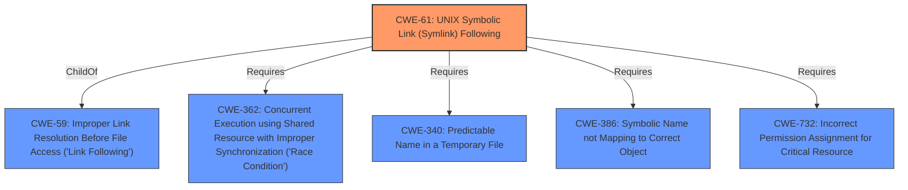

# Analysis for CVE-2021-25321

# Summary
| CWE ID | CWE Name | Confidence | CWE Abstraction Level | CWE Vulnerability Mapping Label | CWE-Vulnerability Mapping Notes |
|---|---|---|---|---|---|
| CWE-61 | UNIX Symbolic Link (Symlink) Following | 1.0 | Compound | Allowed | Primary CWE |
| CWE-59 | Improper Link Resolution Before File Access ('Link Following') | 0.7 | Base | Allowed | Secondary Candidate |
| CWE-732 | Incorrect Permission Assignment for Critical Resource | 0.6 | Class | Allowed-with-Review | Secondary Candidate |

## Evidence and Confidence

*   **Confidence Score:** 0.9
*   **Evidence Strength:** HIGH

## Relationship Analysis
The primary CWE, CWE-61 [UNIX Symbolic Link (Symlink) Following], is a compound weakness that encompasses several contributing factors. It is **ChildOf** CWE-59 [Improper Link Resolution Before File Access ('Link Following')], indicating a more specific case of the general link following issue. It **Requires** CWE-362 [Concurrent Execution using Shared Resource with Improper Synchronization ('Race Condition')], CWE-340 [Predictable Name in a Temporary File], CWE-386 [Symbolic Name not Mapping to Correct Object], and CWE-732 [Incorrect Permission Assignment for Critical Resource] all of which highlight the conditions necessary for successful exploitation.

## Vulnerability Chain
The vulnerability chain starts with the attacker's ability to create a symbolic link in the /var/lib/arpwatch directory, pointing to a sensitive file. Arpwatch, when started with an unprivileged user, changes the ownership of the directory and the symlink to that user due to **insecure file handling** during privilege dropping. This allows the attacker to gain ownership of the target file and escalate privileges to root.
  - Root Cause: **UNIX Symbolic Link (Symlink) Following**
  - Weakness: Insecure file handling during privilege dropping, **improper link resolution**, incorrect permission assignment.
  - Impact: Local privilege escalation (LPE) to root.

## Summary of Analysis
My initial analysis focused on the **UNIX Symbolic Link (Symlink) Following** vulnerability, as indicated in the vulnerability description. The CVE Reference Links Content Summary confirms that the root cause is related to **insecure file handling** when dropping privileges. The `dropprivileges` function uses `chown` to change the ownership of the arpwatch directory and files without checking if they are symbolic links. This allows an attacker to place a symbolic link to an arbitrary file, and upon the next restart of arpwatch, the attacker gains ownership of that file, leading to privilege escalation.

The graph relationships show that CWE-61 [UNIX Symbolic Link (Symlink) Following] is a compound weakness, and its child CWE-59 [Improper Link Resolution Before File Access ('Link Following')] represents a contributing factor. CWE-732 [Incorrect Permission Assignment for Critical Resource] also plays a role, as the incorrect assignment of ownership to the symlink target is critical to the exploit.

I considered other CWEs, such as CWE-22 [Improper Limitation of a Pathname to a Restricted Directory ('Path Traversal')], but it is not the primary issue here. While path traversal could be involved in creating the initial symbolic link, the core problem is the insecure handling of symbolic links during the privilege dropping process.

The selected CWEs are at the optimal level of specificity. CWE-61 [UNIX Symbolic Link (Symlink) Following] accurately represents the overall vulnerability, while CWE-59 [Improper Link Resolution Before File Access ('Link Following')] and CWE-732 [Incorrect Permission Assignment for Critical Resource] highlight contributing factors.

The evidence for selecting CWE-61 [UNIX Symbolic Link (Symlink) Following] is strong, with the vulnerability description explicitly mentioning the "**UNIX Symbolic Link (Symlink) Following**" vulnerability. The CVE Reference Links Content Summary further supports this by stating that the program changes the ownership of the directory and files to the specified user, even if a symbolic link is created in place of the expected file.

Relevant CWE Information:
- "A **UNIX Symbolic Link (Symlink) Following** vulnerability in arpwatch"
- "Root cause of vulnerability: The arpwatch daemon, when run with an unprivileged user, changes the ownership of the /var/lib/arpwatch directory and its files to the unprivileged user."
- "The program changes the ownership of the directory and files to the specified user, even if a symbolic link is created in place of the expected file"

CWEs considered but not used:
- CWE-22 [Improper Limitation of a Pathname to a Restricted Directory ('Path Traversal')]: While path traversal might be used to create the symlink, the core issue is the **improper handling of symbolic links**.
- CWE-73 [External Control of File Name or Path]: While the attacker controls the path of the symlink, the vulnerability is more specifically about how symlinks are handled during privilege dropping.
- CWE-23 [Relative Path Traversal]: Similar to CWE-22, path traversal may be a contributing factor, but not the primary weakness.