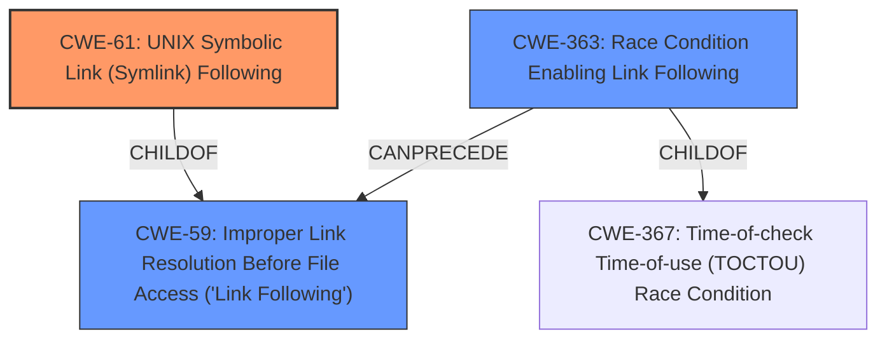

# Analysis Report for CVE-2021-25322

# Vulnerability Analysis Report: CVE-2021-25322

## Description


## Analysis (with Relationship Data)

# Summary
| CWE ID | CWE Name | Confidence | CWE Abstraction Level | CWE Vulnerability Mapping Label | CWE-Vulnerability Mapping Notes |
|---|---|---|---|---|---|
| CWE-61 | UNIX Symbolic Link (Symlink) Following | 0.9 | Compound | Allowed | Primary CWE |
| CWE-59 | Improper Link Resolution Before File Access ('Link Following') | 0.7 | Base | Allowed | Secondary Candidate |
| CWE-363 | Race Condition Enabling Link Following | 0.6 | Base | Allowed | Secondary Candidate |

## Evidence and Confidence

*   **Confidence Score:** 0.8
*   **Evidence Strength:** HIGH

## Relationship Analysis
The primary CWE, CWE-61 [UNIX Symbolic Link (Symlink) Following], is a compound weakness that requires several conditions to be met, including a race condition and improper privilege management, to allow symlink following. CWE-59 [Improper Link Resolution Before File Access ('Link Following')] is a base weakness and parent of CWE-61, but CWE-61 is more specific in this context because it explicitly mentions UNIX symbolic links. CWE-363 [Race Condition Enabling Link Following] describes the race condition aspect of the vulnerability, which is a prerequisite for the symlink following to occur.



## Vulnerability Chain
The vulnerability chain starts with the `hyperkitty-permissions.sh` script running as root. This script recursively changes ownership and ACL settings, but it **does not properly** handle symbolic links, creating a race condition. An attacker can exploit this race condition by creating symbolic links to sensitive files. When the script attempts to change the ownership of these symbolic links, it inadvertently changes the ownership of the target files, leading to privilege escalation.

## Summary of Analysis
The initial analysis focused on the **UNIX Symbolic Link Following** vulnerability, as highlighted in the description. The key evidence supporting this is the recursive ownership changes performed by the `hyperkitty-permissions.sh` script and the attacker's ability to manipulate symbolic links. The retriever results also indicate that CWE-61 [UNIX Symbolic Link (Symlink) Following] and CWE-59 [Improper Link Resolution Before File Access ('Link Following')] are strong candidates.

The analysis considered the relationship between CWE-61 [UNIX Symbolic Link (Symlink) Following], CWE-59 [Improper Link Resolution Before File Access ('Link Following')], and CWE-363 [Race Condition Enabling Link Following]. CWE-61 [UNIX Symbolic Link (Symlink) Following] is a compound weakness that encompasses the race condition and improper handling of symbolic links. CWE-59 [Improper Link Resolution Before File Access ('Link Following')] is a more general case of link following. CWE-363 [Race Condition Enabling Link Following] specifically addresses the race condition aspect, where the attacker can replace a file with a link between the check and the use.

The final decision is to primarily map to CWE-61 [UNIX Symbolic Link (Symlink) Following] because it is the most specific and accurately represents the vulnerability. It combines the **improper** handling of symbolic links with the context of a UNIX environment. CWE-59 [Improper Link Resolution Before File Access ('Link Following')] is included as a secondary candidate since it is the parent of CWE-61 [UNIX Symbolic Link (Symlink) Following] and represents the general case of link following. CWE-363 [Race Condition Enabling Link Following] is also included as a secondary candidate because it highlights the race condition aspect.

The selection of CWE-61 [UNIX Symbolic Link (Symlink) Following] is at the optimal level of specificity because it is a compound weakness that combines multiple factors (symlink, UNIX environment, and **improper** handling). The evidence from the vulnerability description, particularly the mention of "UNIX Symbolic Link Following" and the details of the `hyperkitty-permissions.sh` script, supports this classification.

Relevant CWE Information:

# Enhanced Context (25 CWEs)
The following CWEs were identified as potentially relevant to this vulnerability:

## CWE-59: Improper Link Resolution Before File Access ('Link Following')
**Abstraction Level**: Base
**Similarity Score**: 0.81
**Source**: dense

**Description**:
The product attempts to access a file based on the filename, but it **does not properly** prevent that filename from identifying a link or shortcut that resolves to an unintended resource.

**Mapping Guidance**:
- Usage: Allowed
- Rationale: This CWE entry is at the Base level of abstraction, which is a preferred level of abstraction for mapping to the root causes of vulnerabilities.

## CWE-266: Incorrect Privilege Assignment
**Abstraction Level**: Base
**Similarity Score**: 0.79
**Source**: dense

**Description**:
A product **incorrectly** assigns a privilege to a particular actor, creating an unintended sphere of control for that actor.

**Mapping Guidance**:
- Usage: Allowed
- Rationale: This CWE entry is at the Base level of abstraction, which is a preferred level of abstraction for mapping to the root causes of vulnerabilities.

## CWE-267: Privilege Defined With Unsafe Actions
**Abstraction Level**: Base
**Similarity Score**: 0.78
**Source**: dense

**Description**:
A particular privilege, role, capability, or right can be used to perform unsafe actions that were not intended, even when it is assigned to the correct entity.

**Mapping Guidance**:
- Usage: Allowed
- Rationale: This CWE entry is at the Base level of abstraction, which is a preferred level of abstraction for mapping to the root causes of vulnerabilities.

## CWE-41: Improper Resolution of Path Equivalence
**Abstraction Level**: Base
**Similarity Score**: 0.78
**Source**: dense

**Description**:
The product is vulnerable to file system contents disclosure through path equivalence. Path equivalence involves the use of special characters in file and directory names. The associated manipulations are intended to generate multiple names for the same object.

**Mapping Guidance**:
- Usage: Allowed
- Rationale: This CWE entry is at the Base level of abstraction, which is a preferred level of abstraction for mapping to the root causes of vulnerabilities.

## CWE-61: UNIX Symbolic Link (Symlink) Following
**Abstraction Level**: Compound
**Similarity Score**: 0.77
**Source**: dense

**Description**:
The product, when opening a file or directory, **does not sufficiently** account for when the file is a symbolic link that resolves to a target outside of the intended control sphere. This could allow an attacker to cause the product to operate on unauthorized files.

**Mapping Guidance**:
- Usage: Allowed
- Rationale: This is a well-known Composite of multiple weaknesses that must all occur simultaneously, although it is attack-oriented in nature.

## CWE-23: Relative Path Traversal
**Abstraction Level**: Base
**Similarity Score**: 0.77
**Source**: dense

**Description**:
The product uses external input to construct a pathname that should be within a restricted directory, but it **does not properly** neutralize sequences such as ".." that can resolve to a location that is outside of that directory.

**Mapping Guidance**:
- Usage: Allowed
- Rationale: This CWE entry is at the Base level of abstraction, which is a preferred level of abstraction for mapping to the root causes of vulnerabilities.

## CWE-668: Exposure of Resource to Wrong Sphere
**Abstraction Level**: Class
**Similarity Score**: 0.77
**Source**: dense

**Description**:
The product exposes a resource to the wrong control sphere, providing unintended actors with inappropriate access to the resource.

**Mapping Guidance**:
- Usage: Discouraged
- Rationale: CWE-668 is high-level and is often misused as a catch-all when lower-level CWE IDs might be applicable. It is sometimes used for low-information vulnerability reports [REF-1287]. It is a level-1 Class (i.e., a child of a Pillar). It is not useful for trend analysis.

## CWE-274: Improper Handling of Insufficient Privileges
**Abstraction Level**: Base
**Similarity Score**: 0.77
**Source**: dense

**Description**:
The product **does not handle** or **incorrectly handles** when it has insufficient privileges to perform an operation, leading to resultant weaknesses.

**Mapping Guidance**:
- Usage: Discour


## CWE Relationship Analysis

Current CWEs represent these abstraction levels: .


### Vulnerability Chain Analysis

**Chain starting from CWE-41:**
- 41 (Improper Resolution of Path Equivalence) - ROOT


**Chain starting from CWE-274:**
- 274 (Improper Handling of Insufficient Privileges) - ROOT


### CWE Relationship Diagram

```mermaid
graph TD
    classDef primary fill:#f96,stroke:#333,stroke-width:2px
    classDef secondary fill:#69f,stroke:#333
    classDef tertiary fill:#9e9,stroke:#333
```


*Report generated on 2025-04-01 17:09:00*
