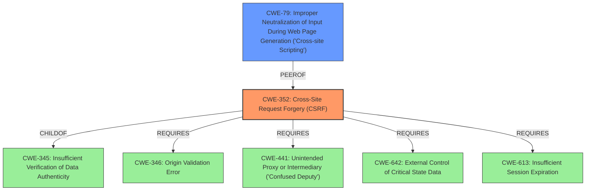

# Raw Analyzer Response for CVE-2021-25327

# Summary
| CWE ID | CWE Name | Confidence | CWE Abstraction Level | CWE Vulnerability Mapping Label | CWE-Vulnerability Mapping Notes |
|---|---|---|---|---|---|
| CWE-352 | Cross-Site Request Forgery (CSRF) | 1.0 | Compound | Allowed | Primary CWE |
| CWE-79 | Improper Neutralization of Input During Web Page Generation ('Cross-site Scripting') | 1.0 | Base | Allowed | Secondary CWE |

## Evidence and Confidence

*   **Confidence Score:** 1.0
*   **Evidence Strength:** HIGH

## Relationship Analysis
The primary weakness is CWE-352 [CWE-352: Cross-Site Request Forgery (CSRF)], a Compound weakness. The relationships for CWE-352 include: ChildOf CWE-345, Requires CWE-346, Requires CWE-441, Requires CWE-642, and Requires CWE-613. The secondary weakness is CWE-79 [CWE-79: Improper Neutralization of Input During Web Page Generation ('Cross-site Scripting')], a Base level weakness. CWE-79 is a PeerOf CWE-352. The relationship between XSS and CSRF is mentioned in the description of both CWEs. An attacker might use CSRF in order to trick the victim into submitting requests to the server in which the requests contain an XSS payload.

## Vulnerability Chain
The vulnerability chain starts with **missing CSRF protection** (CWE-352), which allows an attacker to inject malicious code. The application also **fails to properly sanitize user-supplied input** which leads to Cross-Site Scripting (XSS) vulnerability. This allows an attacker to inject malicious JavaScript code. Successful exploitation can lead to arbitrary code execution on the affected device. The XSS vulnerability can be leveraged to perform actions on behalf of an authenticated user via CSRF.

## Summary of Analysis
The initial analysis identified two key weaknesses: **missing CSRF protection** and Cross-Site Scripting (XSS) due to **insufficient input sanitization**.
The primary CWE is CWE-352 [CWE-352: Cross-Site Request Forgery (CSRF)], as the **root cause** is the **missing CSRF protection** in `/cgi-bin/net-routeadd.asp` and `/cgi-bin/sec-urlfilter.asp`. The "Vulnerability Description Key Phrases" section explicitly states "**rootcause:** **missing CSRF protection**" and "**impact:** cross-site request forgery". The "CVE Reference Links Content Summary" confirms "Cross-Site Request Forgery (CSRF) due to **missing CSRF validation**." This aligns with the CWE-352 description: "The web application does not, or can not, sufficiently verify whether a well-formed, valid, consistent request was intentionally provided by the user who submitted the request."
The secondary CWE is CWE-79 [CWE-79: Improper Neutralization of Input During Web Page Generation ('Cross-site Scripting')], because the "CVE Reference Links Content Summary" section states "Cross-Site Scripting (XSS) due to **insufficient input sanitization**". The "CVE Reference Links Content Summary" further states, "The application **fails to properly sanitize user-supplied input** in the `DestIPAddress` parameter of `/cgi-bin/net-routeadd.asp` and the `urlitem` parameter of `/cgi-bin/sec-urlfilter.asp`. This allows an attacker to inject malicious JavaScript code." This aligns with the CWE-79 description: "The product does not neutralize or incorrectly neutralizes user-controllable input before it is placed in output that is used as a web page that is served to other users."
Both CWEs are at the optimal level of specificity, with CWE-352 at the Compound level and CWE-79 at the Base level.

Relevant CWE Information: