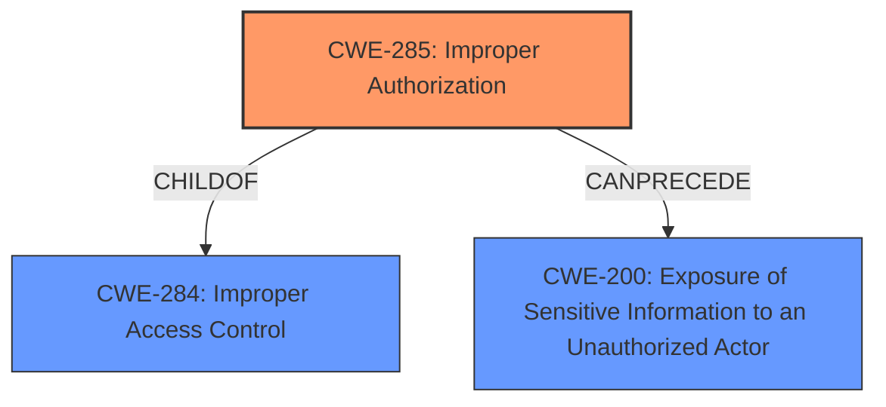

# Analysis Report for CVE-2021-25333

# Vulnerability Analysis Report: CVE-2021-25333

## Description


## Analysis (with Relationship Data)

# Summary
| CWE ID | CWE Name | Confidence | CWE Abstraction Level | CWE Vulnerability Mapping Label | CWE-Vulnerability Mapping Notes |
|---|---|---|---|---|---|
| CWE-285 | Improper Authorization | 0.8 | Class | Primary | Discouraged - but selected because there are no more specific matches |
| CWE-200 | Exposure of Sensitive Information to an Unauthorized Actor | 0.5 | Class | Secondary | Discouraged |

## Evidence and Confidence

*   **Confidence Score:** 0.7
*   **Evidence Strength:** MEDIUM

## Relationship Analysis
The primary relationship influencing the decision is the parent-child relationship between CWE-284 (Improper Access Control) and CWE-285 (Improper Authorization). CWE-285 is a child of CWE-284, representing a more specific type of access control issue related to authorization. However, no base level CWEs were a better fit. CWE-200 (Exposure of Sensitive Information) is a class-level CWE that represents the impact of the vulnerability.



## Vulnerability Chain
The vulnerability chain starts with **improper access control**, leading to unauthorized access to balance information.
  - Root Cause: **Improper access control** (CWE-285)
  - Impact: Unauthorized access to balance information (CWE-200)

## Summary of Analysis
The initial analysis identified **improper access control** as the root cause. This is explicitly stated in the "Vulnerability Description Key Phrases" section. The vulnerability allows unauthorized access to balance information by scanning a specific QR code.

The analysis considered the retriever results, which suggested CWE-200, CWE-926, CWE-284, and CWE-287, among others. However, CWE-285 (Improper Authorization) was chosen as the primary CWE because it directly addresses the **improper authorization** aspect of the vulnerability. CWE-284 is too high level, and while CWE-200 describes the impact, it doesn't describe the root cause.

CWE-285 is a class-level CWE, and the mapping guidance discourages its use when more specific CWEs are available. However, in this case, none of the child CWEs of CWE-285 are a better fit based on the available information.

The selection of CWE-285 is based on the evidence from the vulnerability description, which clearly states **improper access control**. The relationship analysis shows that CWE-285 is a more specific type of access control issue than CWE-284. The final decision is to use CWE-285 because it more accurately reflects the root cause of the vulnerability than the other options, despite the discouraged usage.

The confidence level is 0.7 because while the evidence points to **improper access control**, the selection of CWE-285 is not ideal due to its class level and the discouraged usage. Further information might allow a more precise CWE to be assigned.

Relevant CWE Information:

# Enhanced Context (25 CWEs)
The following CWEs were identified as potentially relevant to this vulnerability:

## CWE-653: Improper Isolation or Compartmentalization
**Abstraction Level**: Class
**Similarity Score**: 0.76
**Source**: dense

**Description**:
The product does not properly compartmentalize or isolate functionality, processes, or resources that require different privilege levels, rights, or permissions.

**Mapping Guidance**:
- Usage: Allowed
- Rationale: This CWE entry is at the Base level of abstraction, which is a preferred level of abstraction for mapping to the root causes of vulnerabilities.

*Not selected:* This is not related to isolation or compartmentalization.

## CWE-274: Improper Handling of Insufficient Privileges
**Abstraction Level**: Base
**Similarity Score**: 0.75
**Source**: dense

**Description**:
The product does not handle or incorrectly handles when it has insufficient privileges to perform an operation, leading to resultant weaknesses.

**Mapping Guidance**:
- Usage: Discouraged
- Rationale: This CWE entry could be deprecated in a future version of CWE.

*Not selected:* This CWE isn't about handling *insufficient* privileges but rather how privileges are assigned and checked in the first place.

## CWE-226: Sensitive Information in Resource Not Removed Before Reuse
**Abstraction Level**: Base
**Similarity Score**: 0.75
**Source**: dense

**Description**:
The product releases a resource such as memory or a file so that it can be made available for reuse, but it does not clear or "zeroize" the information contained in the resource before the product performs a critical state transition or makes the resource available for reuse by other entities.

**Mapping Guidance**:
- Usage: Allowed
- Rationale: This CWE entry is at the Base level of abstraction, which is a preferred level of abstraction for mapping to the root causes of vulnerabilities.

*Not selected:* The issue isn't about releasing resources without clearing sensitive information.

## CWE-280: Improper Handling of Insufficient Permissions or Privileges 
**Abstraction Level**: Base
**Similarity Score**: 0.75
**Source**: dense

**Description**:
The product does not handle or incorrectly handles when it has insufficient privileges to access resources or functionality as specified by their permissions. This may cause it to follow unexpected code paths that may leave the product in an invalid state.

**Mapping Guidance**:
- Usage: Allowed
- Rationale: This CWE entry is at the Base level of abstraction, which is a preferred level of abstraction for mapping to the root causes of vulnerabilities.

*Not selected:* Similar to CWE-274, this doesn't address the root cause of how privileges are assigned.

## CWE-668: Exposure of Resource to Wrong Sphere
**Abstraction Level**: Class
**Similarity Score**: 0.74
**Source**: dense

**Description**:
The product exposes a resource to the wrong control sphere, providing unintended actors with inappropriate access to the resource.

**Mapping Guidance**:
- Usage: Discouraged
- Rationale: CWE-668 is high-level and is often misused as a catch-all when lower-level CWE IDs might be applicable. It is sometimes used for low-information vulnerability reports [REF-1287]. It is a level-1 Class (i.e., a child of a Pillar). It is not useful for trend analysis.

*Not selected:* While related, CWE-668 is too generic and discouraged.

## CWE-639: Authorization Bypass Through User-Controlled Key
**Abstraction Level**: Base
**Similarity Score**: 0.74
**Source**: dense

**Description**:
The system's authorization functionality does not prevent one user from gaining access to another user's data or record by modifying the key value identifying the data.

**Mapping Guidance**:
- Usage: Allowed
- Rationale: This CWE entry is at the Base level of abstraction, which is a preferred level of abstraction for mapping to the root causes of vulnerabilities.

*Not selected:* The vulnerability description doesn't mention user-controlled keys.

## CWE-667: Improper Locking
**Abstraction Level**: Class
**Similarity Score**: 0.74
**Source**: dense

**Description**:
The product does not properly acquire or release a lock on a resource, leading to unexpected resource state changes and behaviors.

**Mapping Guidance**:
- Usage: Allowed-with-Review
- Rationale: This CWE entry is a Class and might have Base-level children that would be more appropriate

*Not selected:* This is not related to locking mechanisms.

## CWE-345: Insufficient Verification of Data Authenticity
**Abstraction Level**: Class
**Similarity Score**: 0.74
**Source**: dense

**Description**:
The product does not sufficiently verify the origin or authenticity of data, in a way that causes it to accept invalid data.

**Mapping Guidance**:
- Usage: Discouraged
- Rationale: This CWE entry is a level-1 Class (i.e., a child of a Pillar). It might have lower-level children that would be more appropriate

*Not selected:* The issue isn't about verifying data authenticity.

## CWE-1220: Insufficient Granularity of Access Control
**Abstraction Level**: Base
**Similarity Score**: 0.74
**Source**: dense

**Description**:
The product implements access controls via a policy or other feature with the intention to disable or restrict accesses (reads and/or writes) to assets in a system from untrusted agents. However, implemented access controls lack required granularity, which


## CWE Relationship Analysis

Current CWEs represent these abstraction levels: .


### Vulnerability Chain Analysis

**Chain starting from CWE-667:**
- 667 (Improper Locking) - ROOT


**Chain starting from CWE-284:**
- 284 (Improper Access Control) - ROOT


### CWE Relationship Diagram

```mermaid
graph TD
    classDef primary fill:#f96,stroke:#333,stroke-width:2px
    classDef secondary fill:#69f,stroke:#333
    classDef tertiary fill:#9e9,stroke:#333
```


*Report generated on 2025-04-02 12:18:29*
