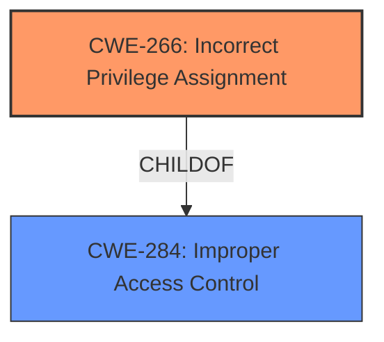

# Raw Analyzer Response for CVE-2021-25338

# Summary
| CWE ID | CWE Name | Confidence | CWE Abstraction Level | CWE Vulnerability Mapping Label | CWE-Vulnerability Mapping Notes |
|---|---|---|---|---|---|
| CWE-266 | Incorrect Privilege Assignment | 0.8 | Base | Allowed | Primary CWE |
| CWE-284 | Improper Access Control | 0.6 | Pillar | Discouraged | Secondary Candidate |

## Evidence and Confidence

*   **Confidence Score:** 0.8
*   **Evidence Strength:** MEDIUM

## Relationship Analysis
The primary relationship influencing the CWE selection is the hierarchical structure. CWE-266 "Incorrect Privilege Assignment" is a Base level CWE, while CWE-284 "Improper Access Control" is a high-level Pillar. The vulnerability description points to a specific type of access control issue, which is related to the assignment of privileges in memory access. Therefore, the more specific CWE-266 is preferred over the general CWE-284.

## Vulnerability Chain
The vulnerability chain starts with the **improper memory access control** which leads to an attacker being able to write to certain parts of the RKP EL2 memory region given a compromised kernel.

## Summary of Analysis
The initial analysis identified **improper memory access control** as the root cause. The provided text explicitly mentions this. The retriever results provided several candidate CWEs, with varying degrees of similarity.

The final decision was heavily influenced by the following:

1.  The explicit mention of "**improper memory access control**" in the vulnerability description.
2.  The need to identify the root cause rather than the impact.
3.  The abstraction levels of the candidate CWEs, preferring a Base level CWE.
4.  The relationships between the CWEs, favoring a more specific child CWE over a general parent CWE.

Therefore, CWE-266 "Incorrect Privilege Assignment" was chosen as the primary CWE because it best represents the **improper memory access control** and is a base level CWE. CWE-284 "Improper Access Control" was considered as a secondary CWE, but was ultimately deemed too general.

Relevant CWE Information:

# Enhanced Context (25 CWEs)

## CWE-1289: Improper Validation of Unsafe Equivalence in Input
**Abstraction Level**: Base
**Similarity Score**: 0.80
**Source**: dense

**Description**:
The product receives an input value that is used as a resource identifier or other type of reference, but it does not validate or incorrectly validates that the input is equivalent to a potentially-unsafe value.
**Why it was not selected**: This CWE focuses on validation of input equivalence to unsafe values, which is not the primary issue in this vulnerability. The core problem is incorrect privilege assignment.

## CWE-807: Reliance on Untrusted Inputs in a Security Decision
**Abstraction Level**: Base
**Similarity Score**: 0.77
**Source**: dense

**Description**:
The product uses a protection mechanism that relies on the existence or values of an input, but the input can be modified by an untrusted actor in a way that bypasses the protection mechanism.
**Why it was not selected**: This vulnerability is related to memory access control, and not reliance on untrusted inputs in a security decision.

## CWE-183: Permissive List of Allowed Inputs
**Abstraction Level**: Base
**Similarity Score**: 0.77
**Source**: dense

**Description**:
The product implements a protection mechanism that relies on a list of inputs (or properties of inputs) that are explicitly allowed by policy because the inputs are assumed to be safe, but the list is too permissive - that is, it allows an input that is unsafe, leading to resultant weaknesses.
**Why it was not selected**: This CWE focuses on overly permissive lists of allowed inputs, which is not the primary issue.

## CWE-1288: Improper Validation of Consistency within Input
**Abstraction Level**: Base
**Similarity Score**: 0.76
**Source**: dense

**Description**:
The product receives a complex input with multiple elements or fields that must be consistent with each other, but it does not validate or incorrectly validates that the input is actually consistent.
**Why it was not selected**: This CWE focuses on consistency validation within input, which is not the primary concern here.

## CWE-184: Incomplete List of Disallowed Inputs
**Abstraction Level**: Base
**Similarity Score**: 0.76
**Source**: dense

**Description**:
The product implements a protection mechanism that relies on a list of inputs (or properties of inputs) that are not allowed by policy or otherwise require other action to neutralize before additional processing takes place, but the list is incomplete.
**Why it was not selected**: This CWE describes incomplete lists of disallowed inputs, and doesn't fit the description of improper memory access control as well as CWE-266.

## CWE-179: Incorrect Behavior Order: Early Validation
**Abstraction Level**: Base
**Similarity Score**: 0.76
**Source**: dense

**Description**:
The product validates input before applying protection mechanisms that modify the input, which could allow an attacker to bypass the validation via dangerous inputs that only arise after the modification.
**Why it was not selected**: This CWE focuses on incorrect order of validation, which is not the core issue in this vulnerability.

## CWE-274: Improper Handling of Insufficient Privileges
**Abstraction Level**: Base
**Similarity Score**: 0.76
**Source**: dense

**Description**:
The product does not handle or incorrectly handles when it has insufficient privileges to perform an operation, leading to resultant weaknesses.
**Why it was not selected**: The root cause is about improper assignment of privileges, not the handling of insufficient privileges.

## CWE-703: Improper Check or Handling of Exceptional Conditions
**Abstraction Level**: Pillar
**Similarity Score**: 0.75
**Source**: dense

**Description**:
The product does not properly anticipate or handle exceptional conditions that rarely occur during normal operation of the product.
**Why it was not selected**: This CWE is a high-level Pillar and does not accurately represent the specific vulnerability.

## CWE-1173: Improper Use of Validation Framework
**Abstraction Level**: Base
**Similarity Score**: 0.75
**Source**: dense

**Description**:
The product does not use, or incorrectly uses, an input validation framework that is provided by the source language or an independent library.
**Why it was not selected**: This CWE focuses on the usage of validation frameworks. The vulnerability description points to incorrect memory access control, which is more directly related to privilege assignment.

## CWE-280: Improper Handling of Insufficient Permissions or Privileges
**Abstraction Level**: Base
**Similarity Score**: 0.75
**Source**: dense

**Description**:
The product does not handle or incorrectly handles when it has insufficient privileges to access resources or functionality as specified by their permissions. This may cause it to follow unexpected code paths that may leave the product in an invalid state.
**Why it was not selected**: The root cause is not the handling of insufficient privileges, but the improper assignment of privileges.

## CWE-863: Incorrect Authorization
**Abstraction Level**: Class
**Similarity Score**: 6494.30
**Source**: sparse

**Description**:
The product performs an authorization check when an actor attempts to access a resource or perform an action, but it does not correctly perform the check.
**Why it was not selected**: This CWE describes incorrect performance of an authorization check, but is less specific to memory access control compared to CWE-266.

## CWE-285: Improper Authorization
**Abstraction Level**: Class
**Similarity Score**: 6403.30
**Source**: sparse

**Description**:
The product does not perform or incorrectly performs an authorization check when an actor attempts to access a resource or perform an action.
**Why it was not selected**: This CWE is a high-level class and less descriptive than the base CWE-266.

## CWE-639: Authorization Bypass Through User-Controlled Key
**Abstraction Level**: Base
**Similarity Score**: 6344.71
**Source**: sparse

**Description**:
The system's authorization functionality does not prevent one user from gaining access to another user's data or record by modifying the key value identifying the data.
**Why it was not selected**: While it relates to authorization, it is too specific, focusing on bypass through user-controlled keys.

## CWE-1284: Improper Validation of Specified Quantity in Input
**Abstraction Level**: Base
**Similarity Score**: 6337.27
**Source**: sparse

**Description**:
The product receives input that is expected to specify a quantity (such as size or length), but it does not validate or incorrectly validates that the quantity has the required properties.
**Why it was not selected**: This CWE describes improper validation of specified