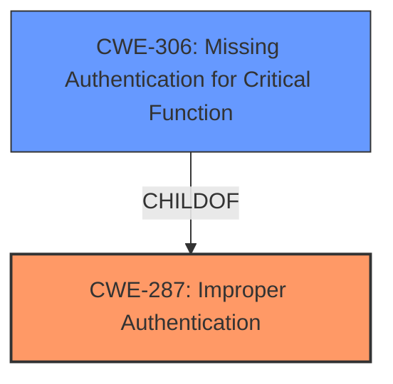

# Analysis Report for CVE-2021-25341

# Vulnerability Analysis Report: CVE-2021-25341

## Description


## Analysis (with Relationship Data)

# Summary

| CWE ID | CWE Name | Confidence | CWE Abstraction Level | CWE Vulnerability Mapping Label | CWE-Vulnerability Mapping Notes |
|---|---|---|---|---|---|
| CWE-287 | Improper Authentication | 0.8 | Class | Primary CWE | Discouraged |
| CWE-306 | Missing Authentication for Critical Function | 0.6 | Base | Secondary | Allowed |

## Evidence and Confidence

*   **Confidence Score:** 0.7
*   **Evidence Strength:** MEDIUM

## Relationship Analysis
The primary relationship influencing the decision is that CWE-306, Missing Authentication for Critical Function, is a child of CWE-287, Improper Authentication. The initial assessment favored CWE-287 due to its broader applicability to the description. However, the description explicitly mentions the calling of a "non-existent provider," suggesting a scenario where authentication is entirely absent for this specific function. This drives the consideration of CWE-306 as a more precise classification, although the evidence is not definitive.



## Vulnerability Chain
The vulnerability chain starts with the **calling of a non-existent provider**, leading to **improper authentication** or **missing authentication** for that function. This can then be exploited to perform **unauthorized actions, including denial of service attack by hijacking the provider**.

## Summary of Analysis
The initial analysis pointed towards CWE-287, Improper Authentication, as the primary weakness, which aligns with the given "Primary CWE Match" from the similar CVE descriptions. However, after further examination of the vulnerability description, the phrase "calling of non-existent provider" indicates a scenario where there might be a complete lack of authentication for a critical function.

The final decision involves recognizing that the **root cause** seems to be that the application is calling a non-existent provider and not validating its existence or requiring authentication before use. This is a form of **improper authentication**. It may be more specific to describe it as a **missing authentication** issue for this particular function (the "non-existent provider").

The evidence supporting this is the vulnerability description: "Calling of non-existent provider in S Assistant prior to version 6.5.01.22 allows unauthorized actions including denial of service attack by hijacking the provider."

CWE-287 is selected as the primary weakness due to the overall authentication failure. CWE-306 is considered a secondary candidate as it highlights the specific case of missing authentication for the "non-existent provider."

The chosen CWEs are at an appropriate level of specificity, with CWE-287 providing a general classification and CWE-306 offering a more detailed view of the authentication issue.

Relevant CWE Information:

# Enhanced Context (25 CWEs)

## CWE-287: Improper Authentication
**Abstraction:** Class
**Status:** Draft

### Description
When an actor claims to have a given identity, the product does not prove or insufficiently proves that the claim is correct.

### Extended Description
Not provided

### Alternative Terms
authentification: An alternate term is "authentification", which appears to be most commonly used by people from non-English-speaking countries.
AuthN: "AuthN" is typically used as an abbreviation of "authentication" within the web application security community. It is also distinct from "AuthZ," which is an abbreviation of "authorization." The use of "Auth" as an abbreviation is discouraged, since it could be used for either authentication or authorization.
AuthC: "AuthC" is used as an abbreviation of "authentication," but it appears to used less frequently than "AuthN."

### Relationships
ChildOf -> CWE-284
ChildOf -> CWE-284

### Mapping Guidance
**Usage:** Discouraged
**Rationale:** This CWE entry might be misused when lower-level CWE entries are likely to be applicable. It is a level-1 Class (i.e., a child of a Pillar).
**Comments:** Consider children or descendants, beginning with CWE-1390: Weak Authentication or CWE-306: Missing Authentication for Critical Function.
**Reasons:**
- Frequent Misuse
**Suggested Alternatives:**
- CWE-1390: Weak Authentication
- CWE-306: Missing Authentication for Critical Function

## CWE-306: Missing Authentication for Critical Function
**Abstraction:** Base
**Status:** Draft

### Description
The product does not perform any authentication for functionality that requires a provable user identity or consumes a significant amount of resources.

### Extended Description
Not provided

### Alternative Terms
None

### Relationships
ChildOf -> CWE-287
ChildOf -> CWE-287

### Mapping Guidance
**Usage:** Allowed
**Rationale:** This CWE entry is at the Base level of abstraction, which is a preferred level of abstraction for mapping to the root causes of vulnerabilities.
**Comments:** Carefully read both the name and description to ensure that this mapping is an appropriate fit. Do not try to 'force' a mapping to a lower-level Base/Variant simply to comply with this preferred level of abstraction.
**Reasons:**
- Acceptable-Use

### Other CWEs Considered and Rejected:

*   **CWE-74: Improper Neutralization of Special Elements in Output Used by a Downstream Component ('Injection')**: While the "hijacking" aspect could potentially involve injection, there is no explicit mention of input or output that is not neutralized. Therefore, this CWE is not suitable.
*   **CWE-290: Authentication Bypass by Spoofing**: The description does not specify that the authentication is being bypassed by spoofing. It only mentions that the provider being called is non-existent.
*   **CWE-863: Incorrect Authorization and CWE-285: Improper Authorization**: These are related to authorization, but the issue is primarily related to authenticating the provider and not authorizing it.


## CWE Relationship Analysis

Current CWEs represent these abstraction levels: .


### Vulnerability Chain Analysis

**Chain starting from CWE-306:**
- 306 (Missing Authentication for Critical Function) - ROOT


**Chain starting from CWE-284:**
- 284 (Improper Access Control) - ROOT


### CWE Relationship Diagram

```mermaid
graph TD
    classDef primary fill:#f96,stroke:#333,stroke-width:2px
    classDef secondary fill:#69f,stroke:#333
    classDef tertiary fill:#9e9,stroke:#333
```


*Report generated on 2025-04-01 16:58:00*
