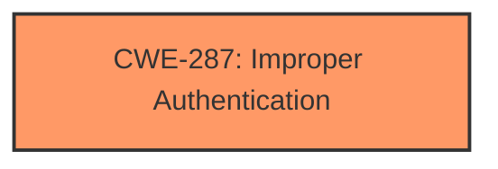

# Enhanced Analysis for CVE-2021-25342

# Summary
| CWE ID    | CWE Name                                                                        | Confidence | CWE Abstraction Level | CWE Vulnerability Mapping Label | CWE-Vulnerability Mapping Notes |
| --------- | ------------------------------------------------------------------------------- | ---------- | ----------------------- | ------------------------------- | ----------------------------- |
| CWE-287   | Improper Authentication                                                         | 0.8        | Class                   | Allowed-with-Review           | Discouraged                  |

## Evidence and Confidence

*   **Confidence Score:** 0.8
*   **Evidence Strength:** MEDIUM

## Relationship Analysis
The primary CWE, CWE-287 (Improper Authentication), is a Class-level CWE. The retriever results also included related CWEs such as CWE-290 (Authentication Bypass by Spoofing) and CWE-302 (Authentication Bypass by Assumed-Immutable Data). However, based on the provided description, the best fit is CWE-287 as the **calling of a non-existent provider** suggests a fundamental **failure to properly authenticate** the provider being called. CWE-1390 (Weak Authentication) and CWE-306 (Missing Authentication for Critical Function) were suggested alternatives.



## Vulnerability Chain
The chain of events begins with the **calling of a non-existent provider**, which leads to **improper authentication**, and ultimately results in the ability to perform **unauthorized actions**, including a **denial of service attack**.

## Summary of Analysis
The initial assessment focused on the **weakness** of **calling a non-existent provider** and its impact, which is a denial-of-service attack. The primary CWE match from similar CVE descriptions was CWE-287 (Improper Authentication). The retriever results also suggested CWE-287 as a strong candidate.

The vulnerability description states "**Calling of non-existent provider** in SMP sdk prior to version 3.0.9 allows unauthorized actions including denial of service attack by hijacking the provider."

CWE-287 (Improper Authentication) is a Class-level CWE. Although the guidance discourages using class-level CWEs, in this case, it fits the description because the root cause is related to authentication. While more specific CWEs like CWE-306 (Missing Authentication for Critical Function) or CWE-1390 (Weak Authentication) could potentially be considered, the information provided doesn't give enough detail to narrow it down further.

Relevant CWE Information:

# Enhanced Context (25 CWEs)
The following CWEs were identified as potentially relevant to this vulnerability:

## CWE-287: Improper Authentication
**Abstraction:** Class
**Status:** Draft

### Description
When an actor claims to have a given identity, the product does not prove or insufficiently proves that the claim is correct.

### Extended Description
Not provided

### Alternative Terms
authentification: An alternate term is "authentification", which appears to be most commonly used by people from non-English-speaking countries.
AuthN: "AuthN" is typically used as an abbreviation of "authentication" within the web application security community. It is also distinct from "AuthZ," which is an abbreviation of "authorization." The use of "Auth" as an abbreviation is discouraged, since it could be used for either authentication or authorization.
AuthC: "AuthC" is used as an abbreviation of "authentication," but it appears to used less frequently than "AuthN."

### Relationships
ChildOf -> CWE-284
ChildOf -> CWE-284

### Mapping Guidance
**Usage:** Discouraged
**Rationale:** This CWE entry might be misused when lower-level CWE entries are likely to be applicable. It is a level-1 Class (i.e., a child of a Pillar).
**Comments:** Consider children or descendants, beginning with CWE-1390: Weak Authentication or CWE-306: Missing Authentication for Critical Function.
**Reasons:**
- Frequent Misuse
**Suggested Alternatives:**
- CWE-1390: Weak Authentication
- CWE-306: Missing Authentication for Critical Function


## CWE Relationship Analysis

Current CWEs represent these abstraction levels: .


### Vulnerability Chain Analysis

**Chain starting from CWE-306:**
- 306 (Missing Authentication for Critical Function) - ROOT


**Chain starting from CWE-284:**
- 284 (Improper Access Control) - ROOT


### CWE Relationship Diagram

```mermaid
graph TD
    classDef primary fill:#f96,stroke:#333,stroke-width:2px
    classDef secondary fill:#69f,stroke:#333
    classDef tertiary fill:#9e9,stroke:#333
```