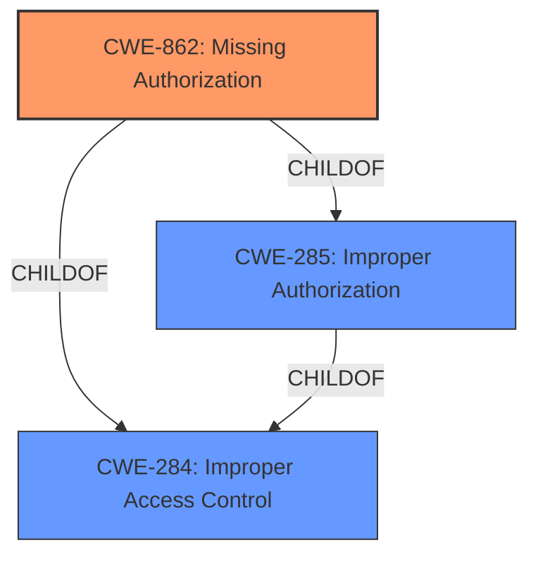

# Raw Analyzer Response for CVE-2021-25344

# Summary
| CWE ID | CWE Name | Confidence | CWE Abstraction Level | CWE Vulnerability Mapping Label | CWE-Vulnerability Mapping Notes |
|---|---|---|---|---|---|
| CWE-862 | Missing Authorization | 1.0 | Class | Allowed-with-Review | Primary |

## Evidence and Confidence

*   **Confidence Score:** 1.0
*   **Evidence Strength:** HIGH

## Relationship Analysis
The primary relationship that influenced the selection was the ChildOf relationship between CWE-862 and CWE-285 (Improper Authorization) and CWE-284 (Improper Access Control). CWE-862 is a more specific Class-level weakness that directly addresses the **missing permission check**, making it a better fit than its more general parents. The abstraction level was a key factor in selecting CWE-862, as it represents the **root cause** at an appropriate level of detail.

## Vulnerability Chain
The vulnerability chain is straightforward:
1.  **Root Cause:** **Missing permission check** (CWE-862)
2.  **Impact:** Attackers gain access to devices serial number.

## Summary of Analysis
The analysis is based on the provided evidence, specifically the "Vulnerability Description Key Phrases" which indicates the **rootcause** as "**Missing permission check**".

The retriever results listed CWE-862 (Missing Authorization) as the top candidate, which aligns with the vulnerability description. The CWE description states: "The product does not perform an authorization check when an actor attempts to access a resource or perform an action." This directly matches the provided vulnerability description, confirming its relevance. The official MITRE mapping guidance suggests reviewing child entries for a better fit, but in this case, the Class-level CWE-862 accurately describes the **root cause**.

Other CWEs were considered but deemed less suitable:

*   CWE-285 (Improper Authorization): While related, it's a higher-level class and less specific than CWE-862. The description also mentions that CWE-285 is discouraged and suggests looking at its children, which led to the selection of CWE-862.
*   CWE-280 (Improper Handling of Insufficient Permissions or Privileges): This CWE focuses on incorrect handling when privileges are insufficient, which isn't the primary issue here. The main issue is the **missing permission check** itself.
*   CWE-306 (Missing Authentication for Critical Function): While related to security, it's more focused on the absence of authentication, whereas the description specifies that an authorization check is **missing**.

The final decision to assign CWE-862 is based on the direct evidence of a **missing permission check**, the alignment of the CWE description with the vulnerability, and the hierarchical relationship analysis that favored a more specific Class-level weakness.