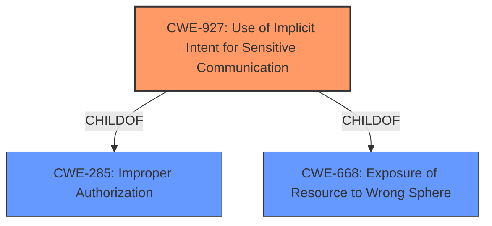

# Enhanced Analysis for CVE-2021-25349

# Summary
| CWE ID | CWE Name | Confidence | CWE Abstraction Level | CWE Vulnerability Mapping Label | CWE-Vulnerability Mapping Notes |
|---|---|---|---|---|---|
| CWE-927 | Use of Implicit Intent for Sensitive Communication | 0.8 | Variant | Allowed | Primary CWE: The application is using an **unsafe PendingIntent**, which aligns with the implicit intent vulnerability. |
| CWE-285 | Improper Authorization | 0.6 | Class | Discouraged | Secondary CWE: The **unsafe PendingIntent** is being used to perform an unauthorized action. |

## Evidence and Confidence

*   **Confidence Score:** 0.7
*   **Evidence Strength:** MEDIUM

## Relationship Analysis
The primary CWE is CWE-927, which is a variant of CWE-285 and CWE-668. CWE-285 is a class-level CWE that describes improper authorization. The relationship between these CWEs highlights that the use of implicit intents leads to broader authorization issues.



## Vulnerability Chain
The vulnerability chain starts with the use of an **unsafe PendingIntent** (CWE-927), which then leads to an unauthorized action due to the lack of proper authorization (CWE-285).

## Summary of Analysis
The initial analysis focused on identifying the root cause of the vulnerability, which is the use of an **unsafe PendingIntent**. The supporting evidence comes from the vulnerability description, which states "**unsafe PendingIntent** in Slow Motion Editor prior to version 3.5.18.5 allows local attackers unauthorized action without permission via hijacking the PendingIntent."

The retriever results indicated CWE-927 as a potential match. CWE-927, "Use of Implicit Intent for Sensitive Communication," is a variant-level CWE that accurately describes the vulnerability. The vulnerability description's reference to "**unsafe PendingIntent**" aligns well with the description of CWE-927.

CWE-285, "Improper Authorization," was considered as a secondary CWE, as the **unsafe PendingIntent** ultimately leads to unauthorized actions. However, CWE-285 is a class-level CWE, and CWE-927 provides a more specific description of the root cause.

The final decision was to select CWE-927 as the primary CWE because it is a variant-level CWE that accurately describes the vulnerability. The use of the **unsafe PendingIntent** is the root cause of the unauthorized action, and CWE-927 directly addresses this issue.

Relevant CWE Information:

# Enhanced Context (25 CWEs)
The following CWEs were identified as potentially relevant to this vulnerability:

## CWE-927: Use of Implicit Intent for Sensitive Communication
**Abstraction Level**: Variant
**Similarity Score**: 0.75
**Source**: dense

**Description**:
The Android application uses an implicit intent for transmitting sensitive data to other applications.

**Mapping Guidance**:
- Usage: Allowed
- Rationale: This CWE entry is at the Variant level of abstraction, which is a preferred level of abstraction for mapping to the root causes of vulnerabilities.


## CWE Relationship Analysis

Current CWEs represent these abstraction levels: .


### Vulnerability Chain Analysis

**Chain starting from CWE-285:**
- 285 (Improper Authorization) - ROOT


**Chain starting from CWE-927:**
- 927 (Use of Implicit Intent for Sensitive Communication) - ROOT


### CWE Relationship Diagram

```mermaid
graph TD
    classDef primary fill:#f96,stroke:#333,stroke-width:2px
    classDef secondary fill:#69f,stroke:#333
    classDef tertiary fill:#9e9,stroke:#333
```