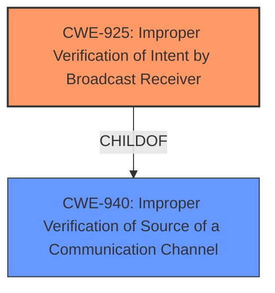

# Raw Analyzer Response for CVE-2021-25357

# Summary
| CWE ID | CWE Name | Confidence | CWE Abstraction Level | CWE Vulnerability Mapping Label | CWE-Vulnerability Mapping Notes |
|---|---|---|---|---|---|
| CWE-925 | Improper Verification of Intent by Broadcast Receiver | 0.7 | Variant | Allowed | Primary CWE |

## Evidence and Confidence

*   **Confidence Score:** 0.7
*   **Evidence Strength:** MEDIUM

## Relationship Analysis
The primary CWE, CWE-925, is a Variant of CWE-940, indicating a specialized type of vulnerability related to broadcast receivers in Android applications. The analysis focused on the specific nature of the **intent verification failure** within the context of broadcast receivers. The abstraction level influenced the choice, prioritizing the most specific Variant available.

## Vulnerability Chain
The vulnerability involves a **pendingIntent hijacking**, which leads to the unprivileged application being able to access contact information.
  - The **weakness** is in the **improper verification** of the intent's source by the broadcast receiver.
  - This allows an unprivileged application to send a crafted intent.
  - The impact is unauthorized access to contact information.

## Summary of Analysis
The initial analysis identified several potential CWEs, including CWE-927, CWE-732, and CWE-926. However, after careful consideration, CWE-925 was chosen as the primary CWE.

The decision to map the vulnerability to CWE-925 is based on the vulnerability description indicating a **pendingIntent hijacking**, which means the application does not properly verify that the intent came from an authorized source. The retriever results listed CWE-925 as a potential candidate, and the CWE description matches the **weakness** exhibited.

The evidence for this mapping is the "Vulnerability Description Key Phrases" section, which highlights the **weakness** as **pendingIntent hijacking**. The description of CWE-925, "The Android application uses a Broadcast Receiver that receives an Intent but does not properly verify that the Intent came from an authorized source," directly aligns with this **weakness**.

The rationale for selecting a Variant-level CWE is to provide the most specific classification possible. While other CWEs, such as CWE-285 (Improper Authorization), might be relevant at a higher level, CWE-925 directly addresses the specific Android component and the nature of the **verification failure**.

The confidence in this mapping is rated as 0.7 due to the limited details available in the vulnerability description. The absence of a detailed explanation of the attack vector reduces the certainty of the mapping.

CWE-20 (Improper Input Validation) was considered but not selected because the vulnerability is not primarily about validating the content of the intent but rather about verifying its source. CWE-22 (Improper Limitation of a Pathname to a Restricted Directory ('Path Traversal')) was also considered but deemed irrelevant as the vulnerability does not involve path manipulation.

Relevant CWE Information:

# Enhanced Context (25 CWEs)

## CWE-280: Improper Handling of Insufficient Permissions or Privileges
**Abstraction Level**: Base
**Similarity Score**: 0.76
**Source**: dense

**Description**:
The product does not handle or incorrectly handles when it has insufficient privileges to access resources or functionality as specified by their permissions. This may cause it to follow unexpected code paths that may leave the product in an invalid state.

**Mapping Guidance**:
- Usage: Allowed
- Rationale: This CWE entry is at the Base level of abstraction, which is a preferred level of abstraction for mapping to the root causes of vulnerabilities.

## CWE-274: Improper Handling of Insufficient Privileges
**Abstraction Level**: Base
**Similarity Score**: 0.76
**Source**: dense

**Description**:
The product does not handle or incorrectly handles when it has insufficient privileges to perform an operation, leading to resultant weaknesses.

**Mapping Guidance**:
- Usage: Discouraged
- Rationale: This CWE entry could be deprecated in a future version of CWE.

## CWE-266: Incorrect Privilege Assignment
**Abstraction Level**: Base
**Similarity Score**: 0.74
**Source**: dense

**Description**:
A product incorrectly assigns a privilege to a particular actor, creating an unintended sphere of control for that actor.

**Mapping Guidance**:
- Usage: Allowed
- Rationale: This CWE entry is at the Base level of abstraction, which is a preferred level of abstraction for mapping to the root causes of vulnerabilities.

## CWE-807: Reliance on Untrusted Inputs in a Security Decision
**Abstraction Level**: Base
**Similarity Score**: 0.74
**Source**: dense

**Description**:
The product uses a protection mechanism that relies on the existence or values of an input, but the input can be modified by an untrusted actor in a way that bypasses the protection mechanism.

**Mapping Guidance**:
- Usage: Allowed
- Rationale: This CWE entry is at the Base level of abstraction, which is a preferred level of abstraction for mapping to the root causes of vulnerabilities.

## CWE-267: Privilege Defined With Unsafe Actions
**Abstraction Level**: Base
**Similarity Score**: 0.74
**Source**: dense

**Description**:
A particular privilege, role, capability, or right can be used to perform unsafe actions that were not intended, even when it is assigned to the correct entity.

**Mapping Guidance**:
- Usage: Allowed
- Rationale: This CWE entry is at the Base level of abstraction, which is a preferred level of abstraction for mapping to the root causes of vulnerabilities.

## CWE-653: Improper Isolation or Compartmentalization
**Abstraction Level**: Class
**Similarity Score**: 0.74
**Source**: dense

**Description**:
The product does not properly compartmentalize or isolate functionality, processes, or resources that require different privilege levels, rights, or permissions.

**Mapping Guidance**:
- Usage: Allowed
- Rationale: This CWE entry is at the Base level of abstraction, which is a preferred level of abstraction for mapping to the root causes of vulnerabilities.

## CWE-1220: Insufficient Granularity of Access Control
**Abstraction Level**: Base
**Similarity Score**: 0.74
**Source**: dense

**Description**:
The product implements access controls via a policy or other feature with the intention to disable or restrict accesses (reads and/or writes) to assets in a system from untrusted agents. However, implemented access controls lack required granularity, which renders the control policy too broad because it allows accesses from unauthorized agents to the security-sensitive assets.

**Mapping Guidance**:
- Usage: Allowed
- Rationale: This CWE entry is at the Base level of abstraction, which is a preferred level of abstraction for mapping to the root causes of vulnerabilities.

## CWE-639: Authorization Bypass Through User-Controlled Key
**Abstraction Level**: Base
**Similarity Score**: 0.74
**Source**: dense

**Description**:
The system's authorization functionality does not prevent one user from gaining access to another user's data or record by modifying the key value identifying the data.

**Mapping Guidance**:
- Usage: Allowed
- Rationale: This CWE entry is at the Base level of abstraction, which is a preferred level of abstraction for mapping to the root causes of vulnerabilities.

## CWE-269: Improper Privilege Management
**Abstraction Level**: Class
**Similarity Score**: 0.73
**Source**: dense

**Description**:
The product does not properly assign, modify, track, or check privileges for an actor, creating an unintended sphere of control for that actor.

**Mapping Guidance**:
- Usage: Discouraged
- Rationale: CWE-269 is commonly misused. It can be conflated with "privilege escalation," which is a technical impact that is listed in many low-information vulnerability reports [REF-1287]. It is not useful for trend analysis.

## CWE-668: Exposure of Resource to Wrong Sphere
**Abstraction Level**: Class
**Similarity Score**: 0.73
**Source**: dense

**Description**:
The product exposes a resource to the wrong control sphere, providing unintended actors with inappropriate access to the resource.

**Mapping Guidance**:
- Usage: Discouraged
- Rationale: CWE-668 is high-level and is often misused as a catch-all when lower-level CWE IDs might be applicable. It is sometimes used for low-information vulnerability reports [REF-1287]. It is a level-1 Class (i.e., a child of a Pillar). It is not useful for trend analysis.

## CWE-22: Improper Limitation of a Pathname to a Restricted Directory ('Path Traversal')
**Abstraction Level**: Base
**Similarity Score**: 7725.55
**Source**: sparse

**Description**:
The product uses external input to construct a pathname that is intended to identify