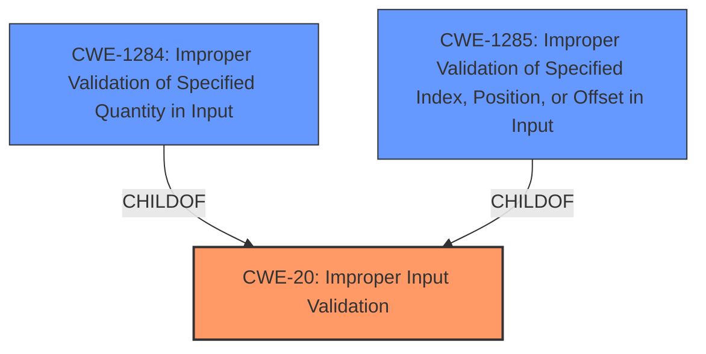

# Raw Analyzer Response for CVE-2021-25360

# Summary
| CWE ID | CWE Name | Confidence | CWE Abstraction Level | CWE Vulnerability Mapping Label | CWE-Vulnerability Mapping Notes |
|---|---|---|---|---|---|
| CWE-20 (Primary) | Improper Input Validation | 0.75 | Class | Discouraged | Consider lower-level children |

## Evidence and Confidence

*   **Confidence Score:** 0.75
*   **Evidence Strength:** MEDIUM

## Relationship Analysis
The primary relationship considered here is the hierarchical one. CWE-20 is a Class-level CWE, and the description mentions **improper input validation** as the root cause. The mapping guidance for CWE-20 suggests considering more specific child CWEs if possible. Several child CWEs were considered and are described in the Summary of Analysis, including CWE-1284 and CWE-1285, but none seemed to fit better than the general **improper input validation**.

## Vulnerability Chain
The vulnerability chain is relatively simple: **improper input validation** leads to the ability to execute arbitrary code.

## Summary of Analysis
The vulnerability description states: "An **improper input validation** vulnerability in libswmfextractor library prior to SMR APR-2021 Release 1 allows attackers to execute arbitrary code on mediaextractor process." The key phrase identified is "**improper input validation**" as the root cause.

The Primary CWE Match for similar CVE Descriptions is CWE-119 (Improper Restriction of Operations within the Bounds of a Memory Buffer). However, the description doesn't explicitly mention a buffer or memory operation, so CWE-119 may not be the best fit.

The Retriever Results list CWE-20 (Improper Input Validation) as a possible candidate, but with a Discouraged usage. However, the description clearly states **improper input validation** as the root cause. The mapping guidance for CWE-20 suggests considering lower-level children.

CWE-1284 (Improper Validation of Specified Quantity in Input) and CWE-1285 (Improper Validation of Specified Index, Position, or Offset in Input) are also listed, but there isn't enough information to determine if the **improper input validation** relates to a quantity, index, position, or offset specifically.

CWE-94 (Improper Control of Generation of Code ('Code Injection')) is a possibility since the impact is arbitrary code execution, but the root cause is still **improper input validation**, and CWE-94 is more about the construction of code segments using externally-influenced input, which isn't clearly stated here.

Given the direct statement of **improper input validation** as the root cause, and the lack of specific details to map to a more specific child of CWE-20, I'm selecting CWE-20 as the primary CWE. Although the usage is Discouraged, the evidence directly points to this weakness.

Relevant CWE Information:
*   **CWE-20: Improper Input Validation** - The product receives input or data, but it does not validate or incorrectly validates that the input has the properties that are required to process the data safely and correctly. The vulnerability description states **improper input validation** directly, making this a relevant candidate.
*   **CWE-1284: Improper Validation of Specified Quantity in Input** - The product receives input that is expected to specify a quantity (such as size or length), but it does not validate or incorrectly validates that the quantity has the required properties. - Considered, but there's no specific mention of a quantity being involved.
*   **CWE-1285: Improper Validation of Specified Index, Position, or Offset in Input** - The product receives input that is expected to specify an index, position, or offset into an indexable resource such as a buffer or file, but it does not validate or incorrectly validates that the specified index/position/offset has the required properties. - Considered, but there's no specific mention of an index, position, or offset being involved.
*   **CWE-94: Improper Control of Generation of Code ('Code Injection')** - The product constructs all or part of a code segment using externally-influenced input from an upstream component, but it does not neutralize or incorrectly neutralizes special elements that could modify the syntax or behavior of the intended code segment. - Considered, the impact is code execution, but the root cause is **improper input validation**, and CWE-94 is more specifically about code injection.

I am overriding the general mapping guidance that suggests avoiding CWE-20 because the vulnerability description explicitly states **improper input validation** as the root cause. The confidence level is relatively high because the vulnerability description directly names the weakness.