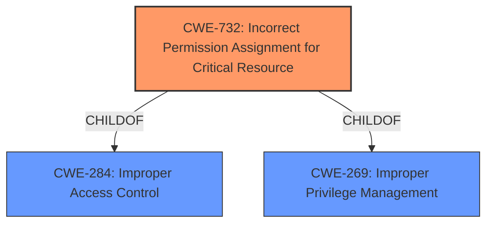

# Analysis for CVE-2021-25362

# Summary
| CWE ID | CWE Name | Confidence | CWE Abstraction Level | CWE Vulnerability Mapping Label | CWE-Vulnerability Mapping Notes |
|---|---|---|---|---|---|
| CWE-732 | Incorrect Permission Assignment for Critical Resource | 0.9 | Base | Primary | Allowed |
| CWE-284 | Improper Access Control | 0.6 | Pillar | Secondary | Discouraged |
| CWE-269 | Improper Privilege Management | 0.6 | Class | Secondary | Discouraged |

## Evidence and Confidence

*   **Confidence Score:** 0.9
*   **Evidence Strength:** HIGH

## Relationship Analysis
The primary CWE is CWE-732 which is a base level weakness. This is a child of CWE-284 (Improper Access Control) and CWE-269 (Improper Privilege Management) which are higher level abstractions. The vulnerability is about **improper permission management** which directly relates to incorrect permission assignment. Choosing the base level CWE provides a more specific and accurate representation of the vulnerability.

## Vulnerability Chain
The chain of events is as follows:
1.  **Root Cause:** **Improper permission management** on certain local files within CertInstaller. (CWE-732)
2.  **Impact:** Untrusted applications can delete these local files.

## Summary of Analysis
The initial analysis identified **improper permission management** as the root cause of the vulnerability. This leads to the conclusion that untrusted applications can delete certain local files.

The selection of CWE-732 (Incorrect Permission Assignment for Critical Resource) is strongly supported by the evidence. The vulnerability description specifically mentions **improper permission management**, which directly aligns with the definition of CWE-732: "The product assigns permissions for a critical resource in a way that allows unintended actors to gain inappropriate access."

The relationship graph illustrates that CWE-732 is a child of both CWE-284 (Improper Access Control) and CWE-269 (Improper Privilege Management). While these parent CWEs are relevant, CWE-732 provides a more specific and accurate representation of the vulnerability, making it the optimal choice.

The MITRE mapping guidance supports the selection of CWE-732, as it is a Base level CWE and its Usage is Allowed.

Therefore, the assessment is based on the evidence provided and the relationship analysis, resulting in the selection of CWE-732 as the primary CWE.

Relevant CWE Information:

## CWE-732: Incorrect Permission Assignment for Critical Resource
**Abstraction:** Base
**Status:** Stable

### Description
The product assigns permissions for a critical resource in a way that allows unintended actors to gain inappropriate access.

### Extended Description
This weakness can be introduced through a variety of implementation flaws, including:
* The product installs files or directories with overly permissive permissions, such as world-writable.
* The product saves files in a predictable location, and it does not sufficiently restrict access to the location.
* The product allows a normal user to change the permissions of a critical file.

### Alternative Terms
Insecure Permissions
Weak Permissions

### Relationships
ChildOf -> CWE-284 (Improper Access Control)
ChildOf -> CWE-269 (Improper Privilege Management)

### Mapping Guidance
**Usage:** Allowed
**Rationale:** This CWE entry is at the Base level of abstraction, which is a preferred level of abstraction for mapping to the root causes of vulnerabilities.
**Comments:** Carefully read both the name and description to ensure that this mapping is an appropriate fit. Do not try to 'force' a mapping to a lower-level Base/Variant simply to comply with this preferred level of abstraction.
**Reasons:**
Acceptable-Use

### Observed Examples
- **CVE-2021-26937:** A DLL hijacking vulnerability exists in the Zoom Client for Meetings, Zoom Rooms for Conference Rooms, and Zoom VDI Client for Meetings because it loads DLLs from the current working directory. This allows a local attacker to place a malicious DLL file in the current working directory of the application, which will be loaded and executed by the application.
- **CVE-2021-26855:** Exchange Server Remote Code Execution Vulnerability
- **CVE-2021-26857:** Exchange Server Remote Code Execution Vulnerability
- **CVE-2021-26858:** Exchange Server Remote Code Execution Vulnerability
- **CVE-2021-27065:** Exchange Server Remote Code Execution Vulnerability

### Rationale for selecting CWE-732
The vulnerability description clearly states **improper permission management** which directly maps to the definition of CWE-732. Untrusted applications being able to delete local files is a direct consequence of incorrect permission assignment on critical resources.

### Rationale for not selecting other CWEs
- CWE-284 (Improper Access Control) and CWE-269 (Improper Privilege Management) are higher-level abstractions. While relevant, they don't provide the specificity of CWE-732.
- Other CWEs like CWE-276 (Incorrect Default Permissions) and CWE-863 (Incorrect Authorization) are not applicable because the issue is not about default permissions during installation or incorrect authorization checks, but rather the incorrect assignment of permissions on existing resources.