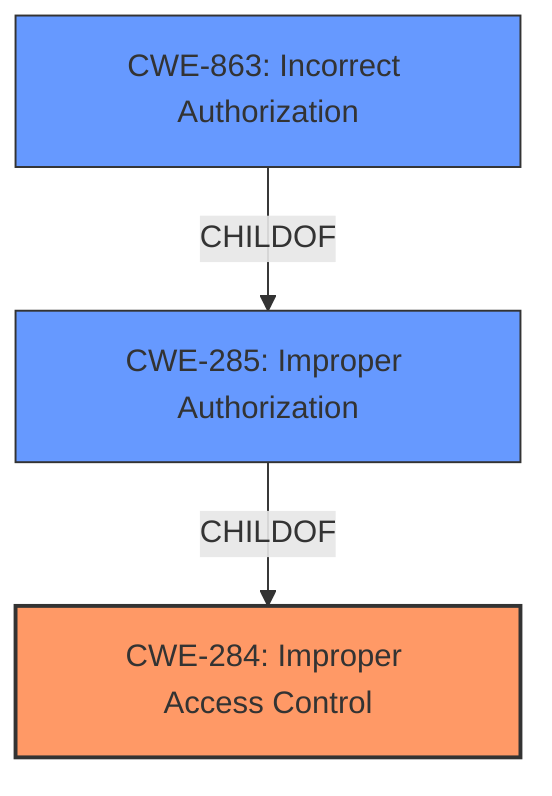

# Analysis for CVE-2021-25363

# Summary
| CWE ID | CWE Name | Confidence | CWE Abstraction Level | CWE Vulnerability Mapping Label | CWE-Vulnerability Mapping Notes |
|---|---|---|---|---|---|
| CWE-284 | Improper Access Control | 0.75 | Pillar | Primary | Discouraged |
| CWE-285 | Improper Authorization | 0.60 | Class | Secondary | Discouraged |
| CWE-863 | Incorrect Authorization | 0.50 | Class | Secondary | Allowed-with-Review |

## Evidence and Confidence

*   **Confidence Score:** 0.75
*   **Evidence Strength:** MEDIUM

## Relationship Analysis
The primary CWE chosen is CWE-284, which is a Pillar level CWE. Due to lack of more specific details, it is difficult to narrow down to a Base or Variant CWE. CWE-284 is a parent of CWE-285 and many authorization and authentication related CWEs. CWE-285, Improper Authorization, is a child of CWE-284. CWE-863, Incorrect Authorization, is a more specific type of CWE-285. However, based on the vulnerability description, it is difficult to confirm that the authorization check was performed incorrectly, versus not performed at all.

## Vulnerability Chain
The vulnerability chain starts with **improper access control**, which allows untrusted applications to access running processes and delete local files.
  - CWE-284 Improper Access Control (Root Cause)
  - Access running processes and delete local files (Impact)

## Summary of Analysis
The initial analysis focused on the **improper access control** vulnerability description, which is the root cause. The vulnerability allows untrusted applications to access running processes and delete local files, which is the impact.

Based on the retriever results, CWE-284, CWE-285, and CWE-863 were considered. CWE-284 is a high-level Pillar, while CWE-285 is a Class, and CWE-863 is also a Class, and a child of CWE-285.

CWE-284 is selected as the primary CWE because the description explicitly mentions **improper access control**. The relationship graph shows that CWE-285 and CWE-863 are children of CWE-284, providing a more granular view of the vulnerability, but the current evidence is insufficient to confirm.

CWE-284 is at the optimal level of specificity, given the available evidence. While more specific CWEs like CWE-863 (Incorrect Authorization) exist, the description does not provide enough detail to confirm that the authorization was performed incorrectly, rather than missing altogether. Further investigation would be needed to determine a more specific CWE.

# Relevant CWE Information:

## Enhanced Context (25 CWEs)

### CWE-284: Improper Access Control
**Abstraction:** Pillar
**Similarity Score**: 0.156
**Source**: sparse

**Description**:
The product does not restrict or incorrectly restricts access to a resource from an unauthorized actor.

**Mapping Guidance**:
- Usage: Discouraged
- Rationale: CWE-284 is extremely high-level, a Pillar. Its name, "Improper Access Control," is often misused in low-information vulnerability reports [REF-1287] or by active use of the OWASP Top Ten, such as "A01:2021-Broken Access Control". It is not useful for trend analysis.

### CWE-285: Improper Authorization
**Abstraction:** Class
**Similarity Score**: 0.142
**Source**: sparse

**Description**:
The product does not perform or incorrectly performs an authorization check when an actor attempts to access a resource or perform an action.

**Mapping Guidance**:
- Usage: Discouraged
- Rationale: CWE-285 is high-level and lower-level CWEs can frequently be used instead. It is a level-1 Class (i.e., a child of a Pillar).

### CWE-863: Incorrect Authorization
**Abstraction:** Class
**Similarity Score**: 5156.84
**Source**: sparse

**Description**:
The product performs an authorization check when an actor attempts to access a resource or perform an action, but it does not correctly perform the check.

**Mapping Guidance**:
- Usage: Allowed-with-Review
- Rationale: This CWE entry is a Class and might have Base-level children that would be more appropriate