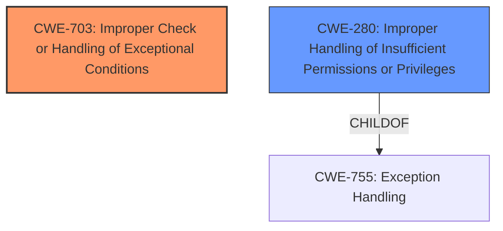

# Raw Analyzer Response for CVE-2021-25365

# Summary
| CWE ID | CWE Name | Confidence | CWE Abstraction Level | CWE Vulnerability Mapping Label | CWE-Vulnerability Mapping Notes |
|---|---|---|---|---|---|
| CWE-703 | Improper Check or Handling of Exceptional Conditions | 0.75 | Pillar | Allowed-with-Review | Primary CWE |
| CWE-280 | Improper Handling of Insufficient Permissions or Privileges | 0.5 | Base | Allowed | Secondary Candidate |

## Evidence and Confidence

*   **Confidence Score:** 0.7
*   **Evidence Strength:** MEDIUM

## Relationship Analysis
The primary CWE selected is CWE-703, which is a Pillar. While this is a high-level category, it aligns with the description of **improper exception control**, as exceptions represent unusual conditions that must be checked and handled. CWE-703's mapping guidance suggests considering more specific children, but none were a good fit. CWE-280, a base level CWE, was considered as a secondary candidate because the vulnerability allows unprivileged applications to access APIs.

## Vulnerability Chain
The vulnerability chain starts with an **improper exception control** (CWE-703). This leads to unprivileged applications being able to access the API in softsimd. This might be related to privileges and could potentially lead to CWE-280, although the evidence is weaker.

## Summary of Analysis
The primary assessment is based on the **Vulnerability Description Key Phrases**, particularly the **rootcause** of **improper exception control**. The description directly mentions the **improper exception control**, which is indicative of CWE-703, Improper Check or Handling of Exceptional Conditions.

The relationship graph shows the link between CWE-703 and a possible child, and CWE-280 with its child. This structure highlights how the vulnerability can be viewed at different levels of abstraction, but the evidence directly supports the **improper exception control**, making CWE-703 a relevant mapping.

The final decision favors CWE-703 due to the explicit mention of **improper exception control** in the vulnerability description. While this is a high-level mapping, it accurately reflects the core issue.

Relevant CWE Information:

# Enhanced Context (25 CWEs)

## CWE-280: Improper Handling of Insufficient Permissions or Privileges
**Abstraction Level**: Base
**Similarity Score**: 0.80
**Source**: dense

**Description**:
The product does not handle or incorrectly handles when it has insufficient privileges to access resources or functionality as specified by their permissions. This may cause it to follow unexpected code paths that may leave the product in an invalid state.

**Mapping Guidance**:
- Usage: Allowed
- Rationale: This CWE entry is at the Base level of abstraction, which is a preferred level of abstraction for mapping to the root causes of vulnerabilities.

## CWE-703: Improper Check or Handling of Exceptional Conditions
**Abstraction:** Pillar
**Similarity Score**: 0.77
**Source**: dense

**Description**:
The product does not properly anticipate or handle exceptional conditions that rarely occur during normal operation of the product.

**Mapping Guidance**:
- Usage: Discouraged
- Rationale: This CWE entry is extremely high-level, a Pillar.

### Analysis of Selected CWEs:

*   **CWE-703: Improper Check or Handling of Exceptional Conditions**
    *   **Match:** The vulnerability description explicitly states "**improper exception control**." Exceptions are unusual or exceptional conditions, aligning with CWE-703's description.
    *   **Impact:** This can lead to unexpected behavior or incorrect state management within the application.
    *   **Relationships:** As a Pillar, CWE-703 is high-level, but no child CWE offers a better fit.
    *   **Guidance:** Despite being discouraged due to its high level, it accurately represents the core weakness.
    *   **Confidence:** 0.75
*   **CWE-280: Improper Handling of Insufficient Permissions or Privileges**
    *   **Match:** The description mentions that unprivileged applications can access the API, suggesting a potential issue with handling privileges.
    *   **Impact:** Allows unprivileged applications to access sensitive APIs.
    *   **Relationships:** Child of CWE-755: Exception Handling
    *   **Guidance:** Allowed as a Base level CWE.
    *   **Confidence:** 0.5

### Analysis of Rejected CWEs:

*   **CWE-927: Use of Implicit Intent for Sensitive Communication**: This is Android specific and is not applicable here.
*   **CWE-476: NULL Pointer Dereference**: There is no mention of pointers in the vulnerability description.
*   **CWE-284: Improper Access Control**: Too high-level and the root cause is an exception handling issue.
*   **CWE-269: Improper Privilege Management**: The description mentions that unprivileged applications can access the API, suggesting a potential issue with handling privileges. However the root cause is still the **improper exception control**.
*   **CWE-1421: Exposure of Sensitive Information in Shared Microarchitectural Structures during Transient Execution**: This is related to hardware implementation and is not applicable here.
*   **CWE-252: Unchecked Return Value**: There is no mention of return values in the vulnerability description.
*   **CWE-285: Improper Authorization**: Too high-level and the root cause is an exception handling issue.
*   **CWE-926: Improper Export of Android Application Components**: This is Android specific and is not applicable here.