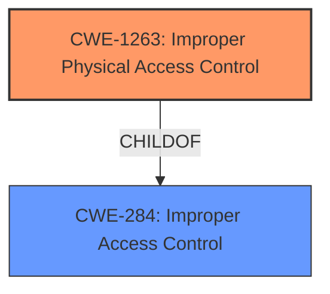

# Raw Analyzer Response for CVE-2021-25366

# Summary
| CWE ID  | CWE Name                 | Confidence | CWE Abstraction Level | CWE Vulnerability Mapping Label | CWE-Vulnerability Mapping Notes |
| :------- | :----------------------- | :--------- | :-------------------- | :----------------------------- | :----------------------------- |
| CWE-1263 | Improper Physical Access Control | 0.8      | Class               | Allowed-with-Review            | Primary CWE                    |
| CWE-284  | Improper Access Control    | 0.6      | Pillar                | Discouraged                   | Secondary Candidate             |

## Evidence and Confidence

*   **Confidence Score:** 0.7
*   **Evidence Strength:** MEDIUM

## Relationship Analysis
The primary relationship influencing my decision is the ChildOf relationship, with CWE-1263 (Improper Physical Access Control) being a child of CWE-284 (Improper Access Control). I chose CWE-1263 as the primary CWE because it is more specific to the scenario described in the vulnerability description.

## Vulnerability Chain
The chain of events starts with **Improper access control**, leading to the bypass of secret modes authentication. The root cause is the access control, and the impact is bypassing authentication.

## Summary of Analysis
My analysis is based on the provided vulnerability description, which indicates "**Improper access control** in Samsung Internet prior to version 13.2.1.70 allows physically proximate attackers to bypass the secret modes authentication."

The selection of CWE-1263 is primarily based on the phrase "physically proximate attackers." This phrase suggests that the vulnerability involves a physical aspect of access control, which aligns with the description of CWE-1263.

CWE-284 is a parent (Pillar) of other more specific access control related CWEs. Because the vulnerability involved physically proximate attackers, CWE-1263 was chosen since it is more specific and therefore more appropriate.

Relevant CWE Information:

# Enhanced Context (25 CWEs)

## CWE-1263: Improper Physical Access Control
**Abstraction:** Class
**Similarity Score**: 0.76
**Source**: dense

**Description**:
The product is designed with access restricted to certain information, but it does not sufficiently protect against an unauthorized actor with physical access to these areas.

**Mapping Guidance**:
- Usage: Allowed-with-Review
- Rationale: This CWE entry is a Class and might have Base-level children that would be more appropriate

## CWE-284: Improper Access Control
**Abstraction:** Pillar
**Similarity Score**: N/A
**Source**: sparse

**Description**:
The product does not restrict or incorrectly restricts access to a resource from an unauthorized actor.

**Mapping Guidance**:
- Usage: Discouraged
- Rationale: CWE-284 is extremely high-level, a Pillar. Its name, "Improper Access Control," is often misused in low-information vulnerability reports or by active use of the OWASP Top Ten, such as "A01:2021-Broken Access Control". It is not useful for trend analysis.
**Comments:** Consider using descendants of CWE-284 that are more specific to the kind of access control involved

I considered CWE-287 (Improper Authentication) because bypassing authentication is mentioned in the vulnerability description. However, the root cause is **improper access control**, making CWE-1263 and its parent, CWE-284, more relevant. I also considered CWE-798 (Use of Hard-coded Credentials), but there's no evidence to support its use, and so it was not selected.