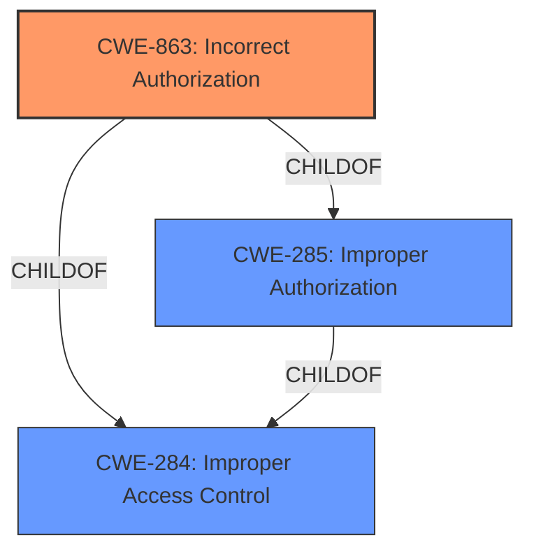

# Analysis Report for CVE-2021-25374

# Vulnerability Analysis Report: CVE-2021-25374

## Description


## Analysis (with Relationship Data)

# Summary
| CWE ID | CWE Name | Confidence | CWE Abstraction Level | CWE Vulnerability Mapping Label | CWE-Vulnerability Mapping Notes |
|---|---|---|---|---|---|
| CWE-863 | Incorrect Authorization | 0.8 | Class | Primary | Allowed-with-Review |
| CWE-285 | Improper Authorization | 0.6 | Class | Secondary | Discouraged |
| CWE-284 | Improper Access Control | 0.5 | Pillar | Secondary | Discouraged |

## Evidence and Confidence

*   **Confidence Score:** 0.8
*   **Evidence Strength:** MEDIUM

## Relationship Analysis
The primary CWE selected is CWE-863 (**Incorrect Authorization**), a Class-level CWE. It is a child of both CWE-285 (**Improper Authorization**) and CWE-284 (**Improper Access Control**). The selection of CWE-863 is influenced by the vulnerability description explicitly stating "**improper authorization**". While CWE-285 could also apply, CWE-863 is more specific, indicating that an authorization check was performed but done incorrectly. CWE-284 is a high-level Pillar, making it less suitable than its more specific children.



## Vulnerability Chain
The vulnerability chain starts with the **improper authorization** (**CWE-863**). This allows remote attackers to access user data related to Samsung Accounts.

## Summary of Analysis
The initial analysis identified **improper authorization** as the root cause, aligning with the vulnerability description. The retriever results also highlighted CWE-863 and CWE-285 as potential matches. The relationship analysis clarified that CWE-863 is a more specific child of CWE-285 and CWE-284, making it a better fit.

The selection of CWE-863 is based on the explicit mention of "**improper authorization**" in the vulnerability description key phrases.

# Relevant CWE Information:

## CWE-280: Improper Handling of Insufficient Permissions or Privileges 
**Abstraction Level**: Base
**Similarity Score**: 0.77

## CWE-274: Improper Handling of Insufficient Privileges
**Abstraction Level**: Base
**Similarity Score**: 0.76

## CWE-668: Exposure of Resource to Wrong Sphere
**Abstraction Level**: Class
**Similarity Score**: 0.76

## CWE-266: Incorrect Privilege Assignment
**Abstraction Level**: Base
**Similarity Score**: 0.75

## CWE-267: Privilege Defined With Unsafe Actions
**Abstraction Level**: Base
**Similarity Score**: 0.75

## CWE-404: Improper Resource Shutdown or Release
**Abstraction Level**: Class
**Similarity Score**: 0.75

## CWE-345: Insufficient Verification of Data Authenticity
**Abstraction Level**: Class
**Similarity Score**: 0.75

## CWE-667: Improper Locking
**Abstraction Level**: Class
**Similarity Score**: 0.75

## CWE-203: Observable Discrepancy
**Abstraction Level**: Base
**Similarity Score**: 0.75

## CWE-639: Authorization Bypass Through User-Controlled Key
**Abstraction Level**: Base
**Similarity Score**: 0.75

## CWE-863: Incorrect Authorization
**Abstraction Level**: Class
**Similarity Score**: 6695.01

**Description**:
The product performs an authorization check when an actor attempts to access a resource or perform an action, but it does not correctly perform the check.

**Mapping Guidance**:
- Usage: Allowed-with-Review
- Rationale: This CWE entry is a Class and might have Base-level children that would be more appropriate

## CWE-285: Improper Authorization
**Abstraction Level**: Class
**Similarity Score**: 6659.39

**Description**:
The product does not perform or incorrectly performs an authorization check when an actor attempts to access a resource or perform an action.

**Mapping Guidance**:
- Usage: Discouraged
- Rationale: CWE-285 is high-level and lower-level CWEs can frequently be used instead. It is a level-1 Class (i.e., a child of a Pillar).

## CWE-200: Exposure of Sensitive Information to an Unauthorized Actor
**Abstraction Level**: Class
**Similarity Score**: 6547.67

## CWE-639: Authorization Bypass Through User-Controlled Key
**Abstraction Level**: Base
**Similarity Score**: 6462.82

## CWE-287: Improper Authentication
**Abstraction Level**: Class
**Similarity Score**: 6401.03

## CWE-201: Insertion of Sensitive Information Into Sent Data
**Abstraction Level**: base
**Similarity Score**: 4.33

## CWE-1272: Sensitive Information Uncleared Before Debug/Power State Transition
**Abstraction Level**: base
**Similarity Score**: 4.33

## CWE-178: Improper Handling of Case Sensitivity
**Abstraction Level**: base
**Similarity Score**: 3.76

## CWE-1289: Improper Validation of Unsafe Equivalence in Input
**Abstraction Level**: base
**Similarity Score**: 3.64

## CWE-226: Sensitive Information in Resource Not Removed Before Reuse
**Abstraction Level**: Base
**Similarity Score**: 2.89

## CWE-322: Key Exchange without Entity Authentication
**Abstraction Level**: base
**Similarity Score**: 2.87

## CWE-289: Authentication Bypass by Alternate Name
**Abstraction Level**: base
**Similarity Score**: 2.87

## CWE-942: Permissive Cross-domain Policy with Untrusted Domains
**Abstraction Level**: variant
**Similarity Score**: 2.68

## CWE-499: Serializable Class Containing Sensitive Data
**Abstraction Level**: variant
**Similarity Score**: 2.68

## CWE-498: Cloneable Class Containing Sensitive Information
**Abstraction Level**: variant
**Similarity Score**: 2.68


## CWE Relationship Analysis

Current CWEs represent these abstraction levels: .


### Vulnerability Chain Analysis

**Chain starting from CWE-404:**
- 404 (Improper Resource Shutdown or Release) - ROOT


**Chain starting from CWE-266:**
- 266 (Incorrect Privilege Assignment) - ROOT


### CWE Relationship Diagram

```mermaid
graph TD
    classDef primary fill:#f96,stroke:#333,stroke-width:2px
    classDef secondary fill:#69f,stroke:#333
    classDef tertiary fill:#9e9,stroke:#333
```


*Report generated on 2025-04-01 22:55:42*
