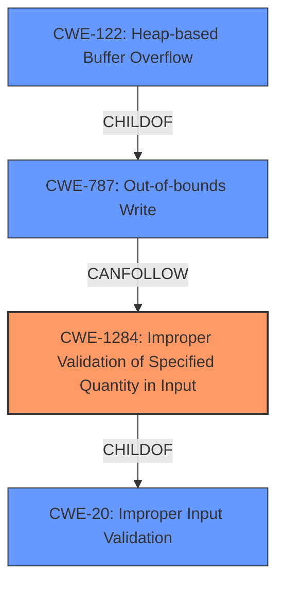

# Analysis Report for CVE-2021-25387

# Vulnerability Analysis Report: CVE-2021-25387

## Description


## Analysis (with Relationship Data)

# Summary
| CWE ID | CWE Name | Confidence | CWE Abstraction Level | CWE Vulnerability Mapping Label | CWE-Vulnerability Mapping Notes |
|---|---|---|---|---|---|
| CWE-1284 | Improper Validation of Specified Quantity in Input | 0.8 | Base | Allowed | Primary CWE. The **improper input validation** involves a quantity, making this a good fit. |
| CWE-787 | Out-of-bounds Write | 0.6 | Base | Allowed | Secondary CWE. The **improper input validation** could lead to a buffer overflow, resulting in an out-of-bounds write. |
| CWE-122 | Heap-based Buffer Overflow | 0.5 | Variant | Allowed | Secondary CWE. It is possible that the **improper input validation** could cause a heap-based buffer overflow.|
| CWE-20 | Improper Input Validation | 0.4 | Class | Discouraged | Secondary CWE. The **improper input validation** is too general and it is preferred to use a more specific CWE such as CWE-1284. |

## Evidence and Confidence

*   **Confidence Score:** 0.7
*   **Evidence Strength:** MEDIUM

## Relationship Analysis
The primary CWE is CWE-1284, which is a child of CWE-20, indicating a more specific type of input validation issue. CWE-787 is a potential consequence of the input validation failure, representing an out-of-bounds write. CWE-122 is a variant of CWE-787, specifying that the out-of-bounds write occurs on the heap. The relationship between these CWEs helps to understand the progression of the vulnerability from the initial flaw (improper input validation) to its potential impact (out-of-bounds write and heap overflow).



## Vulnerability Chain
The vulnerability chain starts with **improper input validation** (CWE-1284) in the `sflacfd_get_frm()` function. This can lead to a buffer overflow, which is represented by CWE-787 (Out-of-bounds Write). If the buffer is allocated on the heap, it becomes a heap-based buffer overflow (CWE-122). The final impact is the ability to execute arbitrary code on the `mediaextractor` process.

## Summary of Analysis
The analysis is based on the provided vulnerability description and the CVE reference links content summary. The **root cause** is identified as **improper input validation**, which could lead to arbitrary code execution. The evidence for this is:

*   "An **improper input validation** vulnerability in sflacfd_get_frm()"
*   "**SVE-2021-20202 (CVE-2021-25387): Arbitrary code execution on mediaextractor process**"
*   "**Root cause of vulnerability:** An improper input validation vulnerability in `sflacfd_get_frm()` within the `libsflacextractor` library."

Based on the retriever results, CWE-20 (Improper Input Validation) is a candidate. However, the mapping guidance for CWE-20 discourages its use when lower-level CWEs are applicable. Given that the vulnerability description mentions that the **improper input validation** could lead to a buffer overflow, the more specific CWE-1284 (Improper Validation of Specified Quantity in Input) is more appropriate. The relationship analysis shows that CWE-1284 is a child of CWE-20, confirming that it is a more specific type of input validation issue.

The description and the retriever results also identified CWE-787 (Out-of-bounds Write) as a potential consequence of the **improper input validation**. If the buffer is allocated on the heap, it becomes a heap-based buffer overflow (CWE-122).

The selected CWEs are at the optimal level of specificity because they accurately represent the vulnerability and its potential impact. CWE-1284 captures the **root cause** of the vulnerability, while CWE-787 and CWE-122 describe the potential impact.

Relevant CWE Information:

# Enhanced Context (25 CWEs)

## CWE-754: Improper Check for Unusual or Exceptional Conditions
**Abstraction Level**: Class
**Similarity Score**: 0.76
**Source**: dense

**Description**:
The product does not check or incorrectly checks for unusual or exceptional conditions that are not expected to occur frequently during day to day operation of the product.

**Mapping Guidance**:
- Usage: Allowed-with-Review
- Rationale: This CWE entry is a Class and might have Base-level children that would be more appropriate

*   This CWE was considered but rejected because the core issue is not about failing to check for unusual conditions, but about failing to validate input.

## CWE-345: Insufficient Verification of Data Authenticity
**Abstraction Level**: Class
**Similarity Score**: 0.76
**Source**: dense

**Description**:
The product does not sufficiently verify the origin or authenticity of data, in a way that causes it to accept invalid data.

**Mapping Guidance**:
- Usage: Discouraged
- Rationale: This CWE entry is a level-1 Class (i.e., a child of a Pillar). It might have lower-level children that would be more appropriate

*   This CWE was considered but rejected because the vulnerability is about not validating input, not about authenticating data.

## CWE-668: Exposure of Resource to Wrong Sphere
**Abstraction Level**: Class
**Similarity Score**: 0.75
**Source**: dense

**Description**:
The product exposes a resource to the wrong control sphere, providing unintended actors with inappropriate access to the resource.

**Mapping Guidance**:
- Usage: Discouraged
- Rationale: CWE-668 is high-level and is often misused as a catch-all when lower-level CWE IDs might be applicable. It is sometimes used for low-information vulnerability reports [REF-1287]. It is a level-1 Class (i.e., a child of a Pillar). It is not useful for trend analysis.

*   This CWE was considered but rejected because it describes a different type of vulnerability (exposure of resources), not an input validation issue.

## CWE-203: Observable Discrepancy
**Abstraction Level**: Base
**Similarity Score**: 0.75
**Source**: dense

**Description**:
The product behaves differently or sends different responses under different circumstances in a way that is observable to an unauthorized actor, which exposes security-relevant information about the state of the product, such as whether a particular operation was successful or not.

**Mapping Guidance**:
- Usage: Allowed
- Rationale: This CWE entry is at the Base level of abstraction, which is a preferred level of abstraction for mapping to the root causes of vulnerabilities.

*   This CWE was considered but rejected because the vulnerability does not involve observable discrepancies in behavior.

## CWE-667: Improper Locking
**Abstraction Level**: Class
**Similarity Score**: 0.75
**Source**: dense

**Description**:
The product does not properly acquire or release a lock on a resource, leading to unexpected resource state changes and behaviors.

**Mapping Guidance**:
- Usage: Allowed-with-Review
- Rationale: This CWE entry is a Class and might have Base-level children that would be more appropriate

*   This CWE was considered but rejected because the vulnerability is not related to locking mechanisms.

## CWE-451: User Interface (UI) Misrepresentation of Critical Information
**Abstraction Level**: Class
**Similarity Score**: 0.74
**Source**: dense

**Description**:
The user interface (UI) does not properly represent critical information to the user, allowing the information - or its source - to be obscured or spoofed. This is often a component in phishing attacks.

**Mapping Guidance**:
- Usage: Allowed-with-Review
- Rationale: This CWE entry is a Class and might have Base-level children that would be more appropriate

*   This CWE was considered but rejected because the vulnerability is not related to UI misrepresentation.

## CWE-404: Improper Resource Shutdown or Release
**Abstraction Level**: Class
**Similarity Score**: 0.74
**Source**: dense

**Description**:
The product does not release or incorrectly releases a resource before it is made available for re-use.


## CWE Relationship Analysis

Current CWEs represent these abstraction levels: .


### Vulnerability Chain Analysis

**Chain starting from CWE-754:**
- 754 (Improper Check for Unusual or Exceptional Conditions) - ROOT


**Chain starting from CWE-787:**
- 787 (Out-of-bounds Write) - ROOT


### CWE Relationship Diagram

```mermaid
graph TD
    classDef primary fill:#f96,stroke:#333,stroke-width:2px
    classDef secondary fill:#69f,stroke:#333
    classDef tertiary fill:#9e9,stroke:#333
```


*Report generated on 2025-04-02 03:55:58*
