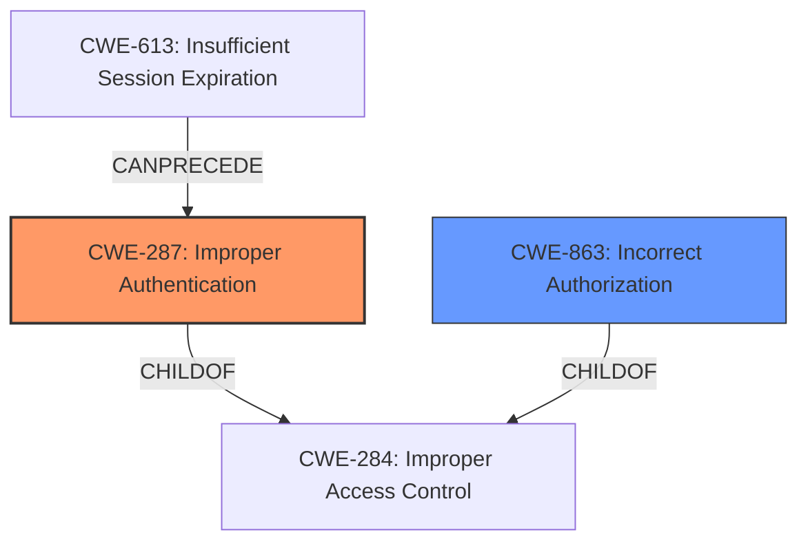

# Analysis Report for CVE-2021-25389

# Vulnerability Analysis Report: CVE-2021-25389

## Description


## Analysis (with Relationship Data)

# Summary
| CWE ID | CWE Name | Confidence | CWE Abstraction Level | CWE Vulnerability Mapping Label | CWE-Vulnerability Mapping Notes |
|---|---|---|---|---|---|
| CWE-287 | Improper Authentication | 0.8 | Class | Primary | Discouraged |
| CWE-863 | Incorrect Authorization | 0.6 | Class | Secondary | Allowed-with-Review |

## Evidence and Confidence

*   **Confidence Score:** 0.7
*   **Evidence Strength:** HIGH

## Relationship Analysis
The primary CWE is CWE-287, which is a Class-level CWE. The retriever also returns CWE-863, which is a peer of CWE-287 and also a Class. The decision to choose CWE-287 as the primary CWE is based on the vulnerability description explicitly mentioning authentication bypass. CWE-287 can precede other vulnerabilities.


## Vulnerability Chain
The vulnerability chain starts with an **improper running task check**, leading to an authentication bypass, which allows attackers to use locked applications without proper authentication.

## Summary of Analysis
The initial analysis identified the **improper running task check** as the root cause, leading to authentication bypass. The retriever results suggested several CWEs related to authentication and authorization.

The primary decision driver was the presence of the term "authentication bypass" in the vulnerability description. CWE-287 (Improper Authentication) directly addresses scenarios where the system insufficiently proves the claimed identity.

The evidence is: "Improper running task check in S Secure prior to SMR MAY-2021 Release 1 allows attackers to use locked app without authentication." and "Weakness: The application does not properly verify the running process when a user attempts to access a locked application."

CWE-287 is selected because the vulnerability description explicitly mentions authentication bypass. While the root cause is the improper check, the direct impact is the bypass of authentication.

Other CWEs Considered:

*   CWE-863 (Incorrect Authorization): Considered as a secondary CWE because the vulnerability involves bypassing authentication to access locked applications. However, it is a less direct match than CWE-287.
*   CWE-285 (Improper Authorization): Similar to CWE-863, it's related to access control but less specific to the authentication bypass.
*   CWE-703 (Improper Check or Handling of Exceptional Conditions): Too generic.
*   CWE-927 (Use of Implicit Intent for Sensitive Communication): Not applicable, as the description doesn't mention intents.
*   CWE-269 (Improper Privilege Management): Not directly related to the authentication bypass.
*   CWE-413 (Improper Resource Locking): Not applicable.
*   CWE-613 (Insufficient Session Expiration): Not applicable.
*   CWE-367 (Time-of-check Time-of-use (TOCTOU) Race Condition): Doesn't appear to be a race condition.
*   CWE-757 (Selection of Less-Secure Algorithm During Negotiation ('Algorithm Downgrade')): Not applicable.


## CWE Relationship Analysis

Current CWEs represent these abstraction levels: .


### Vulnerability Chain Analysis

**Chain starting from CWE-284:**
- 284 (Improper Access Control) - ROOT


**Chain starting from CWE-285:**
- 285 (Improper Authorization) - ROOT


### CWE Relationship Diagram

```mermaid
graph TD
    classDef primary fill:#f96,stroke:#333,stroke-width:2px
    classDef secondary fill:#69f,stroke:#333
    classDef tertiary fill:#9e9,stroke:#333
```


*Report generated on 2025-04-02 07:50:02*
