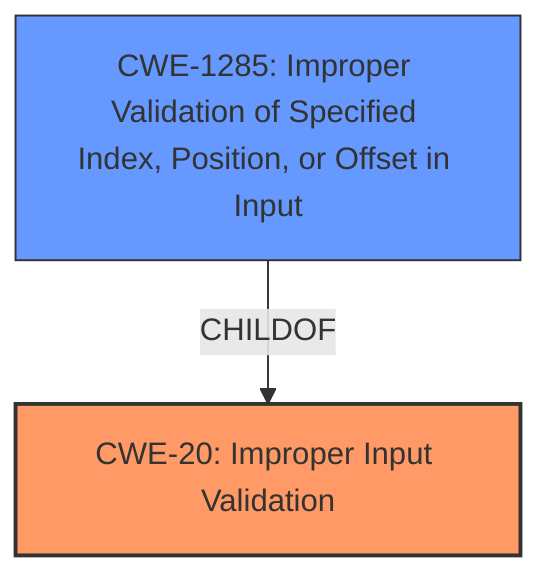

# Enhanced Analysis for CVE-2021-25396

# Summary
| CWE ID    | CWE Name                                                                    | Confidence | CWE Abstraction Level | CWE Vulnerability Mapping Label | CWE-Vulnerability Mapping Notes |
| :-------- | :-------------------------------------------------------------------------- | :--------- | :---------------------- | :------------------------------ | :------------------------------ |
| CWE-20  | Improper Input Validation                                                     | 0.95       | Class                   | Primary                         | Discouraged                   |
| CWE-1285 | Improper Validation of Specified Index, Position, or Offset in Input     | 0.75       | Base                    | Secondary                       | Allowed                       |

## Evidence and Confidence

*   **Confidence Score:** 0.90
*   **Evidence Strength:** HIGH

## Relationship Analysis
The primary CWE is CWE-20 **Improper Input Validation**, which is a Class-level CWE. It has a child CWE-1285 **Improper Validation of Specified Index, Position, or Offset in Input** which is a Base-level CWE. The vulnerability stems from the **improper input validation**, which leads to arbitrary memory write and code execution.



## Vulnerability Chain
The vulnerability chain starts with **improper input validation** in the NPU firmware, which allows an attacker to perform arbitrary memory write and code execution.

## Summary of Analysis
The initial assessment points to CWE-20 **Improper Input Validation** as the primary weakness. The vulnerability description explicitly mentions **improper input validation** as the root cause, which directly aligns with the CWE-20 description. The impact, which is arbitrary memory write and code execution, stems from this **improper input validation**.

The Retriever Results suggest several CWEs, including CWE-1285 **Improper Validation of Specified Index, Position, or Offset in Input**, CWE-476 **NULL Pointer Dereference**, and CWE-1284 **Improper Validation of Specified Quantity in Input**. Given the context of the NPU firmware and potential for accessing memory locations, CWE-1285 becomes a relevant secondary consideration.

CWE-20 is a Class-level CWE, and the MITRE mapping guidance discourages its use when more specific CWEs are available. However, based on the provided evidence, the primary issue is a general lack of input validation. Therefore, I will select CWE-20 as the primary CWE, but also include CWE-1285 as a secondary CWE because the arbitrary memory write indicates the offset or index was not properly validated.

Relevant CWE Information:

# Enhanced Context (25 CWEs)

## CWE-1289: Improper Validation of Unsafe Equivalence in Input
**Abstraction Level**: Base
**Similarity Score**: 0.78

**Description**:
The product receives an input value that is used as a resource identifier or other type of reference, but it does not validate or incorrectly validates that the input is equivalent to a potentially-unsafe value.
**Rationale:** The current description does not include a resource identifier or other type of reference.

## CWE-807: Reliance on Untrusted Inputs in a Security Decision
**Abstraction Level**: Base
**Similarity Score**: 0.76
**Description**:
The product uses a protection mechanism that relies on the existence or values of an input, but the input can be modified by an untrusted actor in a way that bypasses the protection mechanism.
**Rationale:** The current description does not indicate a protection mechanism that relies on the existence or values of an input.

## CWE-703: Improper Check or Handling of Exceptional Conditions
**Abstraction Level**: Pillar
**Similarity Score**: 0.75
**Description**:
The product does not properly anticipate or handle exceptional conditions that rarely occur during normal operation of the product.
**Rationale:** This CWE is too high level and does not specifically describe the vulnerability.

## CWE-691: Insufficient Control Flow Management
**Abstraction Level**: Pillar
**Similarity Score**: 0.75
**Description**:
The code does not sufficiently manage its control flow during execution, creating conditions in which the control flow can be modified in unexpected ways.
**Rationale:** This CWE is too high level and does not specifically describe the vulnerability.

## CWE-274: Improper Handling of Insufficient Privileges
**Abstraction Level**: Base
**Similarity Score**: 0.75
**Description**:
The product does not handle or incorrectly handles when it has insufficient privileges to perform an operation, leading to resultant weaknesses.
**Rationale:** The current description does not describe an issue with insufficient privileges.

## CWE-653: Improper Isolation or Compartmentalization
**Abstraction Level**: Class
**Similarity Score**: 0.74
**Description**:
The product does not properly compartmentalize or isolate functionality, processes, or resources that require different privilege levels, rights, or permissions.
**Rationale:** The current description does not describe an issue with compartmentalization.

## CWE-1220: Insufficient Granularity of Access Control
**Abstraction Level**: Base
**Similarity Score**: 0.74
**Description**:
The product implements access controls via a policy or other feature with the intention to disable or restrict accesses (reads and/or writes) to assets in a system from untrusted agents. However, implemented access controls lack required granularity, which renders the control policy too broad because it allows accesses from unauthorized agents to the security-sensitive assets.
**Rationale:** The current description does not describe an issue with access control granularity.

## CWE-280: Improper Handling of Insufficient Permissions or Privileges
**Abstraction Level**: Base
**Similarity Score**: 0.74
**Description**:
The product does not handle or incorrectly handles when it has insufficient privileges to access resources or functionality as specified by their permissions. This may cause it to follow unexpected code paths that may leave the product in an invalid state.
**Rationale:** The current description does not describe an issue with insufficient privileges.

## CWE-657: Violation of Secure Design Principles
**Abstraction Level**: Class
**Similarity Score**: 0.74
**Description**:
The product violates well-established principles for secure design.
**Rationale:** This CWE is too high level and does not specifically describe the vulnerability.

## CWE-345: Insufficient Verification of Data Authenticity
**Abstraction Level**: Class
**Similarity Score**: 0.74
**Description**:
The product does not sufficiently verify the origin or authenticity of data, in a way that causes it to accept invalid data.
**Rationale:** The current description focuses on input validation, not data authenticity.

## CWE-190: Integer Overflow or Wraparound
**Abstraction Level**: Base
**Similarity Score**: 6999.86
**Description**:
The product performs a calculation that can produce an integer overflow or wraparound when the logic assumes that the resulting value will always be larger than the original value.
**Rationale:** While possible, there is no specific mention of integer overflows in the provided description.

## CWE-1284: Improper Validation of Specified Quantity in Input
**Abstraction Level**: Base
**Similarity Score**: 6855.27
**Description**:
The product receives input that is expected to specify a quantity (such as size or length), but it does not validate or incorrectly validates that the quantity has the required properties.
**Rationale:** While possible, there is no specific mention of quantity in the provided description.

## CWE-125: Out-of-bounds Read
**Abstraction Level**: Base
**Similarity Score**: 6594.31
**Description**:
The product reads data past the end, or before the beginning, of the intended buffer.
**Rationale:** The current description involves arbitrary memory write, not read.

## CWE-295: Improper Certificate Validation
**Abstraction Level**: Base
**Similarity Score**: 6470.52
**Description**:
The product does not validate, or incorrectly validates, a certificate.
**Rationale:** The current description does not describe an issue with certificate validation.

## CWE-863: Incorrect Authorization
**Abstraction Level**: Class
**Similarity Score**: 6432.33
**Description**:
The product performs an authorization check when an actor attempts to access a resource or perform an action, but it does not correctly perform the check.
**Rationale:** The current description focuses on input validation, not authorization.

## CWE-41: Improper Resolution of Path Equivalence
**Abstraction Level**: base
**Similarity Score**: 5.03
**Description**:
CWE-41: Improper Resolution of Path Equivalence
**Rationale:** The current description does not describe an issue with path equivalence.

## CWE-22: Improper Limitation of a Pathname to a Restricted Directory ('Path Traversal')
**Abstraction Level**: base
**Similarity Score**: 4.33
**Description**:
CWE-22: Improper Limitation of a Pathname to a Restricted Directory ('Path Traversal')


## CWE Relationship Analysis

Current CWEs represent these abstraction levels: .


### Vulnerability Chain Analysis

**Chain starting from CWE-691:**
- 691 (Insufficient Control Flow Management) - ROOT


**Chain starting from CWE-1220:**
- 1220 (Insufficient Granularity of Access Control) - ROOT


### CWE Relationship Diagram

```mermaid
graph TD
    classDef primary fill:#f96,stroke:#333,stroke-width:2px
    classDef secondary fill:#69f,stroke:#333
    classDef tertiary fill:#9e9,stroke:#333
```