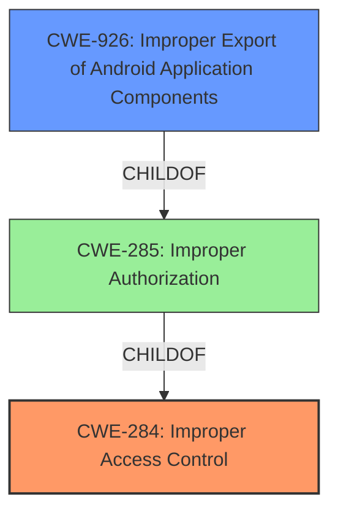

# Enhanced Analysis for CVE-2021-25397

# Summary
| CWE ID | CWE Name | Confidence | CWE Abstraction Level | CWE Vulnerability Mapping Label | CWE-Vulnerability Mapping Notes |
|---|---|---|---|---|---|
| CWE-284 | Improper Access Control | 0.8 | Pillar | Discouraged | The description contains the phrase "**improper access control**". CWE-284 is a high-level Pillar. Prefer more specific child CWEs. |
| CWE-926 | Improper Export of Android Application Components | 0.7 | Variant | Allowed | Local attackers can write arbitrary files via untrusted applications by exploiting an exported receiver. |

## Evidence and Confidence

*   **Confidence Score:** 0.75
*   **Evidence Strength:** MEDIUM

## Relationship Analysis
The analysis focuses on the relationship between CWE-284 and CWE-926. CWE-284 is a high-level category (Pillar) for **improper access control** issues. CWE-926, "Improper Export of Android Application Components," is a Variant of CWE-285 (Improper Authorization) which is a child of CWE-284, providing a more specific classification when the vulnerability involves exported Android components.



## Vulnerability Chain
The vulnerability chain starts with the **improper access control** which leads to writing arbitrary files. Specifically, the exported receiver `com.samsung.android.app.telephonyui.carrierui.photoring.model.PhotoringReceiver` allows saving files from a URL to a specified path, given the correct content type.

## Summary of Analysis
The initial assessment pointed towards CWE-284 due to the "**improper access control**" description. However, based on the additional details in the CVE Reference Links Content Summary, the vulnerability involves an exported Android receiver that allows local attackers to write arbitrary files. Therefore, CWE-926, "Improper Export of Android Application Components," is a more precise classification.

The CVE Reference Links Content Summary provides the following evidence:

*   "root_cause: An **improper access control** vulnerability in TelephonyUI allows local attackers to write arbitrary files of telephony process via untrusted applications."
*   "vulnerabilities: ['Improper Access Control']"
*   "attack_vectors: ['Sending a broadcast intent to the exported receiver `com.samsung.android.app.telephonyui.carrierui.photoring.model.PhotoringReceiver` with a crafted photoring_uri and down_file parameters.']"
*   "additional_details: The receiver `com.samsung.android.app.telephonyui.carrierui.photoring.model.PhotoringReceiver` is exported."

CWE-284 is a high-level category (Pillar). According to its mapping guidance, "CWE-284 is extremely high-level, a Pillar. Its name, "**Improper Access Control**," is often misused in low-information vulnerability reports...Consider using descendants of CWE-284 that are more specific to the kind of access control involved..."

CWE-926 is a Variant, which is a preferred level of abstraction. Its description states: "The Android application exports a component for use by other applications, but does not properly restrict which applications can launch the component or access the data it contains."

CWE-926 is more specific and accurately reflects the vulnerability. The confidence score is 0.75 due to the initial high-level description, but is increased due to the specific details of the attack vector involving the exported receiver.

Relevant CWE Information:


## CWE Relationship Analysis

Current CWEs represent these abstraction levels: .


### Vulnerability Chain Analysis

**Chain starting from CWE-285:**
- 285 (Improper Authorization) - ROOT


**Chain starting from CWE-926:**
- 926 (Improper Export of Android Application Components) - ROOT


### CWE Relationship Diagram

```mermaid
graph TD
    classDef primary fill:#f96,stroke:#333,stroke-width:2px
    classDef secondary fill:#69f,stroke:#333
    classDef tertiary fill:#9e9,stroke:#333
```