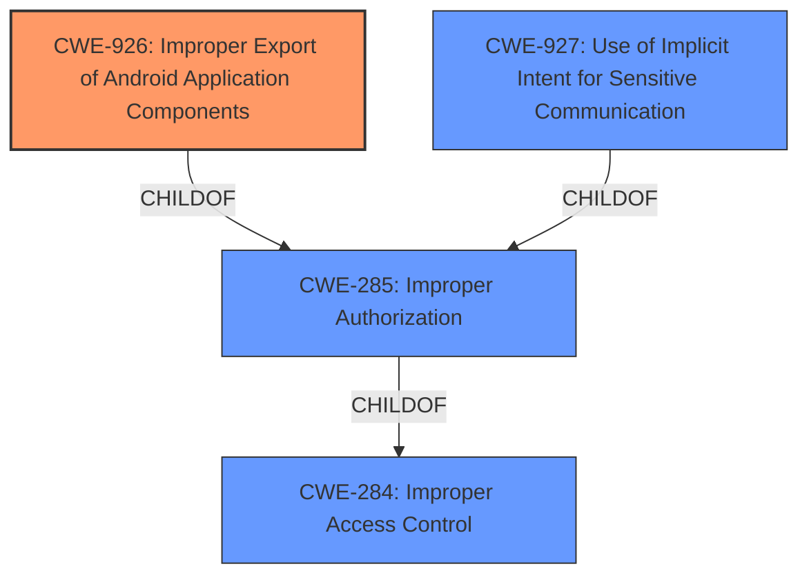

# Analysis Report for CVE-2021-25401

# Vulnerability Analysis Report: CVE-2021-25401

## Description


## Analysis (with Relationship Data)

# Summary
| CWE ID | CWE Name | Confidence | CWE Abstraction Level | CWE Vulnerability Mapping Label | CWE-Vulnerability Mapping Notes |
|---|---|---|---|---|---|
| CWE-926 | Improper Export of Android Application Components | 0.8 | Variant | Allowed | Primary CWE |
| CWE-927 | Use of Implicit Intent for Sensitive Communication | 0.6 | Variant | Allowed | Secondary Candidate |
| CWE-269 | Improper Privilege Management | 0.4 | Class | Discouraged | Secondary Candidate |

## Evidence and Confidence

*   **Confidence Score:** 0.7
*   **Evidence Strength:** MEDIUM

## Relationship Analysis
The primary relationship influencing the CWE selection is the ChildOf relationship. CWE-926 and CWE-927 are both children of CWE-285 (Improper Authorization), but they provide more specific details about the Android intent redirection vulnerability. The Variant level of abstraction is preferred when it accurately represents the weakness.



## Vulnerability Chain
The vulnerability chain starts with the **intent redirection** **weakness**, leading to the ability to execute privileged actions. The chain is:

1.  **Intent Redirection** (**WEAKNESS**): The application allows intents to be redirected.
2.  **Privilege Execution** (Impact): An attacker can execute privileged actions due to the intent redirection.

## Summary of Analysis
The initial analysis focused on the **intent redirection** **weakness** in Samsung Health, which allows an attacker to execute privileged actions. The Retriever Results highlighted CWE-926 (Improper Export of Android Application Components) and CWE-927 (Use of Implicit Intent for Sensitive Communication) as top candidates.

The evidence supporting CWE-926 is the **intent redirection** vulnerability itself. The vulnerability description key phrase "Intent redirection" and the CVE Reference Links Content Summary stating "Root Cause: Intent redirection vulnerability" both point to a problem related to how intents are handled. While the description does not explicitly mention component export, the nature of intent redirection suggests that components might be improperly exposed or accessible.

The evidence supporting CWE-927 is the potential use of implicit intents for sensitive communication, which can lead to untrusted applications obtaining sensitive data. The CVE Reference Links Content Summary mentions "sending a malicious intent," which could involve implicit intents. However, there is no explicit mention of sensitive data being transmitted via implicit intents.

The relationship analysis shows that both CWE-926 and CWE-927 are children of CWE-285 (Improper Authorization). However, CWE-285 is a Class-level CWE and is discouraged. CWE-926 and CWE-927 provide more specific details related to Android intents, which is why they are preferred.

The mapping guidance for both CWE-926 and CWE-927 indicates that they are at the Variant level of abstraction and are allowed.

CWE-269 (Improper Privilege Management) was also considered, but it is too general and is discouraged. The vulnerability is more specific to intent handling rather than general privilege management issues.

The final decision is to assign CWE-926 as the primary CWE because the **intent redirection** vulnerability suggests a problem with how Android application components are exported and made accessible to other applications. CWE-927 is included as a secondary candidate because the sending of malicious intents could potentially involve the use of implicit intents for sensitive communication.

The selected CWEs are at the optimal level of specificity because they directly address the Android intent redirection vulnerability, which is the root cause of the security issue.


## CWE Relationship Analysis

Current CWEs represent these abstraction levels: .


### Vulnerability Chain Analysis

**Chain starting from CWE-284:**
- 284 (Improper Access Control) - ROOT


**Chain starting from CWE-285:**
- 285 (Improper Authorization) - ROOT


### CWE Relationship Diagram

```mermaid
graph TD
    classDef primary fill:#f96,stroke:#333,stroke-width:2px
    classDef secondary fill:#69f,stroke:#333
    classDef tertiary fill:#9e9,stroke:#333
```


*Report generated on 2025-04-02 11:31:25*
