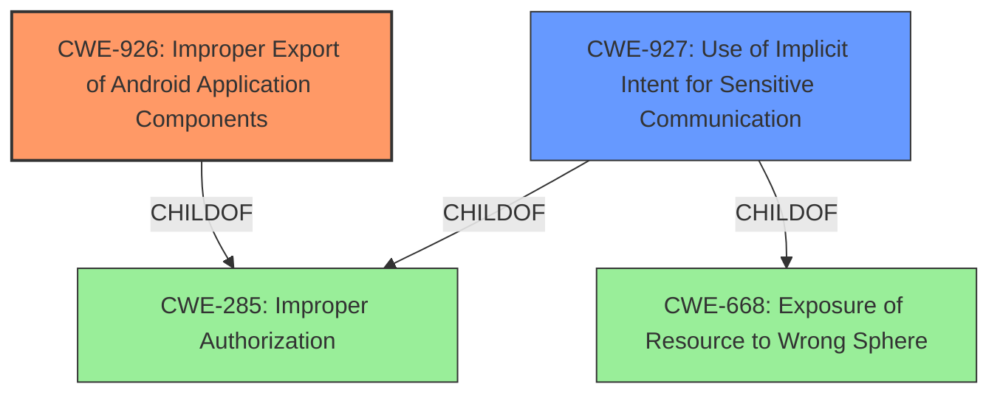

# Enhanced Analysis for CVE-2021-25403

# Summary
| CWE ID | CWE Name | Confidence | CWE Abstraction Level | CWE Vulnerability Mapping Label | CWE-Vulnerability Mapping Notes |
|---|---|---|---|---|---|
| CWE-926 | Improper Export of Android Application Components | 0.9 | Variant | Allowed | Primary CWE. The application exports a component without properly restricting which applications can use it. |
| CWE-927 | Use of Implicit Intent for Sensitive Communication | 0.7 | Variant | Allowed | Secondary CWE. The application uses an implicit intent for sensitive communication, allowing other applications to intercept the data. |

## Evidence and Confidence

*   **Confidence Score:** 0.8
*   **Evidence Strength:** HIGH

## Relationship Analysis
The primary CWE is CWE-926, which is a variant of CWE-285 (Improper Authorization). CWE-927 is also a variant of CWE-285 and CWE-668 (Exposure of Resource to Wrong Sphere). The relationships indicate that the vulnerability stems from improper authorization and potentially exposing resources to the wrong sphere by using implicit intents.



## Vulnerability Chain
The vulnerability chain starts with an **intent redirection vulnerability** due to **improper handling of intents**. This leads to the **attacker** being able to **access contacts and file providers**.

## Summary of Analysis
The initial analysis pointed towards **intent redirection vulnerability**, which led to the identification of CWE-926 and CWE-927 as the most appropriate CWEs. The **Vulnerability Description Key Phrases** mention **intent redirection vulnerability**, and the **CVE Reference Links Content Summary** confirms that the **root cause** is **improper handling of intents**. CWE-926 (Improper Export of Android Application Components) accurately represents the vulnerability because the application exports a component without properly restricting which applications can use it, leading to the **impact** of unauthorized access to contacts and file providers. CWE-927 (Use of Implicit Intent for Sensitive Communication) is also relevant because the application uses an implicit intent for sensitive communication, allowing other applications to intercept the data.

The evidence supports the selection of CWE-926 as the primary CWE because the **rootcause** is the **intent redirection vulnerability** due to **improper handling of intents within the Samsung Account application, specifically within the `SettingWebView` component**. This aligns with CWE-926's description: "The Android application exports a component for use by other applications, but does not properly restrict which applications can launch the component or access the data it contains." The **impact** of this vulnerability is that "an **attacker** can **access contacts and file providers** using the vulnerable `SettingWebView` component."

The selection of CWE-927 as a secondary CWE is supported by the fact that implicit intents are being used for sensitive communication, which increases the risk of unintended applications gaining access to sensitive data.

The selected CWEs are at the optimal level of specificity (Variant) as they provide a detailed representation of the vulnerability.

Relevant CWE Information:

# Enhanced Context (25 CWEs)

## CWE-497: Exposure of Sensitive System Information to an Unauthorized Control Sphere
**Abstraction Level**: Base
**Similarity Score**: 0.77
**Source**: dense

**Description**:
The product does not properly prevent sensitive system-level information from being accessed by unauthorized actors who do not have the same level of access to the underlying system as the product does.
**Reasons for not selecting:** While the vulnerability does expose sensitive information, the root cause is more specifically related to improper intent handling and component exposure, making CWE-926 and CWE-927 more accurate.

## CWE-226: Sensitive Information in Resource Not Removed Before Reuse
**Abstraction Level**: Base
**Similarity Score**: 0.77
**Source**: dense

**Description**:
The product releases a resource such as memory or a file so that it can be made available for reuse, but it does not clear or "zeroize" the information contained in the resource before the product performs a critical state transition or makes the resource available for reuse by other entities.
**Reasons for not selecting:** This CWE is not relevant as the vulnerability is not about releasing resources without clearing sensitive information.

## CWE-538: Insertion of Sensitive Information into Externally-Accessible File or Directory
**Abstraction Level**: Base
**Similarity Score**: 0.77
**Source**: dense

**Description**:
The product places sensitive information into files or directories that are accessible to actors who are allowed to have access to the files, but not to the sensitive information.
**Reasons for not selecting:** This CWE is not relevant as the vulnerability is not about placing sensitive information into externally-accessible files or directories.

## CWE-668: Exposure of Resource to Wrong Sphere
**Abstraction Level**: Class
**Similarity Score**: 0.76
**Source**: dense

**Description**:
The product exposes a resource to the wrong control sphere, providing unintended actors with inappropriate access to the resource.
**Reasons for not selecting:** While this is related, CWE-926 and CWE-927 are more specific variants that better describe the vulnerability.

## CWE-274: Improper Handling of Insufficient Privileges
**Abstraction Level**: Base
**Similarity Score**: 0.76
**Source**: dense

**Description**:
The product does not handle or incorrectly handles when it has insufficient privileges to perform an operation, leading to resultant weaknesses.
**Reasons for not selecting:** This CWE is not relevant as the vulnerability is not about handling insufficient privileges.

## CWE-404: Improper Resource Shutdown or Release
**Abstraction Level**: Class
**Similarity Score**: 0.76
**Source**: dense

**Description**:
The product does not release or incorrectly releases a resource before it is made available for re-use.
**Reasons for not selecting:** This CWE is not relevant as the vulnerability is not about resource shutdown or release.

## CWE-451: User Interface (UI) Misrepresentation of Critical Information
**Abstraction Level**: Class
**Similarity Score**: 0.76
**Source**: dense

**Description**:
The user interface (UI) does not properly represent critical information to the user, allowing the information - or its source - to be obscured or spoofed. This is often a component in phishing attacks.
**Reasons for not selecting:** This CWE is not relevant as the vulnerability is not about UI misrepresentation.

## CWE-280: Improper Handling of Insufficient Permissions or Privileges
**Abstraction Level**: Base
**Similarity Score**: 0.76
**Source**: dense

**Description**:
The product does not handle or incorrectly handles when it has insufficient privileges to access resources or functionality as specified by their permissions. This may cause it to follow unexpected code paths that may leave the product in an invalid state.
**Reasons for not selecting:** This CWE is not relevant as the vulnerability is not about handling insufficient permissions.

## CWE-212: Improper Removal of Sensitive Information Before Storage or Transfer
**Abstraction Level**: Base
**Similarity Score**: 0.75
**Source**: dense

**Description**:
The product stores, transfers, or shares a resource that contains sensitive information, but it does not properly remove that information before the product makes the resource available to unauthorized actors.
**Reasons for not selecting:** This CWE is not relevant as the vulnerability is not about removing sensitive information before storage or transfer.

## CWE-200: Exposure of Sensitive Information to an Unauthorized Actor
**Abstraction Level**: Class
**Similarity Score**: 0.75
**Source**: dense

**Description**:
The product exposes sensitive information to an actor that is not explicitly authorized to have access to that information.
**Reasons for not selecting:** This CWE is a general class, while CWE-926 and CWE-927 provide more specific details about the vulnerability.

## CWE-863: Incorrect Authorization
**Abstraction Level**: Class
**Similarity Score**: 6895.12
**Source**: sparse

**Description**:
The product performs an authorization check when an actor attempts to access a resource or perform an action, but it does not correctly perform the check.
**Reasons for not selecting:** The vulnerability is due to a missing or insufficient check of what components have access, not an incorrect check.

## CWE-285: Improper Authorization
**Abstraction Level**: Class
**Similarity Score**: 6884.26
**Source**: sparse

**Description**:
The product does not


## CWE Relationship Analysis

Current CWEs represent these abstraction levels: .


### Vulnerability Chain Analysis

**Chain starting from CWE-497:**
- 497 (Exposure of Sensitive System Information to an Unauthorized Control Sphere) - ROOT


**Chain starting from CWE-404:**
- 404 (Improper Resource Shutdown or Release) - ROOT


### CWE Relationship Diagram

```mermaid
graph TD
    classDef primary fill:#f96,stroke:#333,stroke-width:2px
    classDef secondary fill:#69f,stroke:#333
    classDef tertiary fill:#9e9,stroke:#333
```