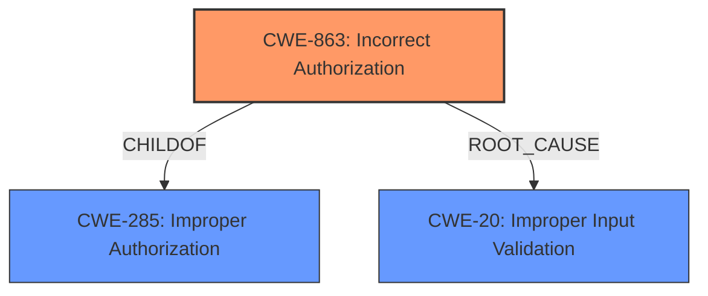

# Analysis for CVE-2021-25428

# Summary
| CWE ID  | CWE Name                                            | Confidence | CWE Abstraction Level | CWE Vulnerability Mapping Label | CWE-Vulnerability Mapping Notes |
| :-------- | :-------------------------------------------------- | :--------- | :---------------------- | :------------------------------ | :------------------------------ |
| CWE-863   | Incorrect Authorization                             | 0.9        | Class                   | Primary                       | Allowed-with-Review           |
| CWE-285   | Improper Authorization                              | 0.7        | Class                   | Secondary                       | Discouraged                   |
| CWE-20    | Improper Input Validation                          | 0.6        | Class                   | Secondary                       | Discouraged                   |

## Evidence and Confidence

*   **Confidence Score:** 0.9
*   **Evidence Strength:** HIGH

## Relationship Analysis
The primary CWE is CWE-863 Incorrect Authorization, which is a child of CWE-285 Improper Authorization. Both are Class level CWEs, but CWE-863 is preferred because it is more specific, indicating that the authorization check was performed but was incorrect, rather than missing entirely (CWE-862). CWE-20, Improper Input Validation, is considered as a secondary weakness since the **improper validation check** led to incorrect authorization.

## Vulnerability Chain
The vulnerability chain starts with **improper validation check** (CWE-20), leading to **incorrect authorization** (CWE-863), and finally resulting in untrusted applications gaining dangerous level permissions without user confirmation.

## Summary of Analysis
The analysis is based on the provided vulnerability description and CVE reference summary. The key phrase "**improper validation check**" points to a validation issue, but the impact "get dangerous level permission without user confirmation" indicates an authorization problem. Therefore, the primary CWE is CWE-863 Incorrect Authorization, as the **improper validation** directly leads to an authorization bypass. CWE-20 is included as the root cause.

The selection of CWE-863 is at the optimal level of specificity because it accurately describes the **incorrect authorization** process. The description does not specify the nature of the **improper validation check**, so selecting a more specific child of CWE-20 is not possible.

Relevant CWE Information:

# Enhanced Context (25 CWEs)
The following CWEs were identified as potentially relevant to this vulnerability:

## CWE-1220: Insufficient Granularity of Access Control
**Abstraction Level**: Base
**Similarity Score**: 0.76
**Source**: dense

**Description**:
The product implements access controls via a policy or other feature with the intention to disable or restrict accesses (reads and/or writes) to assets in a system from untrusted agents. However, implemented access controls lack required granularity, which renders the control policy too broad because it allows accesses from unauthorized agents to the security-sensitive assets.

**Mapping Guidance**:
- Usage: Allowed
- Rationale: This CWE entry is at the Base level of abstraction, which is a preferred level of abstraction for mapping to the root causes of vulnerabilities.

**Analysis:** This CWE is not selected because the vulnerability description does not explicitly mention insufficient granularity of access control. The issue is more generally about an **improper validation check** leading to **incorrect authorization**.

## CWE-274: Improper Handling of Insufficient Privileges
**Abstraction Level**: Base
**Similarity Score**: 0.76
**Source**: dense

**Description**:
The product does not handle or incorrectly handles when it has insufficient privileges to perform an operation, leading to resultant weaknesses.

**Mapping Guidance**:
- Usage: Discouraged
- Rationale: This CWE entry could be deprecated in a future version of CWE.

**Analysis:** This CWE is not selected because the vulnerability description does not focus on the handling of insufficient privileges, but rather on the **improper validation check** that bypasses authorization.

## CWE-653: Improper Isolation or Compartmentalization
**Abstraction Level**: Class
**Similarity Score**: 0.75
**Source**: dense

**Description**:
The product does not properly compartmentalize or isolate functionality, processes, or resources that require different privilege levels, rights, or permissions.

**Mapping Guidance**:
- Usage: Allowed
- Rationale: This CWE entry is at the Base level of abstraction, which is a preferred level of abstraction for mapping to the root causes of vulnerabilities.

**Analysis:** This CWE is not selected because the vulnerability description does not mention issues related to isolation or compartmentalization. The issue is about an **improper validation check** in authorization.

## CWE-1289: Improper Validation of Unsafe Equivalence in Input
**Abstraction Level**: Base
**Similarity Score**: 0.75
**Source**: dense

**Description**:
The product receives an input value that is used as a resource identifier or other type of reference, but it does not validate or incorrectly validates that the input is equivalent to a potentially-unsafe value.

**Mapping Guidance**:
- Usage: Allowed
- Rationale: This CWE entry is at the Base level of abstraction, which is a preferred level of abstraction for mapping to the root causes of vulnerabilities.

**Analysis:** This could be a specific case of CWE-20, but there is not enough information to map the **improper validation check** to this specific type.

## CWE-280: Improper Handling of Insufficient Permissions or Privileges
**Abstraction Level**: Base
**Similarity Score**: 0.75
**Source**: dense

**Description**:
The product does not handle or incorrectly handles when it has insufficient privileges to access resources or functionality as specified by their permissions. This may cause it to follow unexpected code paths that may leave the product in an invalid state.

**Mapping Guidance**:
- Usage: Allowed
- Rationale: This CWE entry is at the Base level of abstraction, which is a preferred level of abstraction for mapping to the root causes of vulnerabilities.

**Analysis:** This CWE is not selected because the vulnerability focuses on the **improper validation check** leading to untrusted applications gaining permissions, rather than how the product handles insufficient permissions.

## CWE-807: Reliance on Untrusted Inputs in a Security Decision
**Abstraction Level**: Base
**Similarity Score**: 0.75
**Source**: dense

**Description**:
The product uses a protection mechanism that relies on the existence or values of an input, but the input can be modified by an untrusted actor in a way that bypasses the protection mechanism.

**Mapping Guidance**:
- Usage: Allowed
- Rationale: This CWE entry is at the Base level of abstraction, which is a preferred level of abstraction for mapping to the root causes of vulnerabilities.

**Analysis:** This is a possibility, but it is too specific given the limited information about the **improper validation check**.

## CWE-691: Insufficient Control Flow Management
**Abstraction Level**: Pillar
**Similarity Score**: 0.74
**Source**: dense

**Description**:
The code does not sufficiently manage its control flow during execution, creating conditions in which the control flow can be modified in unexpected ways.

**Mapping Guidance**:
- Usage: Discouraged
- Rationale: This CWE entry is extremely high-level, a Pillar. However, classification research is limited for weaknesses of this type, so there can be gaps or organizational difficulties within CWE that force use of this weakness, even at such a high level of abstraction.

**Analysis:** This CWE is too general and does not specifically address the **improper validation check** and **incorrect authorization**.

## CWE-183: Permissive List of Allowed Inputs
**Abstraction Level**: Base
**Similarity Score**: 0.74
**Source**: dense

**Description**:
The product implements a protection mechanism that relies on a list of inputs (or properties of inputs) that are explicitly allowed by policy because the inputs are assumed to be safe, but the list is too permissive - that is, it allows an input that is unsafe, leading to resultant weaknesses.

**Mapping Guidance**:
- Usage: Allowed
- Rationale: This CWE entry is at the Base level of abstraction, which is a preferred level of abstraction for mapping to the root causes of vulnerabilities.

**Analysis:** This is a possibility, but it is too specific given the limited information about the **improper validation check**.

## CWE-184: Incomplete List of Disallowed Inputs
**Abstraction Level**: Base
**Similarity Score**: 0.74
**Source**: dense

**Description**:
The product implements a protection mechanism that relies on a list of inputs (or properties of inputs) that are not allowed by policy or otherwise require other action to neutralize before additional processing takes place, but the list is incomplete.

**Mapping Guidance**:
- Usage: Allowed
- Rationale: This CWE entry is at the Base level of abstraction, which is