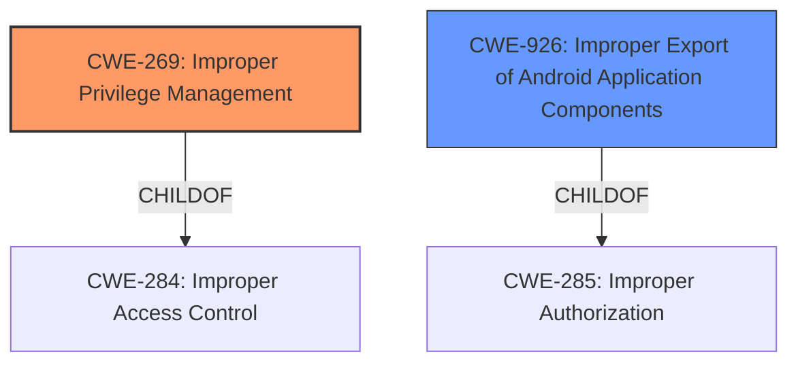

# Analysis for CVE-2021-25429

# Summary
| CWE ID | CWE Name | Confidence | CWE Abstraction Level | CWE Vulnerability Mapping Label | CWE-Vulnerability Mapping Notes |
|---|---|---|---|---|---|
| CWE-269 | Improper Privilege Management | 0.9 | Class | Primary | Discouraged |
| CWE-926 | Improper Export of Android Application Components | 0.6 | Variant | Secondary | Allowed |

## Evidence and Confidence

*   **Confidence Score:** 0.9
*   **Evidence Strength:** HIGH

## Relationship Analysis
The primary CWE is CWE-269 Improper Privilege Management which is a Class and child of CWE-284 Improper Access Control, which is a Pillar. The secondary CWE is CWE-926 Improper Export of Android Application Components which is a Variant and child of CWE-285 Improper Authorization. Because the description has "Improper privilege management" it is likely a privilege management issue. However, this is in the context of an Android application so there is also the possibility of the secondary weakness related to component exposure.

## Vulnerability Chain
The vulnerability chain starts with **Improper privilege management**, which leads to an untrusted application gaining access to Bluetooth information.

## Summary of Analysis
The initial assessment identified **Improper Privilege Management** as the primary weakness, supported by the vulnerability description and the CVE Reference Links Content Summary. The retriever results also show that CWE-269 is the top result. The vulnerability description contains the key phrase "**Improper privilege management** vulnerability in Bluetooth application... allows untrusted application to access the Bluetooth information". The CVE Reference Links Content Summary states the root cause is "**Improper privilege management** and improper access control vulnerabilities in Bluetooth application." This is a weakness because the Bluetooth application does not properly manage privileges, allowing an untrusted application to access Bluetooth information. Although CWE-269 is a class, it is the most specific applicable CWE given the available information. The secondary CWE is CWE-926 Improper Export of Android Application Components, which is a Variant.

Relevant CWE Information:

# Enhanced Context (25 CWEs)
The following CWEs were identified as potentially relevant to this vulnerability:

## CWE-269: Improper Privilege Management
**Abstraction:** Class
**Similarity Score**: 0.79
**Source**: dense

**Description**:
The product does not properly assign, modify, track, or check privileges for an actor, creating an unintended sphere of control for that actor.

## CWE-926: Improper Export of Android Application Components
**Abstraction:** Variant
**Similarity Score**: 0.75
**Source**: dense

**Description**:
The Android application exports a component for use by other applications, but does not properly restrict which applications can launch the component or access the data it contains.