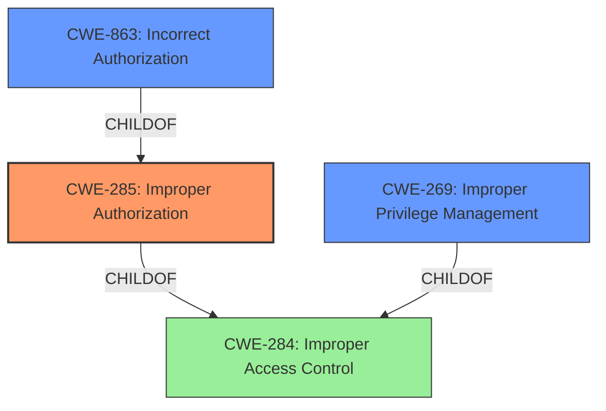

# Analysis Report for CVE-2021-25430

# Vulnerability Analysis Report: CVE-2021-25430

## Description


## Analysis (with Relationship Data)

# Summary
| CWE ID | CWE Name | Confidence | CWE Abstraction Level | CWE Vulnerability Mapping Label | CWE-Vulnerability Mapping Notes |
|---|---|---|---|---|---|
| CWE-285 | Improper Authorization | 0.8 | Class | Primary | Discouraged: CWE-285 is high-level and lower-level CWEs can frequently be used instead. It is a level-1 Class (i.e., a child of a Pillar). |
| CWE-863 | Incorrect Authorization | 0.7 | Class | Secondary | Allowed-with-Review: This CWE entry is a Class and might have Base-level children that would be more appropriate |
| CWE-269 | Improper Privilege Management | 0.6 | Class | Secondary | Discouraged: CWE-269 is commonly misused. |

## Evidence and Confidence

*   **Confidence Score:** 0.8
*   **Evidence Strength:** HIGH

## Relationship Analysis
The primary CWE is CWE-285, which is a parent Class of CWE-863 and includes authorization issues stemming from improper access control. CWE-863 provides a more specific view by focusing on *incorrect* authorization checks, and CWE-269 on *improper* privilege management. The relationship analysis influenced my decision to include CWE-863 and CWE-269 as secondary candidates to provide more granularity.



## Vulnerability Chain
The vulnerability chain involves an **improper access control** leading to unauthorized access to Bluetooth information by an untrusted application.
  - Root Cause: **Improper access control** (CWE-285)
  - Impact: Access to Bluetooth information

## Summary of Analysis
The initial assessment identified **improper access control** as the primary weakness, aligning with CWE-285. The detailed analysis confirmed this, supported by the CVE Reference Links Content Summary, which states "**Improper access control** vulnerabilities in Bluetooth application".

The selection of CWE-285 is based on the vulnerability description, which states "**Improper access control** vulnerability in Bluetooth application prior to SMR July-2021 Release 1 allows untrusted application to access the Bluetooth information in Bluetooth application." The vulnerability description key phrases also highlight "**Improper access control**" as the root cause.

While CWE-284 (Improper Access Control) is a parent of CWE-285, CWE-285 is more specific because the authorization check is not properly performed or is missing, as opposed to a general access control issue. This is a critical distinction that steered the classification.

CWE-863 (Incorrect Authorization) was considered as a more specific child of CWE-285, and included as a secondary candidate.

CWE-269 (Improper Privilege Management) was also considered and included as a secondary candidate, as it is related to how privileges are assigned and managed, which is a component of access control.

The final decision is based on the available evidence, relationship analysis, and mapping guidance, selecting CWE-285 as the primary CWE with CWE-863 and CWE-269 as secondary candidates. The selected CWEs are at the optimal level of specificity based on the evidence provided.

Relevant CWE Information:

# Enhanced Context (25 CWEs)
The following CWEs were identified as potentially relevant to this vulnerability:

## CWE-807: Reliance on Untrusted Inputs in a Security Decision
**Abstraction Level**: Base
**Similarity Score**: 0.76
**Source**: dense

**Description**:
The product uses a protection mechanism that relies on the existence or values of an input, but the input can be modified by an untrusted actor in a way that bypasses the protection mechanism.
**NOT USED:** This CWE is not applicable because the provided information does not indicate reliance on untrusted inputs for a security decision. The vulnerability is about **improper access control**, not how inputs affect security decisions.

## CWE-1289: Improper Validation of Unsafe Equivalence in Input
**Abstraction Level**: Base
**Similarity Score**: 0.75
**Source**: dense

**Description**:
The product receives an input value that is used as a resource identifier or other type of reference, but it does not validate or incorrectly validates that the input is equivalent to a potentially-unsafe value.
**NOT USED:** This CWE is not applicable as the vulnerability is about access control, not the validation of input equivalence.

## CWE-183: Permissive List of Allowed Inputs
**Abstraction Level**: Base
**Similarity Score**: 0.74
**Source**: dense

**Description**:
The product implements a protection mechanism that relies on a list of inputs (or properties of inputs) that are explicitly allowed by policy because the inputs are assumed to be safe, but the list is too permissive - that is, it allows an input that is unsafe, leading to resultant weaknesses.
**NOT USED:** This CWE is not applicable because the vulnerability doesn't involve an overly permissive list of allowed inputs. The core issue is **improper access control**, not the management of an input list.

## CWE-274: Improper Handling of Insufficient Privileges
**Abstraction Level**: Base
**Similarity Score**: 0.74
**Source**: dense

**Description**:
The product does not handle or incorrectly handles when it has insufficient privileges to perform an operation, leading to resultant weaknesses.
**NOT USED:** This CWE is not applicable as the vulnerability is about **improper access control**, rather than the handling of insufficient privileges.

## CWE-1220: Insufficient Granularity of Access Control
**Abstraction Level**: Base
**Similarity Score**: 0.74
**Source**: dense

**Description**:
The product implements access controls via a policy or other feature with the intention to disable or restrict accesses (reads and/or writes) to assets in a system from untrusted agents. However, implemented access controls lack required granularity, which renders the control policy too broad because it allows accesses from unauthorized agents to the security-sensitive assets.
**NOT USED:** While this CWE relates to access control, it focuses on granularity, which is not the primary issue described in the vulnerability.

## CWE-1390: Weak Authentication
**Abstraction Level**: Class
**Similarity Score**: 0.74
**Source**: dense

**Description**:
The product uses an authentication mechanism to restrict access to specific users or identities, but the mechanism does not sufficiently prove that the claimed identity is correct.
**NOT USED:** This CWE is not applicable because the vulnerability focuses on **improper access control** and authorization, not the strength of authentication mechanisms.

## CWE-639: Authorization Bypass Through User-Controlled Key
**Abstraction Level**: Base
**Similarity Score**: 0.74
**Source**: dense

**Description**:
The system's authorization functionality does not prevent one user from gaining access to another user's data or record by modifying the key value identifying the data.
**NOT USED:** This CWE is not applicable because the provided information does not suggest that an authorization bypass occurs by modifying a user-controlled key. The vulnerability focuses on **improper access control**.

## CWE-303: Incorrect Implementation of Authentication Algorithm
**Abstraction Level**: Base
**Similarity Score**: 0.73
**Source**: dense

**Description**:
The requirements for the product dictate the use of an established authentication algorithm, but the implementation of the algorithm is incorrect.
**NOT USED:** This CWE is not applicable as the vulnerability focuses on **improper access control**, rather than the implementation of authentication algorithms.

## CWE-280: Improper Handling of Insufficient Permissions or Privileges
**Abstraction Level**: Base
**Similarity Score**: 0.73
**Source**: dense

**Description**:
The product does not handle or incorrectly handles when it has insufficient privileges to access resources or functionality as specified by their permissions. This may cause it to follow unexpected code paths that may leave the product in an invalid state.
**NOT USED:** This CWE is not applicable as the vulnerability is about **improper access control**, not the handling of insufficient permissions.

## CWE-799: Improper Control of Interaction Frequency
**Abstraction Level**: Class
**Similarity Score**: 0.73
**Source**: dense

**Description**:
The product does not properly limit the number or frequency of interactions that it has with an actor, such as the number of incoming requests.
**NOT USED:** This CWE is not applicable because the vulnerability focuses on **improper access control**,


## CWE Relationship Analysis

Current CWEs represent these abstraction levels: .


### Vulnerability Chain Analysis

**Chain starting from CWE-303:**
- 303 (Incorrect Implementation of Authentication Algorithm) - ROOT


**Chain starting from CWE-284:**
- 284 (Improper Access Control) - ROOT


### CWE Relationship Diagram

```mermaid
graph TD
    classDef primary fill:#f96,stroke:#333,stroke-width:2px
    classDef secondary fill:#69f,stroke:#333
    classDef tertiary fill:#9e9,stroke:#333
```


*Report generated on 2025-04-01 18:29:54*
