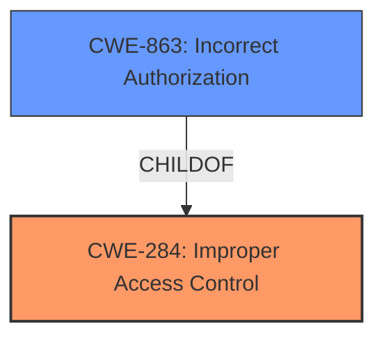

# Analysis Report for CVE-2021-25431

# Vulnerability Analysis Report: CVE-2021-25431

## Description


## Analysis (with Relationship Data)

# Summary
| CWE ID | CWE Name | Confidence | CWE Abstraction Level | CWE Vulnerability Mapping Label | CWE-Vulnerability Mapping Notes |
|---|---|---|---|---|---|
| CWE-284 | Improper Access Control | 0.75 | Pillar | Primary | Discouraged |
| CWE-863 | Incorrect Authorization | 0.60 | Class | Secondary | Allowed-with-Review |

## Evidence and Confidence

*   **Confidence Score:** 0.70
*   **Evidence Strength:** MEDIUM

## Relationship Analysis
The primary CWE selected is CWE-284, Improper Access Control, which is a high-level Pillar. Given the limited information in the vulnerability description, it's difficult to pinpoint a more specific root cause. CWE-863, Incorrect Authorization, a child of CWE-284, was considered as a secondary option because it involves authorization checks, but the description doesn't explicitly state that the application performs an authorization check incorrectly; it simply states that there's **improper access control**.



## Vulnerability Chain
The vulnerability chain starts with **improper access control**, which allows untrusted applications to access certain functions of Cameralyzer. This **improper access control** is the root cause. The impact is that untrusted applications can access functions of Cameralyzer. The provided information lacks details on specific functions accessed or how access control is bypassed, leading to a higher-level CWE selection.

## Summary of Analysis
The initial assessment focused on the **improper access control** vulnerability description. The key phrase "Improper access control" directly points to CWE-284. The provided evidence is somewhat limited, as it does not describe the specific mechanism of access control failure.

The retriever results suggested several CWEs, including CWE-284, CWE-863, CWE-22, and CWE-94.

*   CWE-284 (Improper Access Control) was considered as a primary candidate due to the direct match with the vulnerability description. However, it is a very high-level *Pillar*.
*   CWE-863 (Incorrect Authorization) was considered, as authorization is a form of access control. However, there is no specific mention of authorization checks being performed incorrectly.
*   CWE-22 (Improper Limitation of a Pathname to a Restricted Directory ('Path Traversal')) and CWE-94 (Improper Control of Generation of Code ('Code Injection')) were deemed less relevant as they describe different types of vulnerabilities.
*   CWE-939 (Improper Authorization in Handler for Custom URL Scheme) is a potential candidate if Cameralyzer uses custom URL schemes for inter-application communication. There is insufficient evidence to support this.
*   CWE-425 (Direct Request ('Forced Browsing')) This CWE is not appropriate because it is specific to web applications, and the described vulnerability is not specific to web applications.
*   CWE-927 (Use of Implicit Intent for Sensitive Communication) This CWE is a possibility, however the vulnerability description does not give enough information to choose this CWE.
*   CWE-732 (Incorrect Permission Assignment for Critical Resource) This CWE is not appropriate, because the description does not provide enough information to indicate that incorrect permissions were assigned to a critical resource.
*   CWE-200 (Exposure of Sensitive Information to an Unauthorized Actor) This CWE is not appropriate because the vulnerability does not have a technical impact of information exposure.

Given the limited information, CWE-284 is selected as the primary CWE due to its direct match with the **improper access control** vulnerability. It's important to acknowledge its high-level nature. CWE-863 is a secondary option.

Relevant CWE Information:

# Enhanced Context (25 CWEs)
The following CWEs were identified as potentially relevant to this vulnerability:

## CWE-538: Insertion of Sensitive Information into Externally-Accessible File or Directory
**Abstraction Level**: Base
**Similarity Score**: 0.77
**Source**: dense

**Description**:
The product places sensitive information into files or directories that are accessible to actors who are allowed to have access to the files, but not to the sensitive information.

**Mapping Guidance**:
- Usage: Allowed
- Rationale: This CWE entry is at the Base level of abstraction, which is a preferred level of abstraction for mapping to the root causes of vulnerabilities.

## CWE-668: Exposure of Resource to Wrong Sphere
**Abstraction Level**: Class
**Similarity Score**: 0.77
**Source**: dense

**Description**:
The product exposes a resource to the wrong control sphere, providing unintended actors with inappropriate access to the resource.

**Mapping Guidance**:
- Usage: Discouraged
- Rationale: CWE-668 is high-level and is often misused as a catch-all when lower-level CWE IDs might be applicable. It is sometimes used for low-information vulnerability reports [REF-1287]. It is a level-1 Class (i.e., a child of a Pillar). It is not useful for trend analysis.

## CWE-497: Exposure of Sensitive System Information to an Unauthorized Control Sphere
**Abstraction Level**: Base
**Similarity Score**: 0.77
**Source**: dense

**Description**:
The product does not properly prevent sensitive system-level information from being accessed by unauthorized actors who do not have the same level of access to the underlying system as the product does.

**Mapping Guidance**:
- Usage: Allowed
- Rationale: This CWE entry is at the Base level of abstraction, which is a preferred level of abstraction for mapping to the root causes of vulnerabilities.

## CWE-226: Sensitive Information in Resource Not Removed Before Reuse
**Abstraction Level**: Base
**Similarity Score**: 0.77
**Source**: dense

**Description**:
The product releases a resource such as memory or a file so that it can be made available for reuse, but it does not clear or "zeroize" the information contained in the resource before the product performs a critical state transition or makes the resource available for reuse by other entities.

**Mapping Guidance**:
- Usage: Allowed
- Rationale: This CWE entry is at the Base level of abstraction, which is a preferred level of abstraction for mapping to the root causes of vulnerabilities.

## CWE-41: Improper Resolution of Path Equivalence
**Abstraction Level**: Base
**Similarity Score**: 0.76
**Source**: dense

**Description**:
The product is vulnerable to file system contents disclosure through path equivalence. Path equivalence involves the use of special characters in file and directory names. The associated manipulations are intended to generate multiple names for the same object.

**Mapping Guidance**:
- Usage: Allowed
- Rationale: This CWE entry is at the Base level of abstraction, which is a preferred level of abstraction for mapping to the root causes of vulnerabilities.

## CWE-212: Improper Removal of Sensitive Information Before Storage or Transfer
**Abstraction Level**: Base
**Similarity Score**: 0.76
**Source**: dense

**Description**:
The product stores, transfers, or shares a resource that contains sensitive information, but it does not properly remove that information before the product makes the resource available to unauthorized actors.

**Mapping Guidance**:
- Usage: Allowed
- Rationale: This CWE entry is at the Base level of abstraction, which is a preferred level of abstraction for mapping to the root causes of vulnerabilities.

## CWE-639: Authorization Bypass Through User-Controlled Key
**Abstraction Level**: Base
**Similarity Score**: 0.76
**Source**: dense

**Description**:
The system's authorization functionality does not prevent one user from gaining access to another user's data or record by modifying the key value identifying the data.

**Mapping Guidance**:
- Usage: Allowed
- Rationale: This CWE entry is at the Base level of abstraction, which is a preferred level of abstraction for mapping to the root causes of vulnerabilities.

## CWE-280: Improper Handling of Insufficient Permissions or Privileges 
**Abstraction Level**: Base
**Similarity Score**: 0.76
**Source**: dense

**Description**:
The product does not handle or incorrectly handles when it has insufficient privileges to access resources or functionality as specified by their permissions. This may cause it to follow unexpected code paths that may leave the product in an invalid state.

**Mapping Guidance**:
- Usage: Allowed
- Rationale: This CWE entry is at the Base level of abstraction, which is a preferred level of abstraction for mapping to the root causes of vulnerabilities.

## CWE-451: User Interface (UI) Misrepresentation of Critical Information
**Abstraction Level**: Class
**Similarity Score**: 0.76
**Source**: dense

**Description**:
The user interface (UI) does not properly represent critical information to the user, allowing the information - or its source - to be obscured or spoofed. This is often a component in


## CWE Relationship Analysis

Current CWEs represent these abstraction levels: .


### Vulnerability Chain Analysis

**Chain starting from CWE-732:**
- 732 (Incorrect Permission Assignment for Critical Resource) - ROOT


**Chain starting from CWE-497:**
- 497 (Exposure of Sensitive System Information to an Unauthorized Control Sphere) - ROOT


### CWE Relationship Diagram

```mermaid
graph TD
    classDef primary fill:#f96,stroke:#333,stroke-width:2px
    classDef secondary fill:#69f,stroke:#333
    classDef tertiary fill:#9e9,stroke:#333
```


*Report generated on 2025-04-02 01:33:44*
