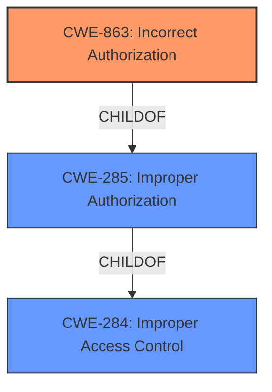

# Analysis for CVE-2021-25433

# Summary
| CWE ID  | CWE Name  | Confidence | CWE Abstraction Level | CWE Vulnerability Mapping Label | CWE-Vulnerability Mapping Notes |
|--------------|-------------------------------------------------|------------|-------------------------|------------------------------------|-----------------------------------------------------------------------------------------------------------------------------------------------------------------------------------------------------------------------------------------------------------------------------------------------------------------|
| **CWE-863** | **Incorrect Authorization** | 1 | Class  | Primary  | Allowed-with-Review: This CWE entry is a Class and might have Base-level children that would be more appropriate |
| CWE-285 | Improper Authorization  | 0.7 | Class | Secondary | Discouraged: CWE-285 is high-level and lower-level CWEs can frequently be used instead. It is a level-1 Class (i.e., a child of a Pillar).  |
| CWE-284 | Improper Access Control  | 0.5 | Pillar | Secondary | Discouraged: CWE-284 is extremely high-level, a Pillar.  It is not useful for trend analysis.  |

## Evidence and Confidence

*   **Confidence Score:** 0.8
*   **Evidence Strength:** HIGH

## Relationship Analysis
The primary CWE is CWE-863 **Incorrect Authorization**.
CWE-863 is a child of CWE-285 **Improper Authorization**, and CWE-285 is a child of CWE-284 **Improper Access Control**.
The analysis starts with CWE-863 because the description includes **"Improper authorization"** which is a more specific term than access control.
The abstraction levels influenced the selection, favoring the Class level (CWE-863) over the Pillar level (CWE-284).

## Vulnerability Chain
The vulnerability chain involves an **improper authorization** flaw that allows an untrusted application to perform a factory reset.
- **Root Cause**: **Improper authorization** in the factory reset policy.
- **Impact**: Untrusted applications can perform a factory reset via dbus signal.

## Summary of Analysis
The initial analysis focused on the **"Improper authorization"** vulnerability, which directly led to the selection of CWE-863 **Incorrect Authorization**. The vulnerability description explicitly states this **improper authorization** in the Tizen factory reset policy as the root cause.
The retriever results also listed CWE-863 as a potential match.
The graph relationships confirm that CWE-863 is a child of the more general CWE-285 **Improper Authorization** and CWE-284 **Improper Access Control**.
The final selection of CWE-863 is based on its specificity and the direct evidence from the vulnerability description: **"Improper authorization vulnerability in Tizen factory reset policy"**. This indicates that the authorization check is present but incorrectly implemented.

Relevant CWE Information:

# Enhanced Context (25 CWEs)

## CWE-1220: Insufficient Granularity of Access Control
**Abstraction Level**: Base
**Similarity Score**: 0.79
**Source**: dense

**Description**:
The product implements access controls via a policy or other feature with the intention to disable or restrict accesses (reads and/or writes) to assets in a system from untrusted agents. However, implemented access controls lack required granularity, which renders the control policy too broad because it allows accesses from unauthorized agents to the security-sensitive assets.

**Mapping Guidance**:
- Usage: Allowed
- Rationale: This CWE entry is at the Base level of abstraction, which is a preferred level of abstraction for mapping to the root causes of vulnerabilities.

CWE-1220 was considered but not selected because the vulnerability description does not specifically mention granularity issues. The primary issue is an **improper authorization**, not necessarily a lack of granularity.

## CWE-274: Improper Handling of Insufficient Privileges
**Abstraction Level**: Base
**Similarity Score**: 0.77
**Source**: dense

**Description**:
The product does not handle or incorrectly handles when it has insufficient privileges to perform an operation, leading to resultant weaknesses.

**Mapping Guidance**:
- Usage: Discouraged
- Rationale: This CWE entry could be deprecated in a future version of CWE.

CWE-274 was considered but not selected because the description focuses on **improper authorization** and doesn't describe a handling error for insufficient privileges.

## CWE-280: Improper Handling of Insufficient Permissions or Privileges
**Abstraction Level**: Base
**Similarity Score**: 0.76
**Source**: dense

**Description**:
The product does not handle or incorrectly handles when it has insufficient privileges to access resources or functionality as specified by their permissions. This may cause it to follow unexpected code paths that may leave the product in an invalid state.

**Mapping Guidance**:
- Usage: Allowed
- Rationale: This CWE entry is at the Base level of abstraction, which is a preferred level of abstraction for mapping to the root causes of vulnerabilities.

CWE-280 was considered but not selected because the description focuses on **improper authorization** and doesn't describe a handling error for insufficient permissions or privileges.

## CWE-807: Reliance on Untrusted Inputs in a Security Decision
**Abstraction Level**: Base
**Similarity Score**: 0.76
**Source**: dense

**Description**:
The product uses a protection mechanism that relies on the existence or values of an input, but the input can be modified by an untrusted actor in a way that bypasses the protection mechanism.

**Mapping Guidance**:
- Usage: Allowed
- Rationale: This CWE entry is at the Base level of abstraction, which is a preferred level of abstraction for mapping to the root causes of vulnerabilities.

CWE-807 was considered but not selected because the **improper authorization** vulnerability does not specifically describe the reliance on untrusted inputs for the security decision.

## CWE-1263: Improper Physical Access Control
**Abstraction Level**: Class
**Similarity Score**: 0.76
**Source**: dense

**Description**:
The product is designed with access restricted to certain information, but it does not sufficiently protect against an unauthorized actor with physical access to these areas.

**Mapping Guidance**:
- Usage: Allowed-with-Review
- Rationale: This CWE entry is a Class and might have Base-level children that would be more appropriate

CWE-1263 was considered but not selected because it relates to physical access control, which is not relevant to this vulnerability.

## CWE-303: Incorrect Implementation of Authentication Algorithm
**Abstraction Level**: Base
**Similarity Score**: 0.76
**Source**: dense

**Description**:
The requirements for the product dictate the use of an established authentication algorithm, but the implementation of the algorithm is incorrect.

**Mapping Guidance**:
- Usage: Allowed
- Rationale: This CWE entry is at the Base level of abstraction, which is a preferred level of abstraction for mapping to the root causes of vulnerabilities.

CWE-303 was considered but not selected because it refers to the incorrect implementation of an *authentication* algorithm, whereas the vulnerability is about **improper authorization**.

## CWE-653: Improper Isolation or Compartmentalization
**Abstraction Level**: Class
**Similarity Score**: 0.76
**Source**: dense

**Description**:
The product does not properly compartmentalize or isolate functionality, processes, or resources that require different privilege levels, rights, or permissions.

**Mapping Guidance**:
- Usage: Allowed
- Rationale: This CWE entry is at the Base level of abstraction, which is a preferred level of abstraction for mapping to the root causes of vulnerabilities.

CWE-653 was considered but not selected because the provided description focuses on **improper authorization**, not on improper isolation or compartmentalization.

## CWE-799: Improper Control of Interaction Frequency
**Abstraction Level**: Class
**Similarity Score**: 0.76
**Source**: dense

**Description**:
The product does not properly limit the number or frequency of interactions that it has with an actor, such as the number of incoming requests.

**Mapping Guidance**:
- Usage: Allowed-with-Review
- Rationale: This CWE entry is a Class and might have Base-level children that would be more appropriate

CWE-799 was considered but not selected because the description focuses on **improper authorization**, not on improper control of interaction frequency.

## CWE-345: Insufficient Verification of Data Authenticity
**Abstraction Level**: Class
**Similarity Score**: 0.75
**Source**: dense

**Description**:
The product does not sufficiently verify the origin or authenticity of