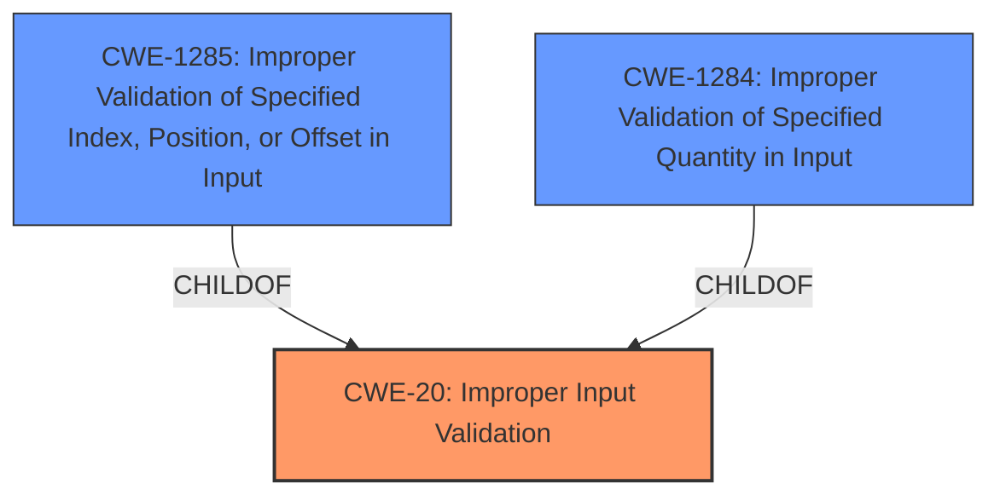

# Analysis for CVE-2021-25434

# Summary
| CWE ID | CWE Name | Confidence | CWE Abstraction Level | CWE Vulnerability Mapping Label | CWE-Vulnerability Mapping Notes |
|---|---|---|---|---|---|
| CWE-20 | Improper Input Validation | 0.9 | Class | Allowed-with-Review | Primary CWE |
| CWE-1285 | Improper Validation of Specified Index, Position, or Offset in Input | 0.6 | Base | Allowed | Secondary Candidate |
| CWE-1284 | Improper Validation of Specified Quantity in Input | 0.5 | Base | Allowed | Secondary Candidate |

## Evidence and Confidence

*   **Confidence Score:** 0.9
*   **Evidence Strength:** HIGH

## Relationship Analysis
The primary CWE identified is CWE-20, which is a Class-level CWE. While the description mentions **improper input validation**, which aligns with CWE-20, the retriever results offer more specific Base-level CWEs like CWE-1285 and CWE-1284. CWE-1285 and CWE-1284 are both children of CWE-20, providing a hierarchical relationship. Selecting a child CWE provides a more specific classification when the available evidence supports it.

## Vulnerability Chain
The vulnerability chain begins with the **improper input validation** in the Tizen bootloader which leads to arbitrary code execution.

## Summary of Analysis
The initial analysis identified CWE-20 as the primary weakness due to the description of **improper input validation**. However, based on the retriever results and the desire for more specificity, CWE-1285 and CWE-1284 were also considered. The evidence supports the selection of CWE-20, but it could potentially benefit from a more specific child.

The vulnerability description states: "**Improper input validation** vulnerability in Tizen bootloader prior to Firmware update JUL-2021 Release allows arbitrary code execution using param partition in wireless firmware download mode." This directly points to a problem with how input is being validated.

The decision to primarily map to CWE-20 is based on the direct statement of **improper input validation**. While more specific CWEs might apply, there isn't sufficient information to confirm them. Therefore, CWE-20 is selected at a higher level of abstraction.

CWE-1285 and CWE-1284 are considered as secondary candidates. More specifically for CWE-1285, there is not enough information to confirm that the improper validation involves an index, position, or offset. Likewise for CWE-1284, there isn't enough information to confirm that the improper validation involves a quantity.

Relevant CWE Information:

# Enhanced Context (25 CWEs)

## CWE-1173: Improper Use of Validation Framework
**Abstraction Level**: Base
**Similarity Score**: 0.77
This CWE was not selected because there is no evidence that a validation framework was used.

## CWE-1289: Improper Validation of Unsafe Equivalence in Input
**Abstraction Level**: Base
**Similarity Score**: 0.77
This CWE was not selected because there is no evidence that the input is equivalent to a potentially unsafe value.

## CWE-807: Reliance on Untrusted Inputs in a Security Decision
**Abstraction Level**: Base
**Similarity Score**: 0.74
This CWE was not selected because there is no evidence that the product uses a protection mechanism that relies on the existence or values of an input.

## CWE-691: Insufficient Control Flow Management
**Abstraction Level**: Pillar
**Similarity Score**: 0.74
This CWE was not selected because there is no evidence that the code does not sufficiently manage its control flow during execution.

## CWE-1288: Improper Validation of Consistency within Input
**Abstraction Level**: Base
**Similarity Score**: 0.74
This CWE was not selected because there is no evidence that the product receives a complex input with multiple elements or fields that must be consistent with each other.

## CWE-703: Improper Check or Handling of Exceptional Conditions
**Abstraction Level**: Pillar
**Similarity Score**: 0.73
This CWE was not selected because there is no evidence that the product does not properly anticipate or handle exceptional conditions.

## CWE-274: Improper Handling of Insufficient Privileges
**Abstraction Level**: Base
**Similarity Score**: 0.73
This CWE was not selected because there is no evidence that the product does not handle or incorrectly handles when it has insufficient privileges to perform an operation.

## CWE-657: Violation of Secure Design Principles
**Abstraction Level**: Class
**Similarity Score**: 0.73
This CWE was not selected because the provided information is not specific enough to indicate a violation of secure design principles.

## CWE-653: Improper Isolation or Compartmentalization
**Abstraction Level**: Class
**Similarity Score**: 0.73
This CWE was not selected because there is no evidence that the product does not properly compartmentalize or isolate functionality, processes, or resources that require different privilege levels, rights, or permissions.

## CWE-345: Insufficient Verification of Data Authenticity
**Abstraction Level**: Class
**Similarity Score**: 0.73
This CWE was not selected because there is no evidence that the product does not sufficiently verify the origin or authenticity of data, in a way that causes it to accept invalid data.

## CWE-113: Improper Neutralization of CRLF Sequences in HTTP Headers ('HTTP Request/Response Splitting')
**Abstraction Level**: Variant
**Similarity Score**: 6400.53
This CWE was not selected because there is no evidence that the product receives data from an HTTP agent/component.

## CWE-1284: Improper Validation of Specified Quantity in Input
**Abstraction Level**: Base
**Similarity Score**: 6276.61
The product receives input that is expected to specify a quantity (such as size or length), but it does not validate or incorrectly validates that the quantity has the required properties.
**Mapping Guidance**:
- Usage: Allowed
- Rationale: This CWE entry is at the Base level of abstraction, which is a preferred level of abstraction for mapping to the root causes of vulnerabilities.
This CWE was considered as a secondary candidate but was not selected as a primary CWE because the description does not provide enough evidence that a quantity is involved.

## CWE-22: Improper Limitation of a Pathname to a Restricted Directory ('Path Traversal')
**Abstraction Level**: Base
**Similarity Score**: 6096.92
This CWE was not selected because there is no evidence that the product uses external input to construct a pathname.

## CWE-863: Incorrect Authorization
**Abstraction Level**: Class
**Similarity Score**: 6044.42
This CWE was not selected because there is no evidence that the product performs an authorization check incorrectly.

## CWE-295: Improper Certificate Validation
**Abstraction Level**: Base
**Similarity Score**: 6024.59
This CWE was not selected because there is no evidence that the product does not validate, or incorrectly validates, a certificate.

## CWE-494: Download of Code Without Integrity Check
**Abstraction Level**: base
**Similarity Score**: 4.33
This CWE was not selected because there is no evidence that the product downloads code without an integrity check.

## CWE-770: Allocation of Resources Without Limits or Throttling
**Abstraction Level**: base
**Similarity Score**: 4.33
This CWE was not selected because there is no evidence that the product allocates resources without limits or throttling.

## CWE-73: External Control of File Name or Path
**Abstraction Level**: base
**Similarity Score**: 4.33
This CWE was not selected because there is no evidence that the product uses external control of file name or path.

## CWE-190: Integer Overflow or Wraparound
**Abstraction Level**: base
**Similarity Score**: 4.33
This CWE was not selected because there is no evidence that the product experiences an integer overflow or wraparound.

## CWE-79: Improper Neutralization of Input During Web Page Generation ('Cross-site Scripting')
**Abstraction Level**: base
**Similarity Score**: 4.33
This CWE was not selected because there is no evidence that the product improperly neutralizes input during web page generation.

## CWE-789: Memory Allocation with Excessive Size Value
**Abstraction Level**: variant
**Similarity Score**: 3.88
This CWE was not selected because there is no evidence that the product allocates memory with an excessive size value.

##