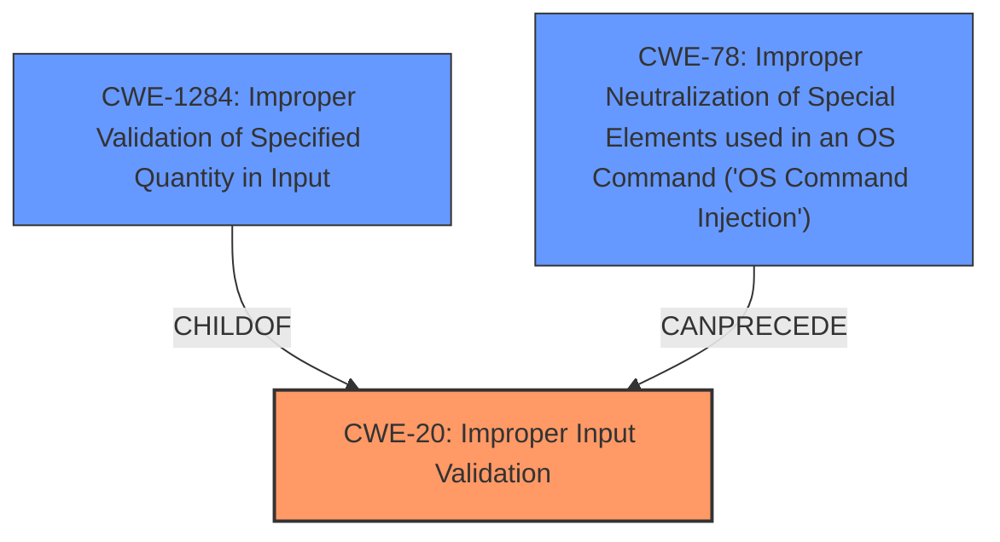

# Enhanced Analysis for CVE-2021-25436

# Summary
| CWE ID | CWE Name | Confidence | CWE Abstraction Level | CWE Vulnerability Mapping Label | CWE-Vulnerability Mapping Notes |
|---|---|---|---|---|---|
| CWE-20 | Improper Input Validation | 0.8 | Class | Primary | Discouraged |
| CWE-1284 | Improper Validation of Specified Quantity in Input | 0.6 | Base | Secondary | Allowed |
| CWE-78 | Improper Neutralization of Special Elements used in an OS Command ('OS Command Injection') | 0.4 | Base | Secondary | Allowed |

## Evidence and Confidence

*   **Confidence Score:** 0.7
*   **Evidence Strength:** MEDIUM

## Relationship Analysis
The primary relationship that impacted the decision was the parent-child relationship between CWE-20 and CWE-1284. CWE-20 is a class-level CWE, while CWE-1284 is a base-level CWE and a child of CWE-20, representing a more specific case of improper input validation. CWE-78 was a potential for impact, however this was not as well defined.



## Vulnerability Chain
The chain of root cause and weaknesses that followed for the Vulnerability Description is:
1.  **Root Cause:** **Improper Input Validation** (CWE-20) in the Tizen FOTA service.
2.  **Weakness:** Lack of proper validation of file inputs within the FOTA service, potentially related to a quantity (CWE-1284).
3.  **Impact:** Arbitrary code execution on the affected devices, which could allow an attacker to completely compromise the device, or OS Command Injection (CWE-78).

## Summary of Analysis
The initial analysis identified **Improper Input Validation** as the root cause, based on the "Vulnerability Description Key Phrases" section. The "CVE Reference Links Content Summary" confirmed this, stating that the vulnerability stems from the **lack of proper validation of input** in the Tizen FOTA service.

The retriever results also highlighted CWE-20 (Improper Input Validation) as a top candidate, along with more specific instances of input validation, such as CWE-1284 (Improper Validation of Specified Quantity in Input).

The relationship analysis showed that CWE-1284 is a child of CWE-20, providing a more specific classification if the vulnerability involved validating a quantity.

While CWE-20 is generally discouraged, the evidence points to it as the primary issue, although a more specific child CWE might be more appropriate. Given the information, it is difficult to determine if a quantity is validated, so CWE-20 is used.

The selection of CWE-20 is based on the evidence provided, even though it is a Class-level CWE and discouraged. The vulnerability description clearly indicates an **improper input validation** issue. This decision aligns with the vulnerability details provided.

Relevant CWE Information:

# Enhanced Context (25 CWEs)

## CWE-367: Time-of-check Time-of-use (TOCTOU) Race Condition
**Abstraction Level**: Base
**Similarity Score**: 0.77
**Source**: dense

**Description**:
The product checks the state of a resource before using that resource, but the resource's state can change between the check and the use in a way that invalidates the results of the check. This can cause the product to perform invalid actions when the resource is in an unexpected state.

**Why Not Used:**
This is not applicable since there is no evidence of a time-of-check time-of-use issue.

## CWE-1289: Improper Validation of Unsafe Equivalence in Input
**Abstraction Level**: Base
**Similarity Score**: 0.76
**Source**: dense

**Description**:
The product receives an input value that is used as a resource identifier or other type of reference, but it does not validate or incorrectly validates that the input is equivalent to a potentially-unsafe value.

**Why Not Used:**
There is no evidence of unsafe equivalence.

## CWE-404: Improper Resource Shutdown or Release
**Abstraction Level**: Class
**Similarity Score**: 0.76
**Source**: dense

**Description**:
The product does not release or incorrectly releases a resource before it is made available for re-use.

**Why Not Used:**
There is no evidence of improper resource shutdown or release.

## CWE-667: Improper Locking
**Abstraction Level**: Class
**Similarity Score**: 0.76
**Source**: dense

**Description**:
The product does not properly acquire or release a lock on a resource, leading to unexpected resource state changes and behaviors.

**Why Not Used:**
There is no evidence of improper locking.

## CWE-184: Incomplete List of Disallowed Inputs
**Abstraction Level**: Base
**Similarity Score**: 0.76
**Source**: dense

**Description**:
The product implements a protection mechanism that relies on a list of inputs (or properties of inputs) that are not allowed by policy or otherwise require other action to neutralize before additional processing takes place, but the list is incomplete.

**Why Not Used:**
While possible, there is no direct evidence for this.

## CWE-754: Improper Check for Unusual or Exceptional Conditions
**Abstraction Level**: Class
**Similarity Score**: 0.75
**Source**: dense

**Description**:
The product does not check or incorrectly checks for unusual or exceptional conditions that are not expected to occur frequently during day to day operation of the product.

**Why Not Used:**
This is too generic and there is no evidence for this.

## CWE-41: Improper Resolution of Path Equivalence
**Abstraction Level**: Base
**Similarity Score**: 0.75
**Source**: dense

**Description**:
The product is vulnerable to file system contents disclosure through path equivalence. Path equivalence involves the use of special characters in file and directory names. The associated manipulations are intended to generate multiple names for the same object.

**Why Not Used:**
There is no evidence of improper resolution of path equivalence.

## CWE-703: Improper Check or Handling of Exceptional Conditions
**Abstraction Level**: Pillar
**Similarity Score**: 0.75
**Source**: dense

**Description**:
The product does not properly anticipate or handle exceptional conditions that rarely occur during normal operation of the product.

**Why Not Used:**
This is too generic and there is no evidence for this.

## CWE-665: Improper Initialization
**Abstraction Level**: Class
**Similarity Score**: 0.74
**Source**: dense

**Description**:
The product does not initialize or incorrectly initializes a resource, which might leave the resource in an unexpected state when it is accessed or used.

**Why Not Used:**
There is no evidence of improper initialization.

## CWE-668: Exposure of Resource to Wrong Sphere
**Abstraction Level**: Class
**Similarity Score**: 0.74
**Source**: dense

**Description**:
The product exposes a resource to the wrong control sphere, providing unintended actors with inappropriate access to the resource.

**Why Not Used:**
There is no evidence of exposure of resource to the wrong sphere.

## CWE-863: Incorrect Authorization
**Abstraction Level**: Class
**Similarity Score**: 7595.48
**Source**: sparse

**Description**:
The product performs an authorization check when an actor attempts to access a resource or perform an action, but it does not correctly perform the check.

**Why Not Used:**
There is no evidence of incorrect authorization.

## CWE-22: Improper Limitation of a Pathname to a Restricted Directory ('Path Traversal')
**Abstraction Level**: Base
**Similarity Score**: 7566.55
**Source**: sparse

**Description**:
The product uses external input to construct a pathname that is intended to identify a file or directory that is located underneath a restricted parent directory, but the product does not properly neutralize special elements within the pathname that can cause the pathname to resolve to a location that is outside of the restricted directory.

**Why Not Used:**
There is no evidence of improper limitation of a pathname.

## CWE-770: Allocation of Resources Without Limits or Throttling
**Abstraction Level**: base
**Similarity Score**: 4.33
**Source**: graph

**Description**:
CWE-770: Allocation of Resources Without Limits or Throttling

**Why Not Used:**
There is no evidence of allocation of resources without limits or throttling

## CWE-73: External Control of File Name or Path
**Abstraction Level**: base
**Similarity Score**: 4.33
**Source**: graph

**


## CWE Relationship Analysis

Current CWEs represent these abstraction levels: .


### Vulnerability Chain Analysis

**Chain starting from CWE-667:**
- 667 (Improper Locking) - ROOT


**Chain starting from CWE-754:**
- 754 (Improper Check for Unusual or Exceptional Conditions) - ROOT


### CWE Relationship Diagram

```mermaid
graph TD
    classDef primary fill:#f96,stroke:#333,stroke-width:2px
    classDef secondary fill:#69f,stroke:#333
    classDef tertiary fill:#9e9,stroke:#333
```