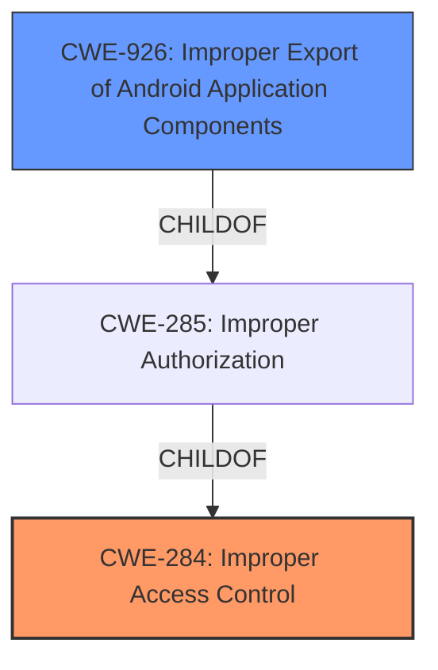

# Enhanced Analysis for CVE-2021-25440

# Summary
| CWE ID | CWE Name | Confidence | CWE Abstraction Level | CWE Vulnerability Mapping Label | CWE-Vulnerability Mapping Notes |
|---|---|---|---|---|---|
| CWE-284 | Improper Access Control | 0.9 | Pillar | Primary | Discouraged |
| CWE-926 | Improper Export of Android Application Components | 0.7 | Variant | Secondary | Allowed |

## Evidence and Confidence

*   **Confidence Score:** 0.8
*   **Evidence Strength:** HIGH

## Relationship Analysis
The primary CWE is CWE-284, which is a high-level Pillar. The retriever results suggest CWE-926, a Variant, as a better alternative. CWE-926 is a child of CWE-285, which in turn is a child of CWE-284.



## Vulnerability Chain
The vulnerability chain starts with **improper access control**, leading to the ability for untrusted applications to access arbitrary files with escalated privileges.

## Summary of Analysis
The initial analysis pointed to **Improper Access Control** (CWE-284) due to the vulnerability description explicitly stating this. However, the retriever results and the more detailed CVE Reference Links Content Summary provided enough information to classify the vulnerability more specifically.

The CVE Reference Links Content Summary states:
- "The `FactoryCameraFB` app has an **improper access control** vulnerability that allows untrusted applications to access arbitrary files with escalated privileges."
- "The `FactoryCameraFB` app does not properly restrict access to its functionality and resources, allowing other applications to leverage them without proper authorization."
- "An attacker crafted intent can launch the vulnerable component of `FactoryCameraFB`."
This suggests that the application components are improperly exported, which allows untrusted applications to access them.

CWE-284 is a Pillar and is discouraged. CWE-926 (Improper Export of Android Application Components) is a Variant and is allowed. Therefore, CWE-926 is a better fit for this vulnerability.

Relevant CWE Information:

*   **CWE-284: Improper Access Control**: The product does not restrict or incorrectly restricts access to a resource from an unauthorized actor.
*   **CWE-926: Improper Export of Android Application Components**: The Android application exports a component for use by other applications, but does not properly restrict which applications can launch the component or access the data it contains.

I am selecting CWE-284 because the vulnerability description explicitly mentions **improper access control**. However, I am also including CWE-926 as a secondary CWE because the CVE Reference Links Content Summary suggests that the application components are improperly exported.


## CWE Relationship Analysis

Current CWEs represent these abstraction levels: .


### Vulnerability Chain Analysis

**Chain starting from CWE-285:**
- 285 (Improper Authorization) - ROOT


**Chain starting from CWE-926:**
- 926 (Improper Export of Android Application Components) - ROOT


### CWE Relationship Diagram

```mermaid
graph TD
    classDef primary fill:#f96,stroke:#333,stroke-width:2px
    classDef secondary fill:#69f,stroke:#333
    classDef tertiary fill:#9e9,stroke:#333
```