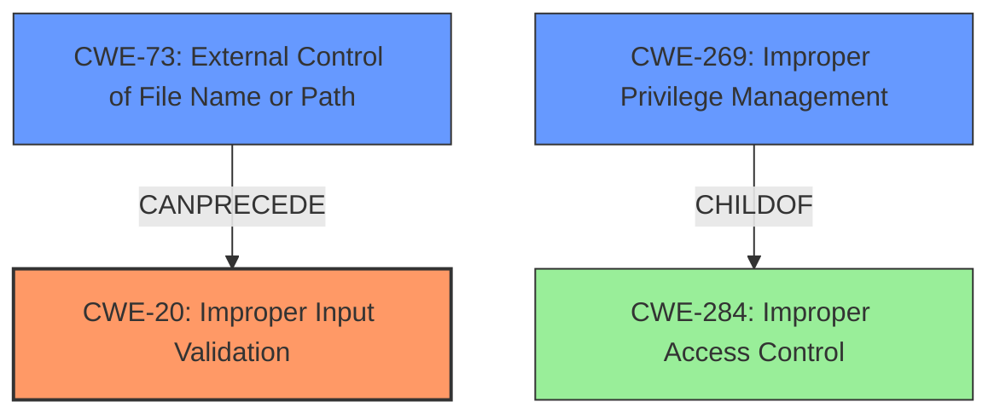

# Enhanced Analysis for CVE-2021-25441

# Summary
| CWE ID | CWE Name | Confidence | CWE Abstraction Level | CWE Vulnerability Mapping Label | CWE-Vulnerability Mapping Notes |
|---|---|---|---|---|---|
| CWE-20 | Improper Input Validation | 0.7 | Class | Discouraged | Primary CWE. Consider lower-level children. |
| CWE-73 | External Control of File Name or Path | 0.6 | Base | Allowed | Secondary CWE. May be present due to file access. |
| CWE-269 | Improper Privilege Management | 0.4 | Class | Discouraged | Secondary candidate. The vulnerability allows access to files with elevated privilege. |

## Evidence and Confidence

*   **Confidence Score:** 0.7
*   **Evidence Strength:** MEDIUM

## Relationship Analysis
The primary CWE is CWE-20, representing the **improper input validation**. CWE-73 (External Control of File Name or Path) and CWE-269 (Improper Privilege Management) are related, as the **improper input validation** leads to external control of file paths and access to files with escalated privileges. The relationship between CWE-20 and CWE-73 is a "Can Precede" relationship. CWE-269 is a child of CWE-284 (Improper Access Control). CWE-20 is a class level and should be replaced by a more specific variant.



## Vulnerability Chain
The vulnerability chain starts with **improper input validation** (CWE-20), which allows untrusted applications to control file paths (CWE-73), ultimately leading to access of arbitrary files with escalated privileges.

## Summary of Analysis
Initially, the analysis focused on the **improper input validation** as the primary weakness. The "Vulnerability Description Key Phrases" section explicitly states "**rootcause:** **Improper input validation**". The "CVE Reference Links Content Summary" section confirms this by stating, "The vulnerability allows untrusted applications to access arbitrary files with escalated privileges due to **improper input validation**".

The retriever results also list CWE-20 (Improper Input Validation) as a candidate.

CWE-73 (External Control of File Name or Path) was considered because the vulnerability allows untrusted applications to access arbitrary files, which implies that they can control the file path.

CWE-269 (Improper Privilege Management) was considered because the vulnerability allows access to arbitrary files with escalated privileges.

CWE-20 is a Class-level CWE, and the MITRE mapping guidance discourages its use. However, given the available information, a more specific CWE cannot be confidently determined. The evidence supports the presence of CWE-20 as a root cause. Further investigation would be needed to identify a more specific variant of CWE-20.
CWE-73 is a Base level CWE, and the MITRE mapping guidance allows its use.
CWE-269 is a Class level CWE, and the MITRE mapping guidance discourages its use.

Relevant CWE Information:
# Enhanced Context (25 CWEs)
The following CWEs were identified as potentially relevant to this vulnerability:

## CWE-1289: Improper Validation of Unsafe Equivalence in Input
**Abstraction Level**: Base
**Similarity Score**: 0.78
**Source**: dense

**Description**:
The product receives an input value that is used as a resource identifier or other type of reference, but it does not validate or incorrectly validates that the input is equivalent to a potentially-unsafe value.

**Mapping Guidance**:
- Usage: Allowed
- Rationale: This CWE entry is at the Base level of abstraction, which is a preferred level of abstraction for mapping to the root causes of vulnerabilities.


## CWE Relationship Analysis

Current CWEs represent these abstraction levels: .


### Vulnerability Chain Analysis

**Chain starting from CWE-284:**
- 284 (Improper Access Control) - ROOT


**Chain starting from CWE-73:**
- 73 (External Control of File Name or Path) - ROOT


### CWE Relationship Diagram

```mermaid
graph TD
    classDef primary fill:#f96,stroke:#333,stroke-width:2px
    classDef secondary fill:#69f,stroke:#333
    classDef tertiary fill:#9e9,stroke:#333
```