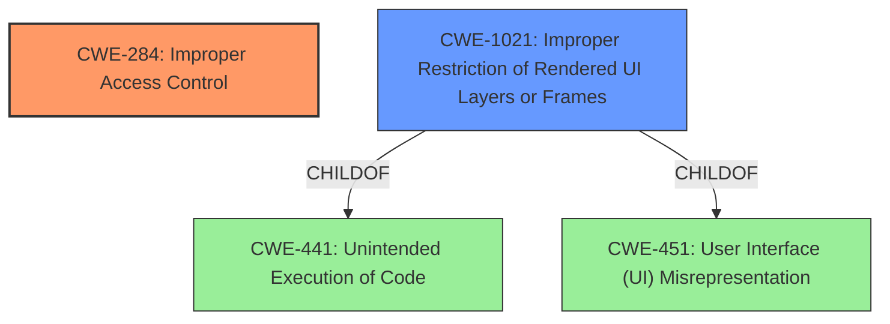

# Enhanced Analysis for CVE-2021-25446

# Summary
| CWE ID | CWE Name | Confidence | CWE Abstraction Level | CWE Vulnerability Mapping Label | CWE-Vulnerability Mapping Notes |
|---|---|---|---|---|---|
| **CWE-284** | Improper Access Control | 0.9 | Pillar | Primary | Discouraged |
| CWE-1021 | Improper Restriction of Rendered UI Layers or Frames | 0.6 | Base | Secondary | Allowed |

## Evidence and Confidence

*   **Confidence Score:** 0.9
*   **Evidence Strength:** HIGH

## Relationship Analysis
The primary CWE selected is CWE-284, which is a Pillar-level CWE. Although discouraged, it is the most accurate high-level categorization for the described **improper access control** vulnerability. CWE-284 is the parent of several more specific CWEs related to authorization and authentication, but the provided vulnerability description lacks the specificity to select a more granular CWE.

CWE-1021 (Improper Restriction of Rendered UI Layers or Frames) is considered a secondary CWE as it relates to the arbitrary webpage loading aspect of the vulnerability. It is a child of CWE-441 (Unintended Execution of Code) and CWE-451 (User Interface (UI) Misrepresentation).



## Vulnerability Chain
The vulnerability chain begins with **improper access control** (CWE-284), leading to the **impact** of arbitrary webpage loading in webview. The chain describes how an **untrusted application** can exploit the **improper access control** to load arbitrary webpages.

## Summary of Analysis
The initial assessment focused on the **improper access control** vulnerability. The retriever results suggested several CWEs, including CWE-284 (Improper Access Control), CWE-1021 (Improper Restriction of Rendered UI Layers or Frames), and others related to path traversal.

The decision to use CWE-284 as the primary CWE is based on the clear statement in the vulnerability description and CVE summary that the root cause is **improper access control**. While CWE-284 is a high-level "Pillar" CWE and is generally discouraged, the available evidence doesn't provide enough specificity to choose a more detailed CWE. The description states "**improper access control vulnerability** in SmartThings prior to version 1.7.67.25 allows **untrusted applications to cause arbitrary webpage loading in webview**."

CWE-1021 is included as a secondary CWE because it captures the arbitrary webpage loading aspect of the vulnerability, which is a direct result of the **improper access control**.

The selected CWEs are at the most specific level possible given the evidence provided. While more specific CWEs might exist, they cannot be confidently mapped without additional information about the exact nature of the **improper access control** mechanism.

Relevant CWE Information:

# Enhanced Context (25 CWEs)
The following CWEs were identified as potentially relevant to this vulnerability:

## CWE-73: External Control of File Name or Path
**Abstraction Level**: Base
**Similarity Score**: 0.80
**Source**: dense

**Description**:
The product allows user input to control or influence paths or file names that are used in filesystem operations.

**Mapping Guidance**:
- Usage: Allowed
- Rationale: This CWE entry is at the Base level of abstraction, which is a preferred level of abstraction for mapping to the root causes of vulnerabilities.

## CWE-284: Improper Access Control
**Abstraction:** Pillar
**Status:** Incomplete

### Description
The product does not restrict or incorrectly restricts access to a resource from an unauthorized actor.

### Extended Description


Access control involves the use of several protection mechanisms such as:


  - Authentication (proving the identity of an actor)

  - Authorization (ensuring that a given actor can access a resource), and

  - Accountability (tracking of activities that were performed)

When any mechanism is not applied or otherwise fails, attackers can compromise the security of the product by gaining privileges, reading sensitive information, executing commands, evading detection, etc.

There are two distinct behaviors that can introduce access control weaknesses:


  - Specification: incorrect privileges, permissions, ownership, etc. are explicitly specified for either the user or the resource (for example, setting a password file to be world-writable, or giving administrator capabilities to a guest user). This action could be performed by the program or the administrator.

  - Enforcement: the mechanism contains errors that prevent it from properly enforcing the specified access control requirements (e.g., allowing the user to specify their own privileges, or allowing a syntactically-incorrect ACL to produce insecure settings). This problem occurs within the program itself, in that it does not actually enforce the intended security policy that the administrator specifies.


### Alternative Terms
Authorization: The terms "access control" and "authorization" are often used interchangeably, although many people have distinct definitions. The CWE usage of "access control" is intended as a general term for the various mechanisms that restrict which users can access which resources, and "authorization" is more narrowly defined. It is unlikely that there will be community consensus on the use of these terms.

### Relationships
None

### Mapping Guidance
**Usage:** Discouraged
**Rationale:** CWE-284 is extremely high-level, a Pillar. Its name, "Improper Access Control," is often misused in low-information vulnerability reports [REF-1287] or by active use of the OWASP Top Ten, such as "A01:2021-Broken Access Control". It is not useful for trend analysis.
**Comments:** Consider using descendants of CWE-284 that are more specific to the kind of access control involved, such as those involving authorization (Missing Authorization (CWE-862), Incorrect Authorization (CWE-863), Incorrect Permission Assignment for Critical Resource (CWE-732), etc.); authentication (Missing Authentication (CWE-306) or Weak Authentication (CWE-1390)); Incorrect User Management (CWE-286); Improper Restriction of Communication Channel to Intended Endpoints (CWE-923); etc.
**Reasons:**
- Frequent Misuse
- Abstraction
**Suggested Alternatives:**
- CWE-862: Missing Authorization
- CWE-863: Incorrect Authorization
- CWE-732: Incorrect Permission Assignment for Critical Resource
- CWE-306: Missing Authentication
- CWE-1390: Weak Authentication
- CWE-923: Improper Restriction of Communication Channel to Intended Endpoints


## CWE Relationship Analysis

Current CWEs represent these abstraction levels: .


### Vulnerability Chain Analysis

**Chain starting from CWE-732:**
- 732 (Incorrect Permission Assignment for Critical Resource) - ROOT


**Chain starting from CWE-286:**
- 286 (Incorrect User Management) - ROOT


### CWE Relationship Diagram

```mermaid
graph TD
    classDef primary fill:#f96,stroke:#333,stroke-width:2px
    classDef secondary fill:#69f,stroke:#333
    classDef tertiary fill:#9e9,stroke:#333
```