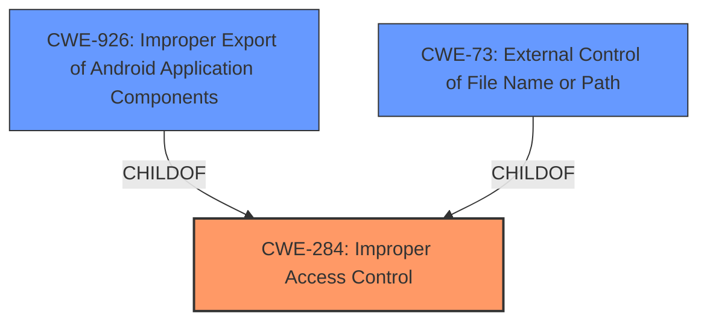

# Analysis for CVE-2021-25447

# Summary
| CWE ID | CWE Name | Confidence | CWE Abstraction Level | CWE Vulnerability Mapping Label | CWE-Vulnerability Mapping Notes |
|---|---|---|---|---|---|
| CWE-284 | Improper Access Control | 0.75 | Pillar | Discouraged | The description explicitly mentions "Improper access control" as the root cause. While discouraged, it's a starting point.|
| CWE-926 | Improper Export of Android Application Components | 0.6 | Variant | Allowed | This is a possible candidate since the vulnerability is in Android, but the information is insufficient to confirm this.|
| CWE-73 | External Control of File Name or Path | 0.5 | Base | Allowed | This is another possible candidate since the impact is local file inclusion, but the evidence is insufficient.|

## Evidence and Confidence

*   **Confidence Score:** 0.7
*   **Evidence Strength:** MEDIUM

## Relationship Analysis
The primary relationship influencing the decision is the parent-child relationship between CWE-284 and its potential children. Since CWE-284 is a Pillar, the analysis attempts to find more specific children. CWE-926 and CWE-73 are candidate CWEs because they are related to the Android platform and file handling respectively, however, the evidence is insufficient to determine if they are the best fit.

## Vulnerability Chain
The vulnerability chain starts with the **improper access control**, leading to local file inclusion in a webview component. The complete chain cannot be fully mapped due to lack of information.

## Summary of Analysis
The initial analysis identified **improper access control** as the root cause, as explicitly stated in the vulnerability description. This points to CWE-284 ([CWE-284: Improper Access Control]). However, CWE-284 is a Pillar, and the mapping guidance discourages its use. The description also states that untrusted applications can cause local file inclusion in webview. This suggests CWE-926 ([CWE-926: Improper Export of Android Application Components]) or CWE-73 ([CWE-73: External Control of File Name or Path]).

The final decision is to assign CWE-284 ([CWE-284: Improper Access Control]) as the primary CWE because the vulnerability description explicitly mentions **improper access control** as the root cause. While this is discouraged, it serves as a high-level representation of the problem. CWE-926 ([CWE-926: Improper Export of Android Application Components]) and CWE-73 ([CWE-73: External Control of File Name or Path]) are considered as secondary candidate CWEs, but the evidence is insufficient to confirm them as the best fit.

The assessment is primarily based on the provided evidence, specifically the "Vulnerability Description Key Phrases" and "CVE Reference Links Content Summary." The graph relationships influenced the decision to consider CWE-926 ([CWE-926: Improper Export of Android Application Components]) and CWE-73 ([CWE-73: External Control of File Name or Path]) as more specific alternatives, but ultimately, the explicit mention of **improper access control** leads to the selection of CWE-284 ([CWE-284: Improper Access Control]). The selected CWEs are at the most specific level possible given the available information.