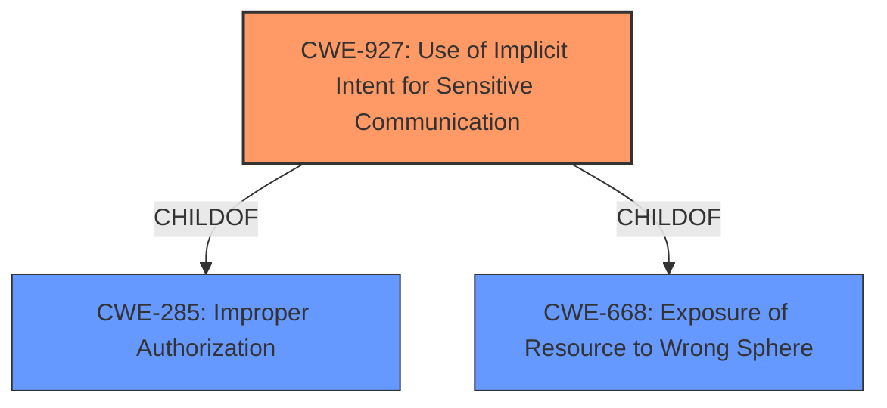

# Analysis Report for CVE-2021-25451

# Vulnerability Analysis Report: CVE-2021-25451

## Description


## Analysis (with Relationship Data)

# Summary
| CWE ID | CWE Name | Confidence | CWE Abstraction Level | CWE Vulnerability Mapping Label | CWE-Vulnerability Mapping Notes |
|---|---|---|---|---|---|
| CWE-927 | Use of Implicit Intent for Sensitive Communication | 0.9 | Variant | Allowed | Primary CWE. The application uses an implicit intent for transmitting sensitive data. |
| CWE-668 | Exposure of Resource to Wrong Sphere | 0.7 | Class | Discouraged | Secondary Candidate. The resource (IMSI data) is exposed to the wrong sphere. |
| CWE-285 | Improper Authorization | 0.6 | Class | Discouraged | Secondary Candidate. The vulnerability could stem from improper authorization. |

## Evidence and Confidence

*   **Confidence Score:** 0.8
*   **Evidence Strength:** HIGH

## Relationship Analysis
The primary CWE is CWE-927, which is a Variant of CWE-285 (Improper Authorization) and CWE-668 (Exposure of Resource to Wrong Sphere). This hierarchical relationship suggests that while CWE-927 is the most specific and relevant weakness, the higher-level CWEs represent broader categories that encompass the vulnerability's underlying issues. The vulnerability involves the use of an implicit intent, which can lead to sensitive data exposure. The chain relationship isn't clearly defined, but the implicit intent could be a prerequisite for the information exposure.



## Vulnerability Chain
The vulnerability chain starts with **PendingIntent hijacking** leading to the impact of getting IMSI data.
  - Root Cause: **PendingIntent hijacking** due to the use of implicit intents (CWE-927).
  - Weakness: Improper authorization (CWE-285) and potential exposure of resource to the wrong sphere (CWE-668).
  - Impact: Attackers obtain IMSI data.

## Summary of Analysis
The initial analysis identified **PendingIntent hijacking** as the root cause, leading to the selection of CWE-927 (Use of Implicit Intent for Sensitive Communication) as the primary CWE. This is supported by the vulnerability description and the CVE reference links content summary, which explicitly mentions **PendingIntent hijacking** in NetworkPolicyManagerService.

The evidence is strong, as the vulnerability description key phrases highlight **PendingIntent hijacking** as the root cause and getting IMSI data as the impact. The CVE reference links content summary confirms the **root cause** as **PendingIntent hijacking** in NetworkPolicyManagerService, and the impact of exploitation as attackers obtaining IMSI data. The patch addresses the intent in NetworkPolicyManagerService to prevent unprivileged access.

The graph relationships influenced the final selection by highlighting the hierarchical connection between CWE-927 and its parent classes, CWE-285 and CWE-668. While CWE-927 is the most specific and relevant, the parent classes provide broader context for the vulnerability.

The selected CWEs are at the optimal level of specificity because CWE-927 directly addresses the use of implicit intents in the context of sensitive communication, which aligns with the vulnerability's core issue. The use of Variant level CWE is appropriate due to the specificity of the vulnerability.

Relevant CWE Information:

# Enhanced Context (25 CWEs)
The following CWEs were identified as potentially relevant to this vulnerability:

## CWE-941: Incorrectly Specified Destination in a Communication Channel
**Abstraction Level**: Base
**Similarity Score**: 0.79
**Source**: dense

**Description**:
The product creates a communication channel to initiate an outgoing request to an actor, but it does not correctly specify the intended destination for that actor.

**Mapping Guidance**:
- Usage: Allowed
- Rationale: This CWE entry is at the Base level of abstraction, which is a preferred level of abstraction for mapping to the root causes of vulnerabilities.

*Reason for not selecting*: While there's a communication channel involved, the root cause is more about the implicit intent and less about the destination specification.

## CWE-451: User Interface (UI) Misrepresentation of Critical Information
**Abstraction Level**: Class
**Similarity Score**: 0.78
**Source**: dense

**Description**:
The user interface (UI) does not properly represent critical information to the user, allowing the information - or its source - to be obscured or spoofed. This is often a component in phishing attacks.

**Mapping Guidance**:
- Usage: Allowed-with-Review
- Rationale: This CWE entry is a Class and might have Base-level children that would be more appropriate

*Reason for not selecting*: This CWE is not applicable as the vulnerability doesn't involve UI misrepresentation.

## CWE-668: Exposure of Resource to Wrong Sphere
**Abstraction Level**: Class
**Similarity Score**: 0.78
**Source**: dense

**Description**:
The product exposes a resource to the wrong control sphere, providing unintended actors with inappropriate access to the resource.

**Mapping Guidance**:
- Usage: Discouraged
- Rationale: CWE-668 is high-level and is often misused as a catch-all when lower-level CWE IDs might be applicable. It is sometimes used for low-information vulnerability reports [REF-1287]. It is a level-1 Class (i.e., a child of a Pillar). It is not useful for trend analysis.

*Reason for considering but not prioritizing*: This is a broader category, and the specific issue is the implicit intent, which is more accurately captured by CWE-927. Though this could be secondary to the main weakness.

## CWE-203: Observable Discrepancy
**Abstraction Level**: Base
**Similarity Score**: 0.77
**Source**: dense

**Description**:
The product behaves differently or sends different responses under different circumstances in a way that is observable to an unauthorized actor, which exposes security-relevant information about the state of the product, such as whether a particular operation was successful or not.

**Mapping Guidance**:
- Usage: Allowed
- Rationale: This CWE entry is at the Base level of abstraction, which is a preferred level of abstraction for mapping to the root causes of vulnerabilities.

*Reason for not selecting*: Not applicable as the vulnerability doesn't primarily involve observable discrepancies.

## CWE-754: Improper Check for Unusual or Exceptional Conditions
**Abstraction Level**: Class
**Similarity Score**: 0.77
**Source**: dense

**Description**:
The product does not check or incorrectly checks for unusual or exceptional conditions that are not expected to occur frequently during day to day operation of the product.

**Mapping Guidance**:
- Usage: Allowed-with-Review
- Rationale: This CWE entry is a Class and might have Base-level children that would be more appropriate

*Reason for not selecting*: Not directly related to the root cause of the vulnerability.

## CWE-319: Cleartext Transmission of Sensitive Information
**Abstraction Level**: Base
**Similarity Score**: 0.77
**Source**: dense

**Description**:
The product transmits sensitive or security-critical data in cleartext in a communication channel that can be sniffed by unauthorized actors.

**Mapping Guidance**:
- Usage: Allowed
- Rationale: This CWE entry is at the Base level of abstraction, which is a preferred level of abstraction for mapping to the root causes of vulnerabilities.

*Reason for not selecting*: Not applicable as the vulnerability doesn't involve cleartext transmission.

## CWE-345: Insufficient Verification of Data Authenticity
**Abstraction Level**: Class
**Similarity Score**: 0.77
**Source**: dense

**Description**:
The product does not sufficiently verify the origin or authenticity of data, in a way that causes it to accept invalid data.

**Mapping Guidance**:
- Usage: Discouraged
- Rationale: This CWE entry is a level-1 Class (i.e., a child of a Pillar). It might have lower-level children that would be more appropriate

*Reason for not selecting*: While there's insufficient verification, the primary issue is the implicit intent.

## CWE-923: Improper Restriction of Communication Channel to Intended Endpoints
**Abstraction Level**: Class
**Similarity Score**: 0.77
**Source**: dense

**Description**:
The product establishes a communication channel to (or from) an endpoint for privileged or protected operations, but it does not properly ensure that it is communicating with the correct endpoint.

**Mapping Guidance**:
- Usage: Allowed-with-Review
- Rationale: This CWE entry is a Class and might have Base-level children that would be more appropriate

*Reason for not selecting*: While related to communication channels, the core issue is the implicit intent.

## CWE-703


## CWE Relationship Analysis

Current CWEs represent these abstraction levels: .


### Vulnerability Chain Analysis

**Chain starting from CWE-754:**
- 754 (Improper Check for Unusual or Exceptional Conditions) - ROOT


**Chain starting from CWE-203:**
- 203 (Observable Discrepancy) - ROOT


### CWE Relationship Diagram

```mermaid
graph TD
    classDef primary fill:#f96,stroke:#333,stroke-width:2px
    classDef secondary fill:#69f,stroke:#333
    classDef tertiary fill:#9e9,stroke:#333
```


*Report generated on 2025-04-02 01:35:41*
