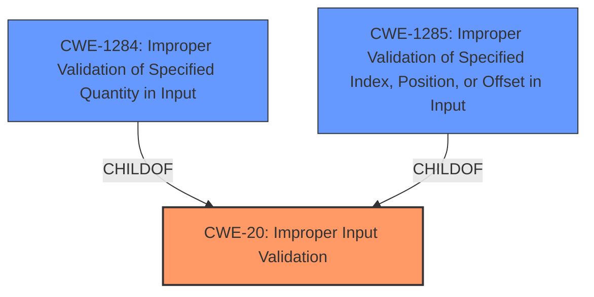

# Enhanced Analysis for CVE-2021-25452

# Summary
| CWE ID | CWE Name | Confidence | CWE Abstraction Level | CWE Vulnerability Mapping Label | CWE-Vulnerability Mapping Notes |
|---|---|---|---|---|---|
| CWE-20 | Improper Input Validation | 0.75 | Class | Primary | Discouraged |
| CWE-1284 | Improper Validation of Specified Quantity in Input | 0.6 | Base | Secondary | Allowed |
| CWE-1285 | Improper Validation of Specified Index, Position, or Offset in Input | 0.5 | Base | Secondary | Allowed |

## Evidence and Confidence

*   **Confidence Score:** 0.7
*   **Evidence Strength:** MEDIUM

## Relationship Analysis
The primary CWE is CWE-20 [Improper Input Validation], which is a Class-level CWE. The vulnerability description clearly states "**improper input validation**" as the root cause, making this a relevant starting point. However, CWE-20 [Improper Input Validation] is a high-level class, so more specific children CWEs were considered.

CWE-1284 [Improper Validation of Specified Quantity in Input] and CWE-1285 [Improper Validation of Specified Index, Position, or Offset in Input] are both children of CWE-20 [Improper Input Validation] and represent more specific types of input validation issues.

The relationship between these CWEs influenced the decision to include CWE-1284 [Improper Validation of Specified Quantity in Input] and CWE-1285 [Improper Validation of Specified Index, Position, or Offset in Input] as secondary considerations, while keeping CWE-20 [Improper Input Validation] as the primary due to the lack of specific details in the vulnerability description.



## Vulnerability Chain
The vulnerability chain starts with the **improper input validation** which leads to a permanent denial of service.

## Summary of Analysis
The initial assessment identified CWE-20 [Improper Input Validation] as the primary weakness, based on the vulnerability description explicitly mentioning "**improper input validation**". However, the description lacks specific details about the type of input that is not being properly validated.

The retriever results provided several candidate CWEs, including CWE-1284 [Improper Validation of Specified Quantity in Input] and CWE-1285 [Improper Validation of Specified Index, Position, or Offset in Input], which are both children of CWE-20 [Improper Input Validation] and represent more specific types of input validation issues.

The final decision was to keep CWE-20 [Improper Input Validation] as the primary CWE, with CWE-1284 [Improper Validation of Specified Quantity in Input] and CWE-1285 [Improper Validation of Specified Index, Position, or Offset in Input] as secondary considerations. This decision is based on the following factors:

*   The vulnerability description explicitly mentions "**improper input validation**" as the root cause.
*   The description lacks specific details about the type of input that is not being properly validated, making it difficult to choose a more specific CWE with high confidence.
*   CWE-20 [Improper Input Validation] is a Class-level CWE, which is generally discouraged, but it is appropriate in this case due to the lack of specific details.
*   CWE-1284 [Improper Validation of Specified Quantity in Input] and CWE-1285 [Improper Validation of Specified Index, Position, or Offset in Input] are both reasonable possibilities, but there is not enough evidence to definitively choose either one.

Relevant CWE Information:

# Enhanced Context (25 CWEs)
The following CWEs were identified as potentially relevant to this vulnerability:

## CWE-1285: Improper Validation of Specified Index, Position, or Offset in Input
**Abstraction Level**: Base
**Similarity Score**: 0.195
**Source**: sparse

**Description**:
The product receives input that is expected to specify an index, position, or offset into an indexable resource such as a buffer or file, but it does not validate or incorrectly validates that the specified index/position/offset has the required properties.

**Mapping Guidance**:
- Usage: Allowed
- Rationale: This CWE entry is at the Base level of abstraction, which is a preferred level of abstraction for mapping to the root causes of vulnerabilities.

## CWE-20: Improper Input Validation
**Abstraction Level**: Class
**Similarity Score**: 0.190
**Source**: sparse

**Description**:
The product receives input or data, but it does
        not validate or incorrectly validates that the input has the
        properties that are required to process the data safely and
        correctly.

**Mapping Guidance**:
- Usage: Discouraged
- Rationale: CWE-20 is commonly misused in low-information vulnerability reports when lower-level CWEs could be used instead, or when more details about the vulnerability are available [REF-1287]. It is not useful for trend analysis. It is also a level-1 Class (i.e., a child of a Pillar).

## CWE-476: NULL Pointer Dereference
**Abstraction Level**: Base
**Similarity Score**: 0.183
**Source**: sparse

**Description**:
The product dereferences a pointer that it expects to be valid but is NULL.

## CWE-1284: Improper Validation of Specified Quantity in Input
**Abstraction Level**: Base
**Similarity Score**: 0.176
**Source**: sparse

**Description**:
The product receives input that is expected to specify a quantity (such as size or length), but it does not validate or incorrectly validates that the quantity has the required properties.

**Mapping Guidance**:
- Usage: Allowed
- Rationale: This CWE entry is at the Base level of abstraction, which is a preferred level of abstraction for mapping to the root causes of vulnerabilities.

## CWE-285: Improper Authorization
**Abstraction Level**: Class
**Similarity Score**: 0.174
**Source**: sparse

**Description**:
The product does not perform or incorrectly performs an authorization check when an actor attempts to access a resource or perform an action.

**Mapping Guidance**:
- Usage: Discouraged
- Rationale: CWE-285 is high-level and lower-level CWEs can frequently be used instead. It is a level-1 Class (i.e., a child of a Pillar).

### Summary of other CWEs considered but not used
*   **CWE-476 [NULL Pointer Dereference]**: While a NULL pointer dereference could lead to a denial of service, the vulnerability description does not provide any specific evidence to support this. The root cause is clearly identified as "**improper input validation**", so CWE-476 [NULL Pointer Dereference] is not an appropriate mapping.
*   **CWE-285 [Improper Authorization]**: This CWE is related to authorization issues, which is not the primary issue described in the vulnerability. The description focuses on input validation, not on whether the user has the proper authorization to perform an action.
*   **CWE-121 [Stack-based Buffer Overflow]**: While a buffer overflow can be caused by **improper input validation**, the description does not provide enough information to support this.
*   **CWE-190 [Integer Overflow or Wraparound]**: Similar to buffer overflows, an integer overflow could be a consequence of **improper input validation**, but there's no specific evidence in the description.
*   **CWE-367 [Time-of-check Time-of-use (TOCTOU) Race Condition]**: This CWE is related to race conditions, which are not mentioned in the vulnerability description.
*   **CWE-284 [Improper Access Control]**: This CWE is a very high-level category that encompasses various access control issues. While **improper input validation** could lead to access control problems, it's not the direct cause described in the vulnerability.
*   **CWE-287 [Improper Authentication]**: This CWE is related to authentication issues, which is not the focus of the vulnerability description.


## CWE Relationship Analysis

Current CWEs represent these abstraction levels: .


### Vulnerability Chain Analysis

**Chain starting from CWE-476:**
- 476 (NULL Pointer Dereference) - ROOT


**Chain starting from CWE-121:**
- 121 (Stack-based Buffer Overflow) - ROOT


### CWE Relationship Diagram

```mermaid
graph TD
    classDef primary fill:#f96,stroke:#333,stroke-width:2px
    classDef secondary fill:#69f,stroke:#333
    classDef tertiary fill:#9e9,stroke:#333
```