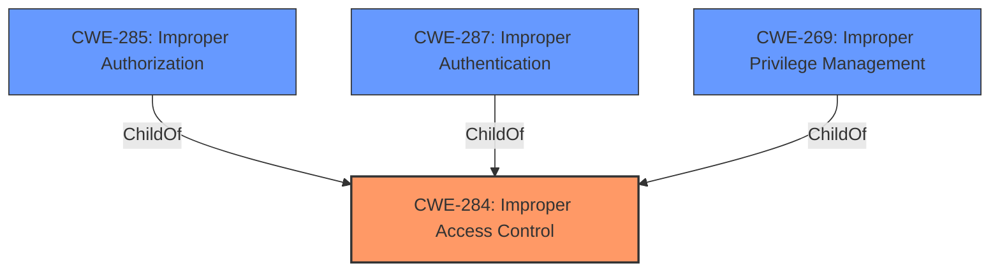

# Analysis Report for CVE-2021-25453

# Vulnerability Analysis Report: CVE-2021-25453

## Description


## Analysis (with Relationship Data)

# Summary
| CWE ID | CWE Name | Confidence | CWE Abstraction Level | CWE Vulnerability Mapping Label | CWE-Vulnerability Mapping Notes |
|---|---|---|---|---|---|
| CWE-284 | Improper Access Control | 0.7 | Pillar | Discouraged | The root cause is **improper access control**, but this is a very high-level (Pillar) CWE. |

## Evidence and Confidence

*   **Confidence Score:** 0.7
*   **Evidence Strength:** HIGH

## Relationship Analysis
The primary relationship to consider is that CWE-284 is a Pillar, meaning it's a very high-level categorization. While it accurately reflects the **improper access control** issue, the guidance discourages its use because more specific CWEs are usually available. Child CWEs like CWE-285 (Improper Authorization) and others provide more granularity.



## Vulnerability Chain
The chain is relatively simple: **improper access control** (root cause) leading to unauthorized access to Bluetooth information (impact).

## Summary of Analysis
The vulnerability description clearly states "**improper access control** in Bluetooth APIs". The CVE Reference Links Content Summary confirms this as the root cause. The challenge lies in selecting the most appropriate CWE.

CWE-284 (Improper Access Control) is the most direct match to the description, however, it's a very high-level "Pillar" CWE, and the mapping guidance explicitly discourages its use when more specific options are available.

The evidence supports the identification of **improper access control** as the fundamental flaw.
# Relevant CWE Information:


## CWE Relationship Analysis

Current CWEs represent these abstraction levels: .


### Vulnerability Chain Analysis

**Chain starting from CWE-285:**
- 285 (Improper Authorization) - ROOT


**Chain starting from CWE-287:**
- 287 (Improper Authentication) - ROOT


### CWE Relationship Diagram

```mermaid
graph TD
    classDef primary fill:#f96,stroke:#333,stroke-width:2px
    classDef secondary fill:#69f,stroke:#333
    classDef tertiary fill:#9e9,stroke:#333
```


*Report generated on 2025-04-01 22:47:37*
