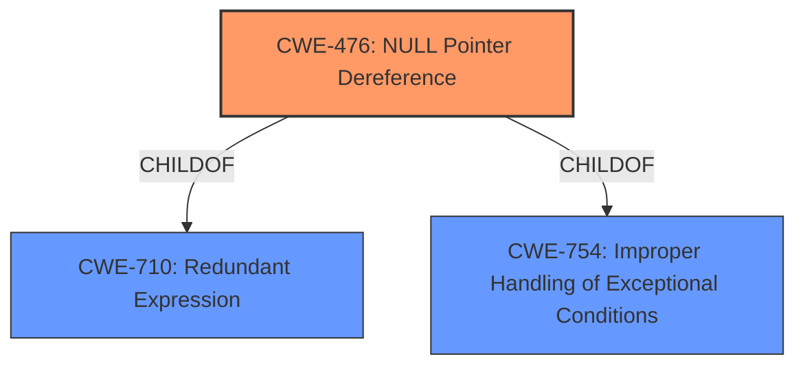

# Enhanced Analysis for CVE-2021-25458

# Summary
| CWE ID  | CWE Name                                                | Confidence | CWE Abstraction Level | CWE Vulnerability Mapping Label | CWE-Vulnerability Mapping Notes |
| :------- | :------------------------------------------------------ | :--------- | :-------------------- | :------------------------------ | :------------------------------ |
| CWE-476 | NULL Pointer Dereference                                | 1.0       | Base                  | Primary CWE                     | Allowed                       |

## Evidence and Confidence

*   **Confidence Score:** 1.0
*   **Evidence Strength:** HIGH

## Relationship Analysis
The primary relationship that impacted my decision was the direct match of the vulnerability description to **CWE-476** (NULL Pointer Dereference). **CWE-476** is a base level CWE which is the preferred level of abstraction. **CWE-476** is a child of **CWE-710** and **CWE-754**, which are both broader classes of software defects.



## Vulnerability Chain
The vulnerability chain is straightforward: a **NULL pointer dereference** (CWE-476) leads to memory corruption.

## Summary of Analysis
The analysis is based on the provided evidence.

The **Vulnerability Description Key Phrases** section explicitly mentions "**rootcause:** **NULL pointer dereference**". The **CVE Reference Links Content Summary** also states, "**Root cause of vulnerability:** - NULL pointer dereference in the ION driver." and "**Weaknesses/vulnerabilities present:** - NULL pointer dereference." This direct and repeated confirmation makes **CWE-476** the most appropriate mapping.

**CWE-476** (NULL Pointer Dereference) is a Base level CWE, which is a preferred level of abstraction for mapping to the root causes of vulnerabilities. The mapping guidance for **CWE-476** states "Usage: Allowed" and "Rationale: This CWE entry is at the Base level of abstraction, which is a preferred level of abstraction for mapping to the root causes of vulnerabilities."

Other CWEs considered but not selected:

*   **CWE-822 (Untrusted Pointer Dereference)**: While related to pointer issues, it involves a pointer from an untrusted source. The description doesn't indicate that the **NULL** pointer originates from an untrusted source.
*   **CWE-665 (Improper Initialization)** and **CWE-908 (Use of Uninitialized Resource)**: These CWEs relate to resources not being properly initialized, which could lead to a **NULL** pointer, but the description explicitly mentions a **NULL** pointer dereference, making **CWE-476** more specific.
*   **CWE-252 (Unchecked Return Value)**: This might be a contributing factor if a function returned a **NULL** pointer that wasn't checked, but the core issue is the dereference of the **NULL** pointer itself.
*   **CWE-690 (Unchecked Return Value to NULL Pointer Dereference)**: This is a compound CWE that combines an unchecked return value with a subsequent **NULL** pointer dereference. Since the description focuses on the **NULL** pointer dereference, **CWE-476** is more appropriate.
*   **CWE-456 (Missing Initialization of a Variable)**: Similar to **CWE-665** and **CWE-908**, this is a possible contributing factor but less direct than the explicit mention of a **NULL** pointer dereference.
*   **CWE-825 (Expired Pointer Dereference)**: This involves dereferencing a pointer to memory that is no longer valid. This does not match the root cause of the vulnerability.
*   **CWE-1285 (Improper Validation of Specified Index, Position, or Offset in Input)** and **CWE-125 (Out-of-bounds Read)**: These CWEs are related to array indexing and buffer access issues, which are not indicated in the description.


## CWE Relationship Analysis

Current CWEs represent these abstraction levels: .


### Vulnerability Chain Analysis

**Chain starting from CWE-476:**
- 476 (NULL Pointer Dereference) - ROOT


**Chain starting from CWE-754:**
- 754 (Improper Check for Unusual or Exceptional Conditions) - ROOT


### CWE Relationship Diagram

```mermaid
graph TD
    classDef primary fill:#f96,stroke:#333,stroke-width:2px
    classDef secondary fill:#69f,stroke:#333
    classDef tertiary fill:#9e9,stroke:#333
```