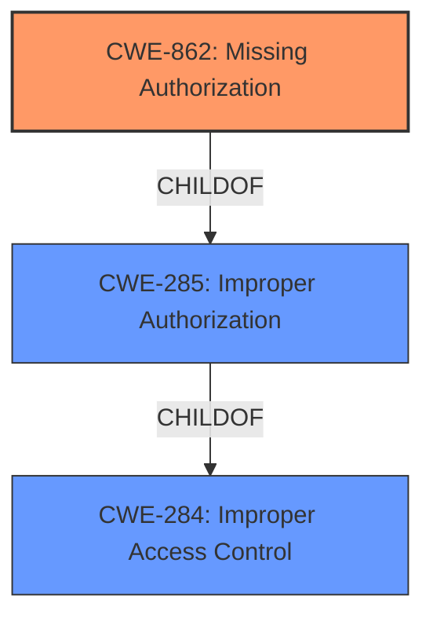

# Raw Analyzer Response for CVE-2021-25459

# Summary
| CWE ID  | CWE Name                                                        | Confidence | CWE Abstraction Level | CWE Vulnerability Mapping Label | CWE-Vulnerability Mapping Notes |
| :------- | :-------------------------------------------------------------- | :--------- | :-------------------- | :------------------------------ | :----------------------------- |
| CWE-862 | Missing Authorization                                             | 0.95       | Base                  | Primary                         | Allowed                        |
| CWE-284 | Improper Access Control                                         | 0.60       | Pillar                | Secondary                       | Discouraged                   |
| CWE-285 | Improper Authorization                                         | 0.50       | Class                 | Secondary                       | Discouraged                   |

## Evidence and Confidence

*   **Confidence Score:** 0.90
*   **Evidence Strength:** HIGH

## Relationship Analysis

The primary CWE selected is CWE-862, which is a Base level CWE and a child of both CWE-285 and CWE-284. CWE-284 is a high-level Pillar, while CWE-285 is a Class. The relationship hierarchy guides us to the most specific and accurate representation of the vulnerability, where the authorization check is **missing**, not just incorrect or improperly handled.

## Vulnerability Chain

The vulnerability chain starts with a **missing authorization** check in the `sspInit()` function of the `BlockchainTZService`. This **missing check** allows an attacker to start the `BlockchainTZService`, leading to unauthorized access.

## Summary of Analysis

The initial analysis pointed to **improper access control**, but further examination of the vulnerability details and available CWEs led to a more specific classification. The key evidence is the statement that the vulnerability allows attackers to start `BlockchainTZService` due to **missing permission checks**. This suggests that there isn't an authorization check at all, which aligns perfectly with CWE-862 description: **Missing Authorization**.

The provided evidence: "**Root cause:** **Improper access control** vulnerability in the `sspInit()` function within `BlockchainTZService`" and "The patch adds the proper permission check to prevent improper access to `BlockchainTZService`", supports the decision to classify this as a **missing authorization** issue rather than simply an incorrect one.

CWE-284 (**Improper Access Control**) and CWE-285 (**Improper Authorization**) were considered due to the initial description of the vulnerability as an **improper access control** issue. However, the more specific description of **missing permission checks** makes CWE-862 a more accurate fit. CWE-284 is a high-level Pillar, making it less specific than CWE-862, while CWE-285 is a Class, which could apply, but CWE-862 specifically identifies the **missing** aspect.

The selection of CWE-862 is at the optimal level of specificity because it directly addresses the root cause of the vulnerability, which is the **absence of an authorization check**.

Relevant CWE Information:

# Enhanced Context (25 CWEs)

## CWE-274: Improper Handling of Insufficient Privileges
**Abstraction Level**: Base
**Similarity Score**: 0.79
**Source**: dense

**Description**:
The product does not handle or incorrectly handles when it has insufficient privileges to perform an operation, leading to resultant weaknesses.

**Mapping Guidance**:
- Usage: Discouraged
- Rationale: This CWE entry could be deprecated in a future version of CWE.

*This CWE was not selected because the issue isn't about handling insufficient privileges but about completely **missing** the authorization check.*

## CWE-280: Improper Handling of Insufficient Permissions or Privileges
**Abstraction Level**: Base
**Similarity Score**: 0.78
**Source**: dense

**Description**:
The product does not handle or incorrectly handles when it has insufficient privileges to access resources or functionality as specified by their permissions. This may cause it to follow unexpected code paths that may leave the product in an invalid state.

**Mapping Guidance**:
- Usage: Allowed
- Rationale: This CWE entry is at the Base level of abstraction, which is a preferred level of abstraction for mapping to the root causes of vulnerabilities.

*This CWE was not selected because the issue isn't about handling insufficient permissions but about completely **missing** the authorization check.*

## CWE-653: Improper Isolation or Compartmentalization
**Abstraction Level**: Class
**Similarity Score**: 0.77
**Source**: dense

**Description**:
The product does not properly compartmentalize or isolate functionality, processes, or resources that require different privilege levels, rights, or permissions.

**Mapping Guidance**:
- Usage: Allowed
- Rationale: This CWE entry is at the Base level of abstraction, which is a preferred level of abstraction for mapping to the root causes of vulnerabilities.

*This CWE was not selected because the issue isn't about isolation or compartmentalization but about completely **missing** the authorization check.*

## CWE-266: Incorrect Privilege Assignment
**Abstraction Level**: Base
**Similarity Score**: 0.77
**Source**: dense

**Description**:
A product incorrectly assigns a privilege to a particular actor, creating an unintended sphere of control for that actor.

**Mapping Guidance**:
- Usage: Allowed
- Rationale: This CWE entry is at the Base level of abstraction, which is a preferred level of abstraction for mapping to the root causes of vulnerabilities.

*This CWE was not selected because the issue isn't about incorrect assignment of privileges but about completely **missing** the authorization check.*

## CWE-267: Privilege Defined With Unsafe Actions
**Abstraction Level**: Base
**Similarity Score**: 0.76
**Source**: dense

**Description**:
A particular privilege, role, capability, or right can be used to perform unsafe actions that were not intended, even when it is assigned to the correct entity.

**Mapping Guidance**:
- Usage: Allowed
- Rationale: This CWE entry is at the Base level of abstraction, which is a preferred level of abstraction for mapping to the root causes of vulnerabilities.

*This CWE was not selected because the issue isn't about privileges enabling unsafe actions but about completely **missing** the authorization check.*

## CWE-281: Improper Preservation of Permissions
**Abstraction Level**: Base
**Similarity Score**: 0.75
**Source**: dense

**Description**:
The product does not preserve permissions or incorrectly preserves permissions when copying, restoring, or sharing objects, which can cause them to have less restrictive permissions than intended.

**Mapping Guidance**:
- Usage: Allowed
- Rationale: This CWE entry is at the Base level of abstraction, which is a preferred level of abstraction for mapping to the root causes of vulnerabilities.

*This CWE was not selected because the issue isn't about preserving permissions but about completely **missing** the authorization check.*

## CWE-664: Improper Control of a Resource Through its Lifetime
**Abstraction Level**: Pillar
**Similarity Score**: 0.75
**Source**: dense

**Description**:
The product does not maintain or incorrectly maintains control over a resource throughout its lifetime of creation, use, and release.

**Mapping Guidance**:
- Usage: Discouraged
- Rationale: This CWE entry is high-level when lower-level children are available.

*This CWE was not selected because it is a high-level description and there are more specific CWEs that apply.*

## CWE-691: Insufficient Control Flow Management
**Abstraction Level**: Pillar
**Similarity Score**: 0.75
**Source**: dense

**Description**:
The code does not sufficiently manage its control flow during execution, creating conditions in which the control flow can be modified in unexpected ways.

**Mapping Guidance**:
- Usage: Discouraged
- Rationale: This CWE entry is extremely high-level, a Pillar. However, classification research is limited for weaknesses of this type, so there can be gaps or organizational difficulties within CWE that force use of this weakness, even at such a high level of abstraction.

*This CWE was not selected because it is too high-level and doesn't accurately describe the root cause.*

## CWE-404: Improper Resource Shutdown or Release
**Abstraction Level**: Class
**Similarity Score**: 0.75
**Source**: dense

**Description**:
The product does not release or incorrectly releases a resource before it is made available for re-use.

**Mapping Guidance**:
- Usage: Allowed-with-Review
- Rationale: This CWE entry is a Class and might have Base-level children that would be more appropriate

*This CWE was not selected because it is unrelated to resource shutdown or release.*

## CWE-754: