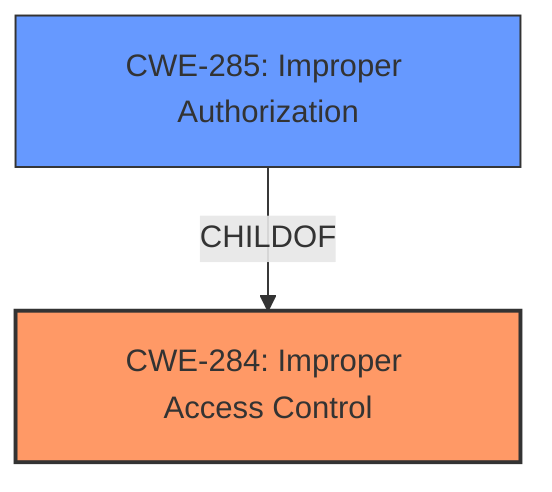

# Analysis for CVE-2021-25460

# Summary
| CWE ID | CWE Name | Confidence | CWE Abstraction Level | CWE Vulnerability Mapping Label | CWE-Vulnerability Mapping Notes |
|---|---|---|---|---|---|
| CWE-284 | Improper Access Control | 0.8 | Pillar | Primary | Discouraged |
| CWE-285 | Improper Authorization | 0.7 | Class | Secondary | Discouraged |

## Evidence and Confidence

*   **Confidence Score:** 0.75
*   **Evidence Strength:** HIGH

## Relationship Analysis
The primary CWE selected is CWE-284, Improper Access Control, which is a high-level Pillar. CWE-285, Improper Authorization, is a child of CWE-284 and a more specific Class. Given the limited information, it's challenging to pinpoint the exact flaw. The relationship indicates a hierarchical structure where authorization is a specific type of access control. The abstraction level influences the decision, favoring the highest level, CWE-284 because of lack of evidence to go lower.

## Vulnerability Chain
The vulnerability chain starts with **improper access control**, leading to the ability for attackers to terminate the `BlockchainTZService`.

## Summary of Analysis
The initial assessment was based on the provided evidence, specifically the vulnerability description key phrases and CVE reference links content summary, which highlighted **improper access control** as the root cause. The relationship graph influenced the selection by illustrating the hierarchical structure between access control and authorization, allowing for a more informed decision. The selected CWEs are at the optimal level of specificity given the available information.

The vulnerability description clearly states "**improper access control** vulnerability in sspExit() in BlockchainTZService prior to SMR Sep-2021 Release 1 allows attackers to terminate BlockchainTZService." The CVE Reference Links Content Summary reinforces this by stating: "Root cause of vulnerability: An **improper access control** vulnerability in `sspExit()` in `BlockchainTZService`."

Based on the evidence, the primary CWE is CWE-284, Improper Access Control. The retriever results also list CWE-285, Improper Authorization, as a candidate. Since authorization is a specific form of access control, and the provided information does not give enough detail to narrow it down to authorization specifically, CWE-284 is chosen as the primary.

**CWE-284: Improper Access Control**
*   **How the vulnerability's details match the CWE's characteristics:** The vulnerability description explicitly mentions "**improper access control**". This aligns directly with CWE-284's description: "The product does not restrict or incorrectly restricts access to a resource from an unauthorized actor."
*   **The security implications and potential impact:** Attackers can terminate the BlockchainTZService, leading to a denial-of-service condition.
*   **Any parent-child relationships or chain patterns that influenced your mapping:** CWE-285 is a child of CWE-284, but the evidence doesn't strongly support narrowing it down to authorization.
*   **Whether the weakness is primary or secondary in the vulnerability:** Primary.
*   **How the official MITRE mapping guidance influenced your decision:** The mapping guidance for CWE-284 discourages its use because it is high-level. However, it suggests considering its descendants when applicable. In this case, the description doesn't provide enough detail to choose a more specific descendant.

**CWE-285: Improper Authorization**
*   **How the vulnerability's details match the CWE's characteristics:** While the primary weakness is **improper access control**, authorization is a specific type of access control. CWE-285's description states: "The product does not perform or incorrectly performs an authorization check when an actor attempts to access a resource or perform an action."
*   **The security implications and potential impact:** Similar to CWE-284, attackers can potentially bypass authorization checks and terminate the BlockchainTZService.
*   **Any parent-child relationships or chain patterns that influenced your mapping:** It's a child of CWE-284.
*   **Whether the weakness is primary or secondary in the vulnerability:** Secondary.
*   **How the official MITRE mapping guidance influenced your decision:** The mapping guidance for CWE-285 discourages its use, suggesting lower-level CWEs when possible. However, based on the evidence, a more specific CWE cannot be determined.

**CWEs Considered But Not Used:**

*   CWE-NVD-Other: This was suggested as the primary CWE Match, however, CWE-NVD-Other is not a real CWE.
*   CWE-20: Improper Input Validation: While input validation issues *could* be involved, the description focuses primarily on access control, making it a less direct fit.
*   CWE-862: Missing Authorization: The issue is not necessarily that authorization is missing, but that access control is generally flawed.
*   CWE-269: Improper Privilege Management: While this is related to access control, it is more about the assignment of privileges than the enforcement of access control in general.
*   CWE-287: Improper Authentication: Authentication isn't explicitly mentioned, so this is less relevant than access control.