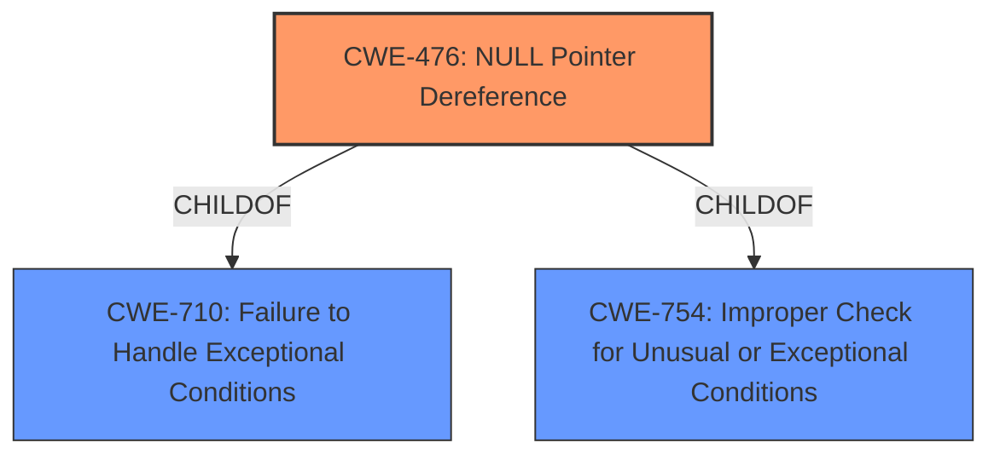

# Raw Analyzer Response for CVE-2021-25462

# Summary
| CWE ID | CWE Name | Confidence | CWE Abstraction Level | CWE Vulnerability Mapping Label | CWE-Vulnerability Mapping Notes |
|---|---|---|---|---|---|
| CWE-476 | NULL Pointer Dereference | 1.0 | Base | Primary | Allowed |

## Evidence and Confidence

*   **Confidence Score:** 1.0
*   **Evidence Strength:** HIGH

## Relationship Analysis
The primary relationship influencing this decision is the direct match of the vulnerability description to the definition of CWE-476. CWE-476 is a base level CWE, which is the preferred level of abstraction. It has parent relationships with CWE-710 and CWE-754, but those are more general.

## Vulnerability Chain
The chain of events is straightforward: a **NULL pointer dereference** occurs, leading to memory corruption.

## Summary of Analysis
The vulnerability description explicitly states a "**NULL pointer dereference** vulnerability" in the NPU driver. The "CVE Reference Links Content Summary" section reinforces this by stating the "root_cause" is a "NULL pointer dereference vulnerability in NPU driver" and a weakness of "NULL pointer dereference". The description of CWE-476 perfectly matches this: "The product dereferences a pointer that it expects to be valid but is NULL." This direct and explicit match makes CWE-476 the clear and appropriate choice. The retriever results also ranked CWE-476 with the highest score.

CWE-822 (Untrusted Pointer Dereference) was considered, but the vulnerability description does not mention that the pointer came from an untrusted source. Similarly, CWE-665 (Improper Initialization) and CWE-908 (Use of Uninitialized Resource) were considered, but the provided information focuses specifically on the dereference of a NULL pointer rather than a more general initialization issue. CWE-252 (Unchecked Return Value) was considered as a possible cause of the NULL pointer, but the description doesn't provide enough information to support this. Thus, CWE-476 remains the most accurate and specific mapping based on the available evidence.