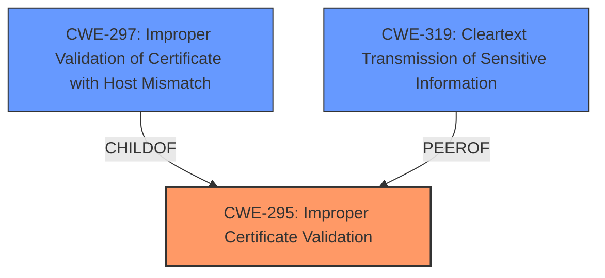

# Enhanced Analysis for CVE-2021-25465

# Summary
| CWE ID | CWE Name | Confidence | CWE Abstraction Level | CWE Vulnerability Mapping Label | CWE-Vulnerability Mapping Notes |
|---|---|---|---|---|---|
| CWE-295 | Improper Certificate Validation | 0.8 | Base | Allowed | Primary CWE |
| CWE-297 | Improper Validation of Certificate with Host Mismatch | 0.6 | Variant | Allowed | Secondary Candidate |
| CWE-319 | Cleartext Transmission of Sensitive Information | 0.5 | Base | Allowed | Secondary Candidate |

## Evidence and Confidence

*   **Confidence Score:** 0.8
*   **Evidence Strength:** HIGH

## Relationship Analysis
The primary relationship is between CWE-295 (Improper Certificate Validation) and its child CWE-297 (Improper Validation of Certificate with Host Mismatch). CWE-295 is a base-level weakness describing the general failure to validate certificates correctly. CWE-297 is a more specific variant where the certificate validation fails specifically due to a mismatch with the host. While the description mentions an "**improper scheme check**" leading to a Man-in-the-middle (MitM) attack, the MitM attack heavily relies on the **improper certificate validation**.



## Vulnerability Chain
The vulnerability chain starts with the **improper scheme check**, which leads to the possibility of a Man-in-the-middle attack. The **improper scheme check** is the root cause that allows an attacker to intercept and potentially modify communications. However, the MitM attack itself relies on the application's failure to properly validate certificates, particularly with regards to host mismatch, which is why CWE-295 is the primary CWE.

## Summary of Analysis
The initial analysis focused on the "**improper scheme check**" as the potential root cause. However, the CVE description and the summary highlight that the vulnerability allows for a Man-in-the-middle attack, which fundamentally relies on issues with certificate validation. The chosen CWEs are at the optimal level of specificity because CWE-295 directly addresses the core issue of **improper certificate validation**, enabling the MitM attack. CWE-297 is a more specific variant addressing host mismatch, which may or may not be the specific cause in this case, making it a secondary candidate. CWE-319 (Cleartext Transmission of Sensitive Information) could be a consequence if the MitM attack is successful, but is not the root cause of the vulnerability itself.

The evidence from the "CVE Reference Links Content Summary" section supports this: "The application fails to properly validate the scheme of URLs or intents... By exploiting this vulnerability, an attacker can perform a Man-in-the-middle (MitM) attack." This explicitly links the **improper scheme check** to the MitM attack enabled by **improper certificate validation**.

Therefore, CWE-295 is the most appropriate primary CWE, with CWE-297 and CWE-319 as secondary considerations.

Relevant CWE Information:

# Enhanced Context (25 CWEs)
The following CWEs were identified as potentially relevant to this vulnerability:

## CWE-345: Insufficient Verification of Data Authenticity
**Abstraction Level**: Class
**Similarity Score**: 0.78
**Source**: dense

**Description**:
The product does not sufficiently verify the origin or authenticity of data, in a way that causes it to accept invalid data.

**Mapping Guidance**:
- Usage: Discouraged
- Rationale: This CWE entry is a level-1 Class (i.e., a child of a Pillar). It might have lower-level children that would be more appropriate

*This CWE was not selected because it is too generic. The analysis needs to be more specific.*

## CWE-303: Incorrect Implementation of Authentication Algorithm
**Abstraction Level**: Base
**Similarity Score**: 0.77
**Source**: dense

**Description**:
The requirements for the product dictate the use of an established authentication algorithm, but the implementation of the algorithm is incorrect.

**Mapping Guidance**:
- Usage: Allowed
- Rationale: This CWE entry is at the Base level of abstraction, which is a preferred level of abstraction for mapping to the root causes of vulnerabilities.

*This CWE was not selected because the description doesn't imply that an authentication algorithm was incorrectly implemented.*

## CWE-807: Reliance on Untrusted Inputs in a Security Decision
**Abstraction Level**: Base
**Similarity Score**: 0.76
**Source**: dense

**Description**:
The product uses a protection mechanism that relies on the existence or values of an input, but the input can be modified by an untrusted actor in a way that bypasses the protection mechanism.

**Mapping Guidance**:
- Usage: Allowed
- Rationale: This CWE entry is at the Base level of abstraction, which is a preferred level of abstraction for mapping to the root causes of vulnerabilities.

*This CWE was not selected because the description doesn't imply that the product relies on untrusted inputs.*

## CWE-1390: Weak Authentication
**Abstraction Level**: Class
**Similarity Score**: 0.76
**Source**: dense

**Description**:
The product uses an authentication mechanism to restrict access to specific users or identities, but the mechanism does not sufficiently prove that the claimed identity is correct.

**Mapping Guidance**:
- Usage: Allowed-with-Review
- Rationale: This CWE entry is a Class and might have Base-level children that would be more appropriate

*This CWE was not selected because the description doesn't imply a weak authentication mechanism.*

## CWE-1289: Improper Validation of Unsafe Equivalence in Input
**Abstraction Level**: Base
**Similarity Score**: 0.76
**Source**: dense

**Description**:
The product receives an input value that is used as a resource identifier or other type of reference, but it does not validate or incorrectly validates that the input is equivalent to a potentially-unsafe value.

**Mapping Guidance**:
- Usage: Allowed
- Rationale: This CWE entry is at the Base level of abstraction, which is a preferred level of abstraction for mapping to the root causes of vulnerabilities.

*This CWE was not selected because the description doesn't imply unsafe equivalance in input.*

## CWE-668: Exposure of Resource to Wrong Sphere
**Abstraction Level**: Class
**Similarity Score**: 0.76
**Source**: dense

**Description**:
The product exposes a resource to the wrong control sphere, providing unintended actors with inappropriate access to the resource.

**Mapping Guidance**:
- Usage: Discouraged
- Rationale: CWE-668 is high-level and is often misused as a catch-all when lower-level CWE IDs might be applicable. It is sometimes used for low-information vulnerability reports [REF-1287]. It is a level-1 Class (i.e., a child of a Pillar). It is not useful for trend analysis.

*This CWE was not selected because it is too generic.*

## CWE-319: Cleartext Transmission of Sensitive Information
**Abstraction Level**: Base
**Similarity Score**: 0.76
**Source**: dense

**Description**:
The product transmits sensitive or security-critical data in cleartext in a communication channel that can be sniffed by unauthorized actors.

**Mapping Guidance**:
- Usage: Allowed
- Rationale: This CWE entry is at the Base level of abstraction, which is a preferred level of abstraction for mapping to the root causes of vulnerabilities.

*This CWE was considered as a secondary candidate because it is a potential impact of the MitM attack.*

## CWE-203: Observable Discrepancy
**Abstraction Level**: Base
**Similarity Score**: 0.75
**Source**: dense

**Description**:
The product behaves differently or sends different responses under different circumstances in a way that is observable to an unauthorized actor, which exposes security-relevant information about the state of the product, such as whether a particular operation was successful or not.

**Mapping Guidance**:
- Usage: Allowed
- Rationale: This CWE entry is at the Base level of abstraction, which is a preferred level of abstraction for mapping to the root causes of vulnerabilities.

*This CWE was not selected because the description doesn't imply observable descrepancies.*

## CWE-1391: Use of Weak Credentials
**Abstraction Level**: Class
**Similarity Score**: 0.75
**Source**: dense

**Description**:
The product uses weak credentials (such as a default key or hard-coded password) that can be calculated, derived, reused, or guessed by an attacker.

**Mapping Guidance**:
- Usage: Allowed-with-Review
-


## CWE Relationship Analysis

Current CWEs represent these abstraction levels: .


### Vulnerability Chain Analysis

**Chain starting from CWE-303:**
- 303 (Incorrect Implementation of Authentication Algorithm) - ROOT


**Chain starting from CWE-297:**
- 297 (Improper Validation of Certificate with Host Mismatch) - ROOT


### CWE Relationship Diagram

```mermaid
graph TD
    classDef primary fill:#f96,stroke:#333,stroke-width:2px
    classDef secondary fill:#69f,stroke:#333
    classDef tertiary fill:#9e9,stroke:#333
```