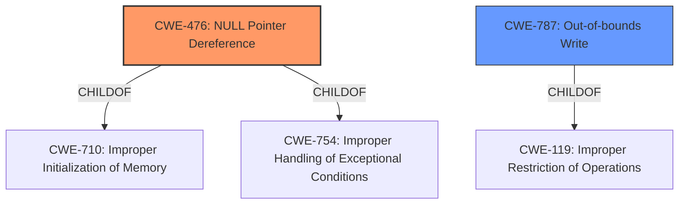

# Analysis Report for CVE-2021-25491

# Vulnerability Analysis Report: CVE-2021-25491

## Description


## Analysis (with Relationship Data)

# Summary
| CWE ID | CWE Name | Confidence | CWE Abstraction Level | CWE Vulnerability Mapping Label | CWE-Vulnerability Mapping Notes |
|---|---|---|---|---|---|
| CWE-476 | NULL Pointer Dereference | 1.0 | Base | Allowed | Primary CWE |
| CWE-787 | Out-of-bounds Write | 0.4 | Base | Allowed | Secondary Candidate |

## Evidence and Confidence

*   **Confidence Score:** 0.8
*   **Evidence Strength:** HIGH

## Relationship Analysis
The primary relationship that influenced the selection was the direct match of the vulnerability description's **root cause** to the CWE-476 description. The relationship between CWE-476 and its parents (CWE-710 and CWE-754) was also considered, but CWE-476 was chosen because it is a base level and more specific. CWE-787 was considered a secondary candidate because **memory corruption** was listed as a weakness, and it is related to out-of-bounds writes.



## Vulnerability Chain
The vulnerability chain starts with a **NULL-pointer dereference** (CWE-476), which directly leads to **memory corruption**. The root cause is the **NULL-pointer dereference**.

## Summary of Analysis
The initial analysis focused on identifying the **root cause** of the vulnerability, which was explicitly stated as a **NULL-pointer dereference**. The evidence for this is strong, based on the "Vulnerability Description Key Phrases" and "CVE Reference Links Content Summary":

*   "**rootcause:** **NULL-pointer dereference**"
*   "A vulnerability in mfc driver allows **memory corruption** via **NULL-pointer dereference**."

Based on this evidence, CWE-476 was selected as the primary CWE.

CWE-787 (Out-of-bounds Write) was considered due to the mention of **memory corruption**. However, since the root cause is a **NULL-pointer dereference**, CWE-476 is the more direct and appropriate mapping. The **memory corruption** is a symptom or impact of the **NULL-pointer dereference**, not the root cause itself.

The selection of CWE-476 is at the optimal level of specificity because it directly addresses the **NULL-pointer dereference**, which is the **root cause** of the vulnerability.

Relevant CWE Information:

# Enhanced Context (25 CWEs)
The following CWEs were identified as potentially relevant to this vulnerability:

## CWE-822: Untrusted Pointer Dereference
**Abstraction Level**: Base
**Similarity Score**: 0.79
**Source**: dense

**Description**:
The product obtains a value from an untrusted source, converts this value to a pointer, and dereferences the resulting pointer.
## CWE-252: Unchecked Return Value
**Abstraction Level**: Base
**Similarity Score**: 0.78
**Source**: dense

**Description**:
The product does not check the return value from a method or function, which can prevent it from detecting unexpected states and conditions.
## CWE-476: NULL Pointer Dereference
**Abstraction Level**: Base
**Similarity Score**: 0.78
**Source**: dense

**Description**:
The product dereferences a pointer that it expects to be valid but is NULL.
## CWE-824: Access of Uninitialized Pointer
**Abstraction Level**: Base
**Similarity Score**: 0.78
**Source**: dense

**Description**:
The product accesses or uses a pointer that has not been initialized.
## CWE-226: Sensitive Information in Resource Not Removed Before Reuse
**Abstraction Level**: Base
**Similarity Score**: 0.76
**Source**: dense

**Description**:
The product releases a resource such as memory or a file so that it can be made available for reuse, but it does not clear or "zeroize" the information contained in the resource before the product performs a critical state transition or makes the resource available for reuse by other entities.
## CWE-170: Improper Null Termination
**Abstraction Level**: Base
**Similarity Score**: 0.76
**Source**: dense

**Description**:
The product does not terminate or incorrectly terminates a string or array with a null character or equivalent terminator.
## CWE-404: Improper Resource Shutdown or Release
**Abstraction Level**: Class
**Similarity Score**: 0.76
**Source**: dense

**Description**:
The product does not release or incorrectly releases a resource before it is made available for re-use.
## CWE-690: Unchecked Return Value to NULL Pointer Dereference
**Abstraction Level**: Compound
**Similarity Score**: 0.76
**Source**: dense

**Description**:
The product does not check for an error after calling a function that can return with a NULL pointer if the function fails, which leads to a resultant NULL pointer dereference.
## CWE-667: Improper Locking
**Abstraction Level**: Class
**Similarity Score**: 0.76
**Source**: dense

**Description**:
The product does not properly acquire or release a lock on a resource, leading to unexpected resource state changes and behaviors.
## CWE-131: Incorrect Calculation of Buffer Size
**Abstraction Level**: Base
**Similarity Score**: 0.76
**Source**: dense

**Description**:
The product does not correctly calculate the size to be used when allocating a buffer, which could lead to a buffer overflow.
## CWE-252: Unchecked Return Value
**Abstraction Level**: Base
**Similarity Score**: 5586.27
**Source**: sparse

**Description**:
The product does not check the return value from a method or function, which can prevent it from detecting unexpected states and conditions.
## CWE-476: NULL Pointer Dereference
**Abstraction Level**: Base
**Similarity Score**: 5379.85
**Source**: sparse

**Description**:
The product dereferences a pointer that it expects to be valid but is NULL.
## CWE-822: Untrusted Pointer Dereference
**Abstraction Level**: Base
**Similarity Score**: 5181.17
**Source**: sparse

**Description**:
The product obtains a value from an untrusted source, converts this value to a pointer, and dereferences the resulting pointer.
## CWE-824: Access of Uninitialized Pointer
**Abstraction Level**: Base
**Similarity Score**: 5032.72
**Source**: sparse

**Description**:
The product accesses or uses a pointer that has not been initialized.
## CWE-825: Expired Pointer Dereference
**Abstraction Level**: Base
**Similarity Score**: 4988.69
**Source**: sparse

**Description**:
The product dereferences a pointer that contains a location for memory that was previously valid, but is no longer valid.
## CWE-1325: Improperly Controlled Sequential Memory Allocation
**Abstraction Level**: base
**Similarity Score**: 5.03
**Source**: graph

**Description**:
CWE-1325: Improperly Controlled Sequential Memory Allocation
## CWE-789: Memory Allocation with Excessive Size Value
**Abstraction Level**: variant
**Similarity Score**: 4.53
**Source**: graph

**Description**:
CWE-789: Memory Allocation with Excessive Size Value
## CWE-787: Out-of-bounds Write
**Abstraction Level**: base
**Similarity Score**: 4.33
**Source**: graph

**Description**:
CWE-787: Out-of-bounds Write
## CWE-825: Expired Pointer Dereference
**Abstraction Level**: base
**Similarity Score**: 4.33
**Source**: graph

**Description**:
CWE-825: Expired Pointer Dereference
## CWE-190: Integer Overflow or Wraparound
**Abstraction Level**: base
**Similarity Score**: 4.33
**Source**: graph

**Description**:
CWE-190: Integer Overflow or Wraparound
## CWE-770: Allocation of Resources Without Limits or Throttling
**Abstraction Level**: base
**Similarity Score**: 4.33
**Source**: graph

**Description**:
CWE-770: Allocation of Resources Without Limits or Throttling
## CWE-456:


## CWE Relationship Analysis

Current CWEs represent these abstraction levels: .


### Vulnerability Chain Analysis

**Chain starting from CWE-754:**
- 754 (Improper Check for Unusual or Exceptional Conditions) - ROOT


**Chain starting from CWE-787:**
- 787 (Out-of-bounds Write) - ROOT


### CWE Relationship Diagram

```mermaid
graph TD
    classDef primary fill:#f96,stroke:#333,stroke-width:2px
    classDef secondary fill:#69f,stroke:#333
    classDef tertiary fill:#9e9,stroke:#333
```


*Report generated on 2025-04-02 09:17:47*
