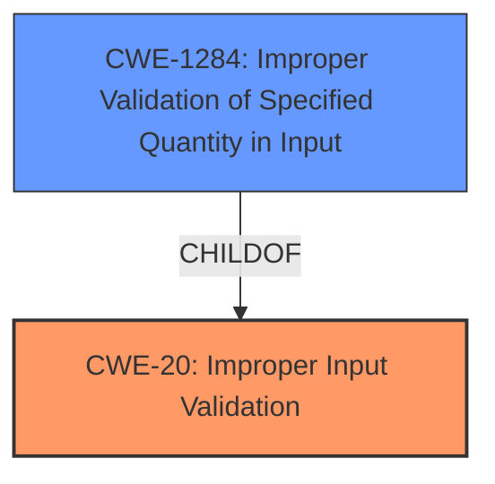

# Raw Analyzer Response for CVE-2021-25503

# Summary
| CWE ID | CWE Name | Confidence | CWE Abstraction Level | CWE Vulnerability Mapping Label | CWE-Vulnerability Mapping Notes |
|---|---|---|---|---|---|
| CWE-20 | Improper Input Validation | 0.9 | Class | Primary | Discouraged |
| CWE-1284 | Improper Validation of Specified Quantity in Input | 0.7 | Base | Secondary | Allowed |

## Evidence and Confidence

*   **Confidence Score:** 0.9
*   **Evidence Strength:** HIGH

## Relationship Analysis
The primary CWE selected is CWE-20, which is a Class-level CWE. While it is generally discouraged, the evidence points strongly to a general lack of input validation. A more specific CWE, CWE-1284 (Base), was also considered as a secondary candidate, since input validation often deals with quantities.

## Vulnerability Chain
The vulnerability chain starts with **improper input validation** (CWE-20), which leads to arbitrary code execution. The exact mechanism of how the **improper input validation** leads to arbitrary code execution is not provided in the description, but the impact is clear.

## Summary of Analysis
The initial analysis focuses on identifying the **root cause** of the vulnerability, which is stated as **improper input validation** in the vulnerability description and CVE reference summary.

The vulnerability description states: "**Improper input validation** vulnerability in HDCP prior to SMR Nov-2021 Release 1 allows attackers to arbitrary code execution."
The CVE Reference Links Content Summary confirms this with: "Root cause of vulnerability: **Improper input validation** in the HDCP driver" and "Weaknesses/vulnerabilities: [**Improper input validation**]".

Based on this evidence, the primary CWE selected is CWE-20 (Improper Input Validation). While CWE-20 is a Class-level CWE and is generally discouraged, the provided information is not specific enough to pinpoint a more precise Base or Variant CWE. The recommendation is to use the child CWEs of CWE-20 where possible.

CWE-1284 (Improper Validation of Specified Quantity in Input) is included as a secondary CWE because input validation often involves checking quantities like size or length, which is a plausible scenario here given the context of HDCP.

CWE-20 is selected because the description explicitly mentions **improper input validation**. The evidence is direct and strong. The relationship analysis also supports the choice of CWE-20 as a general category, with the possibility of more specific types of input validation errors being present. The abstraction level is appropriate, given the limited details.

Relevant CWE Information:

# Enhanced Context (25 CWEs)

## CWE-20: Improper Input Validation
**Abstraction:** Class
**Status:** Stable

### Description
The product receives input or data, but it does
        not validate or incorrectly validates that the input has the
        properties that are required to process the data safely and
        correctly.
### Mapping Guidance
**Usage:** Discouraged
**Rationale:** CWE-20 is commonly misused in low-information vulnerability reports when lower-level CWEs could be used instead, or when more details about the vulnerability are available [REF-1287]. It is not useful for trend analysis. It is also a level-1 Class (i.e., a child of a Pillar).
**Comments:** Consider lower-level children such as Improper Use of Validation Framework (CWE-1173) or **improper validation involving specific types or properties of input such as Specified Quantity (CWE-1284)**; Specified Index, Position, or Offset (CWE-1285); Syntactic Correctness (CWE-1286); Specified Type (CWE-1287); Consistency within Input (CWE-1288); or Unsafe Equivalence (CWE-1289).

## CWE-1284: Improper Validation of Specified Quantity in Input
**Abstraction:** Base
**Status:** Incomplete

### Description
The product receives input that is expected to specify a quantity (such as size or length), but it does not validate or incorrectly validates that the quantity has the required properties.
### Mapping Guidance
**Usage:** Allowed
**Rationale:** This CWE entry is at the Base level of abstraction, which is a preferred level of abstraction for mapping to the root causes of vulnerabilities.