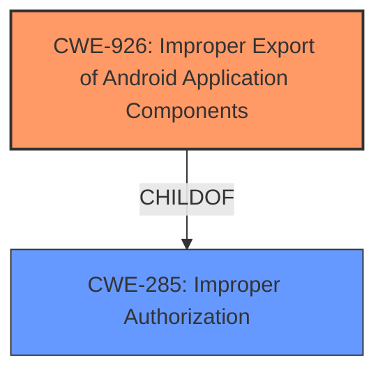

# Raw Analyzer Response for CVE-2021-25506

# Summary
| CWE ID | CWE Name | Confidence | CWE Abstraction Level | CWE Vulnerability Mapping Label | CWE-Vulnerability Mapping Notes |
|---|---|---|---|---|---|
| CWE-926 | Improper Export of Android Application Components | 0.8 | Variant | Allowed | Primary CWE |
| CWE-285 | Improper Authorization | 0.5 | Class | Discouraged | Secondary Candidate |

## Evidence and Confidence

*   **Confidence Score:** 0.8
*   **Evidence Strength:** MEDIUM

## Relationship Analysis
The primary CWE is CWE-926 (Improper Export of Android Application Components), a variant of CWE-285 (Improper Authorization). This indicates a hierarchical relationship where CWE-926 is a more specific instance of the broader authorization issue described by CWE-285.

## Vulnerability Chain
The vulnerability chain starts with the **improper export** of an Android application component, specifically a content provider. This **allows** an attacker to access a **non-existent provider**, potentially leading to denial of service.

## Summary of Analysis
Initially, the analysis focused on the "access non-existent provider" key phrase. However, after reviewing the CVE Reference Links Content Summary and the Retriever Results, it became clear that the root cause is the **improper export** of the component, which then **allows** the attacker to attempt accessing the non-existent provider.

The evidence supporting this is from the CVE Reference Links Content Summary, which states: "The Samsung Health application prior to version 6.19.1.0001 contains a vulnerability that **allows access to a non-existent content provider**." Furthermore, the vulnerability description itself mentions that the attacker can "access it via malicious content provider".

CWE-926, Improper Export of Android Application Components, is at the Variant level and is ALLOWED per MITRE's mapping guidance. The description of CWE-926 aligns well: "The Android application exports a component for use by other applications, but **does not properly restrict which applications can launch the component or access the data it contains.**" The vulnerability allows an attacker to access the content provider via a malicious content provider.

CWE-285, Improper Authorization, was considered but not chosen as the primary CWE. While related, it's a more general Class-level CWE, and CWE-926 provides a more specific description of the Android component export issue. The MITRE guidance DISCOURAGES using CWE-285 when lower-level CWE entries are likely to be applicable.

Relevant CWE Information:

# Enhanced Context (25 CWEs)
The following CWEs were identified as potentially relevant to this vulnerability:

## CWE-926: Improper Export of Android Application Components
**Abstraction Level**: Variant
**Similarity Score**: 0.064
**Source**: sparse

**Description**:
The Android application exports a component for use by other applications, but does not properly restrict which applications can launch the component or access the data it contains.

**Mapping Guidance**:
**Usage:** Allowed
**Rationale:** This CWE entry is at the Variant level of abstraction, which is a preferred level of abstraction for mapping to the root causes of vulnerabilities.
**Comments:** Carefully read both the name and description to ensure that this mapping is an appropriate fit. Do not try to 'force' a mapping to a lower-level Base/Variant simply to comply with this preferred level of abstraction.
**Reasons:**
- Acceptable-Use

## CWE-287: Improper Authentication
**Abstraction Level**: Class
**Similarity Score**: 0.057
**Source**: sparse

**Description**:
When an actor claims to have a given identity, the product does not prove or insufficiently proves that the claim is correct.

**Mapping Guidance**:
**Usage:** Discouraged
**Rationale:** This CWE entry might be misused when lower-level CWE entries are likely to be applicable. It is a level-1 Class (i.e., a child of a Pillar).
**Comments:** Consider children or descendants, beginning with CWE-1390: Weak Authentication or CWE-306: Missing Authentication for Critical Function.
**Reasons:**
- Frequent Misuse

## CWE-703: Improper Check or Handling of Exceptional Conditions
**Abstraction Level**: Pillar
**Similarity Score**: 0.056
**Source**: sparse

**Description**:
The product does not properly anticipate or handle exceptional conditions that rarely occur during normal operation of the product.

**Mapping Guidance**:
**Usage:** Discouraged
**Rationale:** This CWE entry is extremely high-level, a Pillar.
**Comments:** Consider children or descendants of this entry instead.
**Reasons:**
- Abstraction

## CWE-269: Improper Privilege Management
**Abstraction Level**: Class
**Similarity Score**: 0.052
**Source**: sparse

**Description**:
The product does not properly assign, modify, track, or check privileges for an actor, creating an unintended sphere of control for that actor.

**Mapping Guidance**:
**Usage:** Discouraged
**Rationale:** CWE-269 is commonly misused. It can be conflated with "privilege escalation," which is a technical impact that is listed in many low-information vulnerability reports [REF-1287]. It is not useful for trend analysis.
**Comments:** If an error or mistake allows privilege escalation, then use the CWE ID for that mistake. Avoid using CWE-269 when only phrases such as "privilege escalation" or "gain privileges" are available, as these indicate technical impact of the vulnerability - not the root cause weakness. If the root cause seems to be directly related to privileges, then examine the children of CWE-269 for additional hints, such as Execution with Unnecessary Privileges (CWE-250) or Incorrect Privilege Assignment (CWE-266).
**Reasons:**
- Frequent Misuse

## CWE-285: Improper Authorization
**Abstraction Level**: Class
**Similarity Score**: 0.050
**Source**: sparse

**Description**:
The product does not perform or incorrectly performs an authorization check when an actor attempts to access a resource or perform an action.

**Mapping Guidance**:
**Usage:** Discouraged
**Rationale:** CWE-285 is high-level and lower-level CWEs can frequently be used instead. It is a level-1 Class (i.e., a child of a Pillar).
**Comments:** Look at CWE-285's children and consider mapping to CWEs such as CWE-862: Missing Authorization, CWE-863: Incorrect Authorization, CWE-732: Incorrect Permission Assignment for Critical Resource, or others.
**Reasons:**
- Abstraction

## CWE-927: Use of Implicit Intent for Sensitive Communication
**Abstraction Level**: Variant
**Similarity Score**: 0.497
**Source**: dense

**Description**:
The Android application uses an implicit intent for transmitting sensitive data to other applications.

**Mapping Guidance**:
**Usage:** Allowed
**Rationale:** This CWE entry is at the Variant level of abstraction, which is a preferred level of abstraction for mapping to the root causes of vulnerabilities.
**Comments:** Carefully read both the name and description to ensure that this mapping is an appropriate fit. Do not try to 'force' a mapping to a lower-level Base/Variant simply to comply with this preferred level of abstraction.
**Reasons:**
- Acceptable-Use