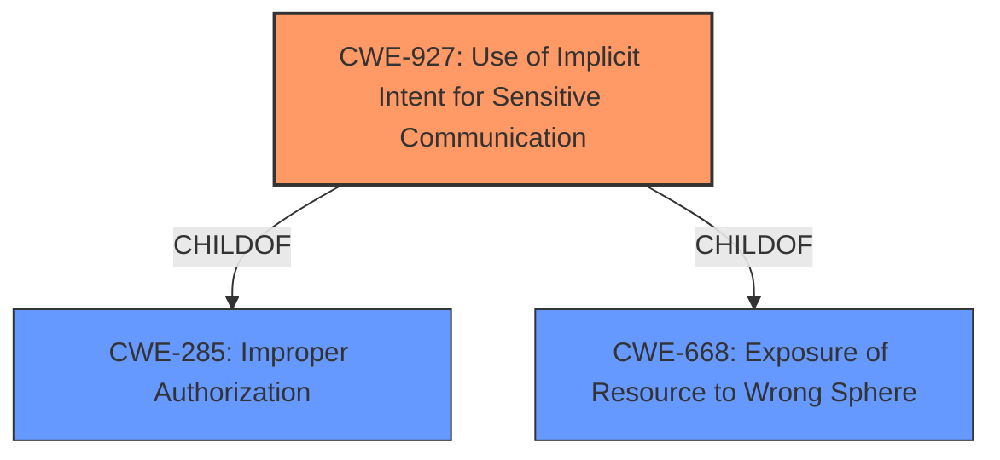

# Enhanced Analysis for CVE-2021-25515

# Summary
| CWE ID | CWE Name | Confidence | CWE Abstraction Level | CWE Vulnerability Mapping Label | CWE-Vulnerability Mapping Notes |
|---|---|---|---|---|---|
| CWE-927 | Use of Implicit Intent for Sensitive Communication | 1.0 | Variant | Allowed | Primary CWE |

## Evidence and Confidence

*   **Confidence Score:** 1.0
*   **Evidence Strength:** HIGH

## Relationship Analysis
The selected CWE, CWE-927, is a Variant of CWE-285 (Improper Authorization) and CWE-668 (Exposure of Resource to Wrong Sphere). This indicates that the vulnerability is a specific type of authorization issue related to how resources are exposed within the Android application. The Variant level is appropriate given the specific context of implicit intents in Android development.



## Vulnerability Chain
The vulnerability chain is relatively simple:
1.  **Root Cause:** **Improper usage of implicit intent** (CWE-927)
2.  **Impact:** Attackers can access BSSID.

## Summary of Analysis
The primary weakness is the **improper usage of implicit intent** which leads to attackers being able to access BSSID.

The vulnerability description explicitly states the **improper usage of implicit intent** as the root cause, making CWE-927 a strong match. "An **improper usage of implicit intent** in SemRewardManager prior to SMR Dec-2021 Release 1 allows attackers to access BSSID."

The graph relationships show that CWE-927 is a child of both CWE-285 and CWE-668. This confirms that the vulnerability is a specific case of improper authorization and resource exposure, making CWE-927 the most appropriate and specific choice.

The selection of CWE-927 is at the optimal level of specificity, as it directly addresses the vulnerability described.

Relevant CWE Information:

# Enhanced Context (25 CWEs)
The following CWEs were identified as potentially relevant to this vulnerability:

## CWE-927: Use of Implicit Intent for Sensitive Communication
**Abstraction Level**: Variant
**Similarity Score**: 5714.00
**Source**: sparse

**Description**:
The Android application uses an implicit intent for transmitting sensitive data to other applications.

**Mapping Guidance**:
- Usage: Allowed
- Rationale: This CWE entry is at the Variant level of abstraction, which is a preferred level of abstraction for mapping to the root causes of vulnerabilities.

### Other CWEs Considered and Rejected:

*   **CWE-926: Improper Export of Android Application Components**: While related to Android application security, this CWE focuses on the improper export of components, not the specific issue of using implicit intents for sensitive data communication.
*   **CWE-925: Improper Verification of Intent by Broadcast Receiver**: This CWE addresses the lack of verification of the source of an intent, whereas the vulnerability is about the **improper usage of implicit intent** regardless of its origin.
*   **CWE-285: Improper Authorization and CWE-287: Improper Authentication**: These are class-level CWEs that are too general. The more specific CWE-927 is a child of CWE-285, making it a better fit.
*   **CWE-807: Reliance on Untrusted Inputs in a Security Decision**: While implicit intents involve untrusted inputs, the core issue is how the intent is used for sensitive communication, not just the reliance on untrusted input.
*   **CWE-213: Exposure of Sensitive Information Due to Incompatible Policies**: This CWE is related to information exposure, but it's more about incompatible security policies. It does not specifically address the Android **implicit intent** issue.
*   **CWE-639: Authorization Bypass Through User-Controlled Key**: This CWE focuses on modifying a key value to bypass authorization, which is not the mechanism described in the vulnerability.
*   **CWE-1220: Insufficient Granularity of Access Control**: The focus of the vulnerability description is on the **improper usage of implicit intent**s rather than the granularity of access control.
*   **CWE-280, CWE-274:** These relate to insufficient privileges, which is not the central issue.
*   **CWE-303**: This is about authentication algorithm implementation which is not what is happening here.
*   **CWE-703, CWE-754**: These are too general and related to handling of exceptional conditions.
*   **CWE-653**: This relates to isolation and compartmentalization which is not the central issue.
*   **CWE-1289**: This relates to unsafe equivalence in input, but the main issue is around **implicit intent** usage.
*   **CWE-22**: This is related to path traversal which is not what is happening here.
*   **CWE-322**: This is related to key exchange, which is not what is happening here.
*   **CWE-499, CWE-498**: These are related to serializable/cloneable classes, which is not what is happening here.
*   **CWE-942**: This is related to cross-domain policy which is not what is happening here.
*   **CWE-350**: This is related to reverse DNS which is not what is happening here.
*   **CWE-497, CWE-359**: These are related to information exposure but more general than the **implicit intent** case.
*   **CWE-1319, CWE-1285**: These are hardware/memory related and not applicable here.


## CWE Relationship Analysis

Current CWEs represent these abstraction levels: .


### Vulnerability Chain Analysis

**Chain starting from CWE-754:**
- 754 (Improper Check for Unusual or Exceptional Conditions) - ROOT


**Chain starting from CWE-350:**
- 350 (Reliance on Reverse DNS Resolution for a Security-Critical Action) - ROOT


### CWE Relationship Diagram

```mermaid
graph TD
    classDef primary fill:#f96,stroke:#333,stroke-width:2px
    classDef secondary fill:#69f,stroke:#333
    classDef tertiary fill:#9e9,stroke:#333
```