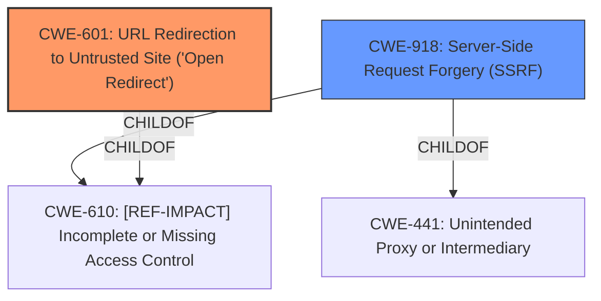

# Analysis Report for CVE-2021-25640

# Vulnerability Analysis Report: CVE-2021-25640

## Description


## Analysis (with Relationship Data)

# Summary
| CWE ID | CWE Name | Confidence | CWE Abstraction Level | CWE Vulnerability Mapping Label | CWE-Vulnerability Mapping Notes |
|---|---|---|---|---|---|
| CWE-601 | URL Redirection to Untrusted Site ('Open Redirect') | 0.7 | Base | Allowed | Primary CWE |
| CWE-918 | Server-Side Request Forgery (SSRF) | 0.7 | Base | Allowed | Secondary CWE |

## Evidence and Confidence

*   **Confidence Score:** 0.7
*   **Evidence Strength:** LOW

## Relationship Analysis
The primary relationship that impacted the decision was the presence of both CWE-601 and CWE-918 as potential outcomes of the **improper** `parseURL` method usage. Both CWEs are at the Base level, providing a good level of specificity. They are also peer vulnerabilities that can occur in this kind of situation.



## Vulnerability Chain
The vulnerability chain starts with the **improper** usage of the `parseURL` method in Apache Dubbo. This **improper** usage leads to a bypass of the white host check. The bypass of the white host check results in either an open redirect (CWE-601) or a Server-Side Request Forgery (SSRF) (CWE-918).

## Summary of Analysis
The initial analysis identified CWE-601 and CWE-918 as the primary candidates, based on the description stating "open redirect or SSRF vulnerability."

The assessment relies on the provided vulnerability description key phrases and the retriever results. The description clearly states the potential outcomes of the vulnerability, which are open redirect or SSRF.

The graph relationships show that both CWE-601 and CWE-918 are related to **Improper Access Control** CWE-610. However, since the description explicitly mentions open redirect and SSRF, it's more appropriate to assign those CWEs directly.

The selected CWEs are at the optimal level of specificity because they directly represent the potential outcomes of the vulnerability.

Relevant CWE Information:

# Enhanced Context (25 CWEs)

## CWE-601: URL Redirection to Untrusted Site ('Open Redirect')
**Abstraction:** Base
**Status:** Draft

### Description
The web application accepts a user-controlled input that specifies a link to an external site, and uses that link in a redirect.

### Extended Description
Not provided

### Alternative Terms
Open Redirect
Cross-site Redirect
Cross-domain Redirect
Unvalidated Redirect

### Relationships
ChildOf -> CWE-610
ChildOf -> CWE-610

### Mapping Guidance
**Usage:** Allowed
**Rationale:** This CWE entry is at the Base level of abstraction, which is a preferred level of abstraction for mapping to the root causes of vulnerabilities.
**Comments:** Carefully read both the name and description to ensure that this mapping is an appropriate fit. Do not try to 'force' a mapping to a lower-level Base/Variant simply to comply with this preferred level of abstraction.
**Reasons:**
- Acceptable-Use

### Additional Notes
**[Other]** Whether this issue poses a vulnerability will be subject to the intended behavior of the application. For example, a search engine might intentionally provide redirects to arbitrary URLs.

### Observed Examples
- **CVE-2005-4206:** URL parameter loads the URL into a frame and causes it to appear to be part of a valid page.
- **CVE-2008-2951:** An open redirect vulnerability in the search script in the software allows remote attackers to redirect users to arbitrary web sites and conduct phishing attacks via a URL as a parameter to the proper function.
- **CVE-2008-2052:** Open redirect vulnerability in the software allows remote attackers to redirect users to arbitrary web sites and conduct phishing attacks via a URL in the proper parameter.

## CWE-918: Server-Side Request Forgery (SSRF)
**Abstraction:** Base
**Status:** Incomplete

### Description
The web server receives a URL or similar request from an upstream component and retrieves the contents of this URL, but it does not sufficiently ensure that the request is being sent to the expected destination.

### Extended Description
Not provided

### Alternative Terms
XSPA: Cross Site Port Attack
SSRF: Server-Side Request Forgery

### Relationships
ChildOf -> CWE-441
ChildOf -> CWE-610

### Mapping Guidance
**Usage:** Allowed
**Rationale:** This CWE entry is at the Base level of abstraction, which is a preferred level of abstraction for mapping to the root causes of vulnerabilities.
**Comments:** Carefully read both the name and description to ensure that this mapping is an appropriate fit. Do not try to 'force' a mapping to a lower-level Base/Variant simply to comply with this preferred level of abstraction.
**Reasons:**
- Acceptable-Use

### Additional Notes
**[Relationship]** CWE-918 (SSRF) and CWE-611 (XXE) are closely related, because they both involve web-related technologies and can launch outbound requests to unexpected destinations. However, XXE can be performed client-side, or in other contexts in which the software is not acting directly as a server, so the "Server" portion of the SSRF acronym does not necessarily apply.

### Observed Examples
- **CVE-2023-32786:** Chain: LLM integration framework has prompt injection (CWE-1427) that allows an attacker to force the service to retrieve data from an arbitrary URL, essentially providing SSRF (CWE-918) and potentially injecting content into downstream tasks.
- **CVE-2021-26855:** Server Side Request Forgery (SSRF) in mail server, as exploited in the wild per CISA KEV.
- **CVE-2021-21973:** Server Side Request Forgery in cloud platform, as exploited in the wild per CISA KEV.

### Other CWEs Considered but Not Used:

*   **CWE-22: Improper Limitation of a Pathname to a Restricted Directory ('Path Traversal')**: While path traversal could be related, the description focuses on redirect or SSRF due to **improper** URL parsing, not necessarily path manipulation.
*   **CWE-73: External Control of File Name or Path**: Similar to CWE-22, this is not directly related to the described vulnerability.
*   **CWE-84: Improper Neutralization of Encoded URI Schemes in a Web Page**: This CWE is related to Cross-Site Scripting (XSS), which is not mentioned in the description.
*   **CWE-1333: Inefficient Regular Expression Complexity**: There's no mention of regular expression inefficiency in the vulnerability description.
*   **CWE-1284: Improper Validation of Specified Quantity in Input**: While input validation is a general concern, the specific issue is the **improper** parsing of URLs, not the validation of quantities.
*   **CWE-20: Improper Input Validation**: This is a very general CWE, and more specific CWEs like CWE-601 and CWE-918 are more appropriate.
*   **CWE-863: Incorrect Authorization**: While authorization bypass is mentioned, the root cause is the **improper** parsing of URLs, which leads to the bypass.
*   **CWE-923: Improper Restriction of Communication Channel to Intended Endpoints**: SSRF could potentially involve this, but CWE-918 is more direct.


## CWE Relationship Analysis

Current CWEs represent these abstraction levels: .


### Vulnerability Chain Analysis

**Chain starting from CWE-1284:**
- 1284 (Improper Validation of Specified Quantity in Input) - ROOT


**Chain starting from CWE-73:**
- 73 (External Control of File Name or Path) - ROOT


### CWE Relationship Diagram

```mermaid
graph TD
    classDef primary fill:#f96,stroke:#333,stroke-width:2px
    classDef secondary fill:#69f,stroke:#333
    classDef tertiary fill:#9e9,stroke:#333
```


*Report generated on 2025-04-01 19:28:42*
