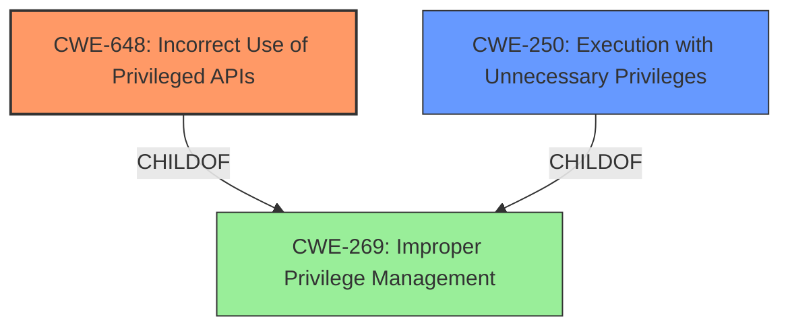

# Analysis Report for CVE-2021-25650

# Vulnerability Analysis Report: CVE-2021-25650

## Description


## Analysis (with Relationship Data)

# Summary
| CWE ID  | CWE Name                                         | Confidence | CWE Abstraction Level | CWE Vulnerability Mapping Label | CWE-Vulnerability Mapping Notes |
| :-------- | :----------------------------------------------- | :--------- | :---------------------- | :------------------------------ | :------------------------------ |
| CWE-648   | Incorrect Use of Privileged APIs                 | 0.8        | Base                    | Allowed                       | Primary CWE                   |
| CWE-250   | Execution with Unnecessary Privileges            | 0.6        | Base                    | Allowed                       | Secondary candidate           |
| CWE-269   | Improper Privilege Management                    | 0.4        | Class                   | Discouraged                   | Secondary candidate           |

## Evidence and Confidence

*   **Confidence Score:** 0.7
*   **Evidence Strength:** MEDIUM

## Relationship Analysis
The primary CWE selected is CWE-648 (Incorrect Use of Privileged APIs), which is a child of CWE-269 (Improper Privilege Management). CWE-250 (Execution with Unnecessary Privileges) is also a child of CWE-269. The selection of CWE-648 is based on the vulnerability description indicating that a local user can execute specially crafted scripts as a privileged user, suggesting an incorrect use of APIs that require elevated privileges. The hierarchical relationship helps to understand that the root cause is related to privilege management, but the specific issue lies in the incorrect use of privileged APIs.



## Vulnerability Chain
The vulnerability chain starts with the **incorrect use of privileged APIs** (CWE-648), which leads to the ability of a local user to **execute specially crafted scripts as a privileged user**, effectively resulting in privilege escalation.

## Summary of Analysis
The initial analysis focused on the vulnerability description, which points to a privilege escalation issue in Avaya Aura Utility Services. The key phrase "execute specially crafted scripts as a privileged user" suggests that the vulnerability involves the incorrect handling or use of privileges.

The Retriever Results highlighted CWE-648 (Incorrect Use of Privileged APIs) as the most relevant CWE. This CWE's description aligns well with the vulnerability description, indicating that the product does not conform to the API requirements for a function call that requires extra privileges.

The relationship analysis confirms that CWE-648 is a child of CWE-269 (Improper Privilege Management), which is a more general class of weakness. However, CWE-648 provides a more specific description of the root cause, making it a more appropriate choice.

The final decision to select CWE-648 is based on the following:

*   The vulnerability description explicitly mentions the execution of scripts as a privileged user, which aligns with the concept of incorrect use of privileged APIs.
*   CWE-648 is a Base-level CWE, which is the preferred level of abstraction for mapping root causes.
*   The MITRE mapping guidance allows the use of CWE-648 and suggests carefully reading the name and description to ensure an appropriate fit, which is the case here.

Other CWEs were considered but not used:

*   CWE-250 (Execution with Unnecessary Privileges): While related, it is not as specific as CWE-648 because the vulnerability involves incorrect use rather than simply unnecessary privileges.
*   CWE-269 (Improper Privilege Management): This is a Class-level CWE and is too general.

Relevant CWE Information:

# Enhanced Context (25 CWEs)
The following CWEs were identified as potentially relevant to this vulnerability:

## CWE-1289: Improper Validation of Unsafe Equivalence in Input
**Abstraction Level**: Base
**Similarity Score**: 0.75
**Source**: dense

**Description**:
The product receives an input value that is used as a resource identifier or other type of reference, but it does not validate or incorrectly validates that the input is equivalent to a potentially-unsafe value.

**Mapping Guidance**:
- Usage: Allowed
- Rationale: This CWE entry is at the Base level of abstraction, which is a preferred level of abstraction for mapping to the root causes of vulnerabilities.

## CWE-653: Improper Isolation or Compartmentalization
**Abstraction Level**: Class
**Similarity Score**: 0.75
**Source**: dense

**Description**:
The product does not properly compartmentalize or isolate functionality, processes, or resources that require different privilege levels, rights, or permissions.

**Mapping Guidance**:
- Usage: Allowed
- Rationale: This CWE entry is at the Base level of abstraction, which is a preferred level of abstraction for mapping to the root causes of vulnerabilities.

## CWE-274: Improper Handling of Insufficient Privileges
**Abstraction Level**: Base
**Similarity Score**: 0.74
**Source**: dense

**Description**:
The product does not handle or incorrectly handles when it has insufficient privileges to perform an operation, leading to resultant weaknesses.

**Mapping Guidance**:
- Usage: Discouraged
- Rationale: This CWE entry could be deprecated in a future version of CWE.

## CWE-667: Improper Locking
**Abstraction Level**: Class
**Similarity Score**: 0.74
**Source**: dense

**Description**:
The product does not properly acquire or release a lock on a resource, leading to unexpected resource state changes and behaviors.

**Mapping Guidance**:
- Usage: Allowed-with-Review
- Rationale: This CWE entry is a Class and might have Base-level children that would be more appropriate

## CWE-404: Improper Resource Shutdown or Release
**Abstraction Level**: Class
**Similarity Score**: 0.74
**Source**: dense

**Description**:
The product does not release or incorrectly releases a resource before it is made available for re-use.

**Mapping Guidance**:
- Usage: Allowed-with-Review
- Rationale: This CWE entry is a Class and might have Base-level children that would be more appropriate

## CWE-691: Insufficient Control Flow Management
**Abstraction Level**: Pillar
**Similarity Score**: 0.74
**Source**: dense

**Description**:
The code does not sufficiently manage its control flow during execution, creating conditions in which the control flow can be modified in unexpected ways.

**Mapping Guidance**:
- Usage: Discouraged
- Rationale: This CWE entry is extremely high-level, a Pillar. However, classification research is limited for weaknesses of this type, so there can be gaps or organizational difficulties within CWE that force use of this weakness, even at such a high level of abstraction.

## CWE-280: Improper Handling of Insufficient Permissions or Privileges
**Abstraction Level**: Base
**Similarity Score**: 0.74
**Source**: dense

**Description**:
The product does not handle or incorrectly handles when it has insufficient privileges to access resources or functionality as specified by their permissions. This may cause it to follow unexpected code paths that may leave the product in an invalid state.

**Mapping Guidance**:
- Usage: Allowed
- Rationale: This CWE entry is at the Base level of abstraction, which is a preferred level of abstraction for mapping to the root causes of vulnerabilities.

## CWE-131: Incorrect Calculation of Buffer Size
**Abstraction Level**: Base
**Similarity Score**: 0.74
**Source**: dense

**Description**:
The product does not correctly calculate the size to be used when allocating a buffer, which could lead to a buffer overflow.

**Mapping Guidance**:
- Usage: Allowed
- Rationale: This CWE entry is at the Base level of abstraction, which is a preferred level of abstraction for mapping to the root causes of vulnerabilities.

## CWE-125: Out-of-bounds Read
**Abstraction Level**: Base
**Similarity Score**: 0.73
**Source**: dense

**Description**:
The product reads data past the end, or before the beginning, of the intended buffer.

**Mapping Guidance**:
- Usage: Allowed
- Rationale: This CWE entry is at the Base level of abstraction, which is a preferred level of abstraction for mapping to the root causes of vulnerabilities.

## CWE-183: Permissive List of Allowed Inputs
**Abstraction Level**: Base
**Similarity Score**: 0.73
**Source**: dense

**Description**:
The product implements a protection mechanism that relies on a list of inputs (or properties of inputs) that are explicitly allowed by policy because the inputs are assumed to be safe, but the list is too permissive - that is, it allows an input that is unsafe, leading to resultant weaknesses.

**Mapping Guidance**:
- Usage: Allowed
- Rationale: This CWE entry is


## CWE Relationship Analysis

Current CWEs represent these abstraction levels: .


### Vulnerability Chain Analysis

**Chain starting from CWE-667:**
- 667 (Improper Locking) - ROOT


**Chain starting from CWE-691:**
- 691 (Insufficient Control Flow Management) - ROOT


### CWE Relationship Diagram

```mermaid
graph TD
    classDef primary fill:#f96,stroke:#333,stroke-width:2px
    classDef secondary fill:#69f,stroke:#333
    classDef tertiary fill:#9e9,stroke:#333
```


*Report generated on 2025-04-02 10:10:01*
